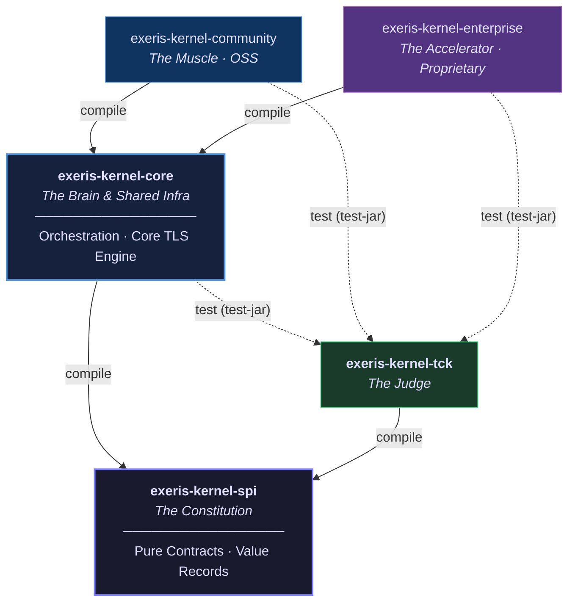

# Physical Tier: SPI (The Constitution)

**Module:** `exeris-kernel-spi`
**Dependencies:** None (Only standard Java 26+ library)

## 🗺️ Dependency Graph: SPI as the Immutable Foundation

`exeris-kernel-spi` is a **leaf node** in the dependency tree. It has no upstream Exeris dependencies.
Every other module in the kernel depends on it, and it depends on nothing.

> **The Wall Rule:** No module may depend on `exeris-kernel-core`, `community`, or `enterprise` from within `SPI`.
> Any class in `exeris-kernel-spi` that imports a non-JDK symbol is a **Wall Breach** and must be rejected in code review.

## 📦 Canonical Module Contents

| Package Suffix             | Allowed Types                                      | Forbidden                                   |
|:---------------------------|:---------------------------------------------------|:--------------------------------------------|
| `*.spi.transport`          | `TransportBinding`, `TlsEngine`, `LoanedBuffer`    | `CommunityTlsEngine`, `QuicBioMultiplexer`  |
| `*.spi.memory`             | `MemoryAllocator`, `LoanedBuffer`, `MemorySlab`    | `PanamaArenaAllocator`, `SlabPool`          |
| `*.spi.persistence`        | `CitadelRepository`, `StorageContext`              | `JdbcTemplate`, `HikariCP`, FFM handles     |
| `*.spi.crypto`             | `TlsEngine`, `TlsHandshakeResult`, `TlsPhase`      | `SSL_CTX*` pointers, OpenSSL symbol names   |
| `*.spi.exceptions`         | `ExerisKernelException` hierarchy                  | Checked exceptions on hot paths             |

## 🛡️ Architectural Rules (L0 Enforcement)

1. **No Implementation Details:** Interfaces must never leak implementation specifics (e.g., no `io_uring` flags, no
   Netty references).
2. **Immutable Carriers:** All data transfer objects must be Java `record` or deeply immutable `final class`, designed
   for Valhalla readiness (JEP 401) — no `synchronized`, no `System.identityHashCode()`, no identity comparisons (`==`)
   on these objects.
3. **No Logic:** SPI contains only Contracts (Interfaces), Exceptions, Enums, and Constants.
4. **Loaned Memory:** All buffer passing must use `LoanedBuffer` to enforce reference counting and zero-copy semantics.