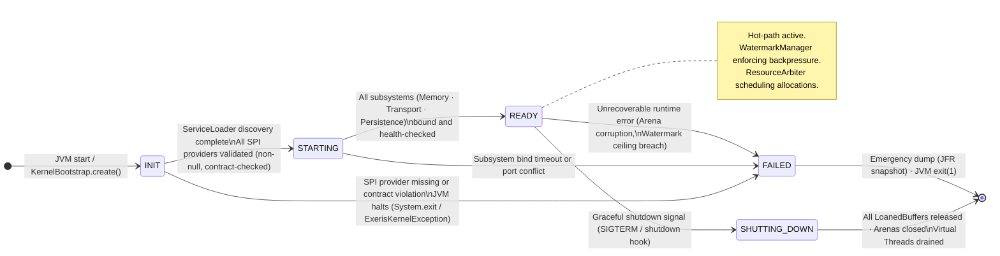

# Physical Tier: Core (The Brain)

**Module:** `exeris-kernel-core`
**Dependencies:**
- `compile`: `exeris-kernel-spi`
- `test`: `exeris-kernel-tck`

## 🗺️ Bootstrap Lifecycle: State Machine

Core owns the canonical subsystem lifecycle. The state machine is driven by `KernelBootstrap`
(implemented as `SubsystemOrchestrator` in `eu.exeris.kernel.core.bootstrap`) and is
irreversible — there is no `RESTART` transition; a failed node must be replaced.

> **Implementation status:** `SubsystemOrchestrator` and `KernelBootstrapEvent` are present in
> `exeris-kernel-core`. The full `ServiceLoader`-backed multi-provider discovery path and the
> named `KernelBootstrap` entrypoint are planned for TRL-4. The state machine below reflects the
> intended complete behaviour.



## 🗺️ Driver Discovery: ServiceLoader Orchestration

Core is **driver-agnostic**. It never imports `exeris-kernel-community` or `exeris-kernel-enterprise` classes.
Concrete implementations are discovered at runtime via `ServiceLoader`, which fulfils the Open-Core SPI contract.

```mermaid
graph TD
    subgraph "exeris-kernel-core (The Brain)"
        KB["KernelBootstrap"]
        WM["WatermarkManager"]
        RA["ResourceArbiter"]
        SL["java.util.ServiceLoader"]
    end

    subgraph "exeris-kernel-spi (Contracts)"
        TE["TlsEngine (interface)"]
        MA["MemoryAllocator (interface)"]
        SP["SecurityProvider (interface)"]
        PP["PersistenceProvider (interface)"]
        PE["PersistenceEngine (interface)"]
        TP["TransportProvider (interface)"]
        TR["TransportEngine (interface)"]
    end

    subgraph "Runtime Classpath (injected — conceptual placeholders)"
        COMM_IMPL["CommunityTlsEngine\nCommunityMemoryAllocator\nDefaultSecurityProvider\nJdbcPersistenceProvider\nJdbcPersistenceEngine\nNioTransportProvider\nNioTransportEngine"]
        ENT_IMPL["EnterpriseTlsEngine\nGlobalMemoryArbiter\nFipsSecurityProvider\nNativePersistenceProvider\nNativePersistenceEngine\nQuicTransportProvider\nQuicTransportEngine"]
    end

    KB --> SL
    SL -->|"resolves at T-0"| TE & MA & SP & PP & PE & TP & TR
    COMM_IMPL -.->|"implements (Community classpath)"| TE & MA & SP & PP & PE & TP & TR
    ENT_IMPL  -.->|"implements (Enterprise classpath)"| TE & MA & SP & PP & PE & TP & TR
    WM --> MA
    RA --> MA
    KB -->|"validates contracts"| WM & RA

    style KB fill:#16213e,color:#e0e0ff,stroke:#4a90d9
    style SL fill:#16213e,color:#e0e0ff,stroke:#4a90d9
    style COMM_IMPL fill:#0f3460,color:#e0e0ff,stroke:#4a90d9,stroke-dasharray: 5 5
    style ENT_IMPL  fill:#533483,color:#e0e0ff,stroke:#9b59b6,stroke-dasharray: 5 5
```



> **Invariant:** If `ServiceLoader` returns zero providers for any mandatory SPI contract, `KernelBootstrap`
> transitions to `FAILED` and the JVM halts. There is no partial bootstrap.

## 🧠 Architectural Rules (L0 Enforcement)

1. **Driver Agnosticism:** Core must NEVER know if it's running on Community or Enterprise drivers. It interacts
   exclusively via `ServiceLoader` and SPI contracts.
2. **Orchestration Only:** Core makes decisions (Watermarks, Load Shedding, Backpressure), but does not execute the
   physical I/O.
3. **Structured Concurrency (JDK 25+ Joiner API):** By default, all concurrent *subtasks* in Core must be created via
   `StructuredTaskScope.open(Joiner)` with an explicit `Joiner`. `ThreadLocal` and raw `ExecutorService` are entirely
   BANNED. Custom `Joiner` implementations should be used for complex aggregation to ensure typed, zero-cast handover
   of subtask results (e.g., `LoanedBuffer`). `ScopedValue` context is propagated strictly into forked subtasks. The only
   sanctioned exceptions are: (a) request-root / entrypoint virtual threads that own their own structured scopes (e.g.,
   the root thread that opens a `StructuredTaskScope` for downstream work), (b) long-lived background maintenance loops
   whose lifetime equals the JVM or subsystem (e.g., `MemoryMaintenanceTask`), and (c) PAQS per-stream virtual threads
   where the stream lifecycle defines the concurrency scope (`PaqsScheduler`). These exceptions must be explicitly
   documented in-code and must not reintroduce ad-hoc executors or unstructured concurrency.
4. **Fail-Fast Bootstrap:** Must validate all injected SPI providers at T-minus 0 and halt the JVM if contracts are not
   met.
5. **Synchronization (JEP 491 Amendment):** The `synchronized` keyword is **permitted exclusively** in off-heap memory
   pool internals (e.g., `SlabPool` slab reclamation, `SegmentPool` free-list management) where CAS sequences are
   susceptible to ABA problems. It is **categorically banned** around FFM `downcall` invocations or any blocking I/O —
   violations cause Virtual Thread Pinning. See ADR-007 for the full rationale.
6. **Lazy Constants (JEP 526 Semantics):** Singleton config caches and expensive one-time initialisations in Core MUST
   use a lazy, single-initialisation, same-instance mechanism (no double-checked locking, no ad-hoc `volatile` fields).
   The SPI currently models this via `Supplier<KernelSettings>` (see `ConfigProvider`); Core code must follow the same
   "compute once, then reuse without additional locking" contract to enable JVM optimisations and eliminate manual
   synchronisation in the init path.

## HTTP in Core (Current Repository State)

- HTTP wire codecs are currently implemented in `exeris-kernel-core` under `eu.exeris.kernel.core.http`.
- Implemented areas: `http1.*`, `http2.*`, `hpack.*`, `hpack.huffman.*`.
- Root reactor does not currently include a dedicated `exeris-kernel-http` module.
- Core remains responsible for delivering these codec primitives to downstream transport integrations in the current layout.

### HTTP TCK Bindings in Core (Test Scope)

- Core contains concrete test bindings for HTTP TCK suites in `src/test/java/eu/exeris/kernel/core/http/tck/*`.
- These classes validate SPI contract behavior through minimal fixtures (provider/server/client/exchange) in test scope.
- They are not production transport engines and do not implement real wire runtime responsibilities (bind/accept/connect loops).

```mermaid
graph LR
    TCK[exeris-kernel-tck\nAbstractHttp*Tck] --> CORETEST[exeris-kernel-core tests\nCoreHttp*TckTest]
    CORETEST --> FIXTURE[CoreHttpProviderFixture\n(test-only)]
    COREMAIN[exeris-kernel-core main\nhttp1/http2/hpack codecs] --> RUNTIME[Driver tiers\nCommunity/Enterprise]
```
