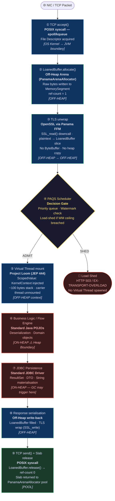

# Physical Tier: Community (The Muscle)

**Module:** `exeris-kernel-community`
**Dependencies:**
- `compile`: `exeris-kernel-core` (dla współdzielonej infrastruktury TLS i SPI)
- `test`: `exeris-kernel-tck`

## 🗺️ Request Flow: Standard POSIX + JDBC Stack

Every incoming request traverses this pipeline. Annotations mark the **memory domain** at each stage.
`[OFF-HEAP]` = Panama `MemorySegment`; `[ON-HEAP]` = JVM Heap; `[POOL]` = slab returned to allocator.

> **Key Insight:** The GC only fires in steps ⑥ and ⑦. The network layer is entirely off-heap.
> For applications that are not persistence-bound, Community eliminates GC pauses entirely.

## 💪 Architectural Rules (L0 Enforcement)

1. **Panama-Powered TCP:** This tier provides a custom, high-performance Off-Heap TCP network stack. It leverages
   JEP 454 (FFM) to bind directly to OS sockets and OpenSSL, completely bypassing standard Java NIO buffers.
2. **Zero-Allocation Network Path (Hard Guarantee):** The TLS + transport pipeline (steps ①–③ and ⑧–⑨ in the
   Request Flow diagram) guarantees **zero JVM heap allocation**. Plaintext and ciphertext reside exclusively in
   `LoanedBuffer` instances backed by Panama `MemorySegment`. This is a hard contract verified by the TCK
   (`AbstractTlsEngineTck.testZeroHeapOnHotPath()`), not a best-effort target.
3. **The Heap Boundary (JDBC):** The heap boundary begins at the business logic layer (step ⑥). JDBC persistence
   (step ⑦) allocates `ResultSet`, DTO, and `String` objects on the JVM heap. The Garbage Collector may trigger
   here. The network and TLS layers are completely exempt from GC.
4. **No Kernel-Bypass:** Uses standard POSIX networking (`epoll`/`kqueue`/`WSAPoll`). Advanced kernel-bypass
   techniques (`io_uring`, strictly off-heap custom DB drivers) are reserved for the Enterprise module.
5. **Controlled Core Access (ADR-008):** Community drivers depend on `exeris-kernel-core` to utilize shared
   infrastructure (e.g., `CoreOpenSslLoader`, `TlsStateMachine`). However, drivers must never bypass standard
   SPI orchestration or attempt to manipulate Core's internal `WatermarkManager` directly.

## 📊 Allocation Contract (Community vs. Enterprise)

| Feature               | Community (Zero-GC Network, Heap Persistence) | Enterprise (Zero-GC End-to-End)               |
|-----------------------|-----------------------------------------------|-----------------------------------------------|
| **Network I/O**       | **Zero-Alloc** (Off-Heap TCP + OpenSSL/FFM) ✅ | Zero-Alloc + Kernel-Bypass (`io_uring`)       |
| **TLS Hot Path**      | **Zero-Alloc** (TCK-verified hard guarantee) ✅ | Zero-Alloc (same Core TLS engine)             |
| **Telemetry**         | Bounded (~65 bytes / JFR event)               | Strict Zero (Binary Ring-Buffer off-heap)     |
| **Persistence**       | JDBC overhead (heap-bound) ⚠️                  | Strict Zero (Native DB driver)                |
| **Context**           | `ScopedValue` (low overhead)                  | `ScopedValue` + Off-Heap Arena                |

## 🎯 Open-Core Strategy

The Community tier is an engineering-grade, production-ready engine — not a crippled fallback. It eliminates the
Garbage Collector from the network hot-path entirely (the bottleneck for 95% of applications). The upgrade path to
Enterprise targets the remaining bottlenecks: OS-level syscall overhead (solved by `io_uring`) and heap-bound DB
drivers (solved by the native persistence driver).
