# Physical Tier: Community (The Muscle)

**Module:** `exeris-kernel-community`
**Dependencies (Planned — not yet declared in `exeris-kernel-community/pom.xml`):**
- `compile`: `exeris-kernel-spi` (SPI contracts — The Wall)
- `compile`: `exeris-kernel-core` (shared infrastructure: `CoreOpenSslLoader`, `TlsStateMachine`, `AbstractLoanedBuffer`)
- `test`: `exeris-kernel-tck`

> **Note:** The current `exeris-kernel-community/pom.xml` declares **no** Maven dependencies and the module has **no** `src/` tree in this repository. The dependency list above reflects the **intended target architecture**. This module is an **active placeholder** — implementations will be added in future pull requests.

> **⚠️ Implementation Status (TRL-3):** `exeris-kernel-community` is currently a **placeholder module** in this
> repository with **no sources** and **no Maven build output**. When complete, it will ship:
> `CommunityTelemetryProvider` *(planned)* (Console/JFR/File sinks),
> `CommunityKernelCryptoProvider` *(planned)* (OpenSSL 3.x via Panama FFM, TCP-only — no QUIC),
> `CommunityMemoryProvider` *(planned)* (Arena-based off-heap allocator + `CommunityAllocationEvent` JFR),
> `CommunityPersistenceProvider` *(planned)* (JDBC-based), and `CommunityGraphProvider` *(planned)* (SQL/Bolt-based).
> The **Network transport driver** (Off-Heap TCP carrier + PAQS scheduler) is **planned (TRL-4)**.
> See the request-flow diagram below for the target architecture.

## 🗺️ Request Flow: Standard POSIX + JDBC Stack

Every incoming request traverses this pipeline. Annotations mark the **memory domain** at each stage.
`[OFF-HEAP]` = Panama `MemorySegment`; `[ON-HEAP]` = JVM Heap; `[POOL]` = slab returned to allocator.

```mermaid
flowchart TD
    NIC(["🌐 NIC / TCP Packet"])

    A["① TCP accept()\n<b>POSIX syscall — epoll/kqueue</b>\nFile Descriptor acquired\n<i>[OS Kernel → JVM boundary]</i>"]

    B["② LoanedBuffer.allocate()\n<b>Off-Heap Arena (PanamaArenaAllocator)\n(conceptual placeholder)</b>\nRaw bytes written to MemorySegment\nref-count = 1\n<i>[OFF-HEAP]</i>\n<i>(conceptual placeholder — TRL-4)</i>"]

    C["③ TLS unwrap\n<b>OpenSSL via Panama FFM</b>\n(planned — current community uses JSSE/SSLEngine)\nSSL_read() downcall · plaintext → LoanedBuffer slice\nNo ByteBuffer · No heap copy\n<i>[OFF-HEAP → OFF-HEAP]</i>\n<i>(conceptual placeholder — TRL-4)</i>"]

    D{"④ PAQS Scheduler\n<b>Decision Gate</b>\nPriority queue · Watermark check\nLoad-shed if WM ceiling breached"}

    E["⑤ Virtual Thread mount\n<b>Project Loom (JEP 444)</b>\nScopedValue: KernelContext injected\n~100 bytes stack · carrier thread unmounted\n<i>[OFF-HEAP context]</i>"]

    F["⑥ Business Logic / Flow Engine\n<b>Standard Java POJOs</b>\nDeserialization · Domain objects\n<i>[ON-HEAP ⚠️ Heap Boundary]</i>"]

    G["⑦ JDBC Persistence\n<b>Standard JDBC Driver</b>\nResultSet · DTO · String materialisation\n<i>[ON-HEAP — GC may trigger here]</i>"]

    H["⑧ Response serialisation\n<b>Off-Heap write-back</b>\nLoanedBuffer filled · TLS wrap (SSL_write)\n<i>[OFF-HEAP]</i>"]

    I["⑨ TCP send() + Slab release\n<b>POSIX syscall</b>\nLoanedBuffer.release() → ref-count 0\nSlab returned to PanamaArenaAllocator pool\n(conceptual placeholder)\n<i>[POOL]</i>\n<i>(conceptual placeholder — TRL-4)</i>"]

    NIC --> A --> B --> C --> D
    D -->|"ADMIT"| E --> F --> G --> H --> I
    D -->|"SHED"| SHED(["🚫 Load Shed\nHTTP 503 / EX-NET-4006\nNo Virtual Thread spawned"])

    style A fill:#0f3460,color:#e0e0ff,stroke:#4a90d9
    style B fill:#0f3460,color:#e0e0ff,stroke:#2ecc71
    style C fill:#0f3460,color:#e0e0ff,stroke:#2ecc71
    style D fill:#1a1a2e,color:#ffe066,stroke:#ffe066,stroke-width:2px
    style E fill:#0f3460,color:#e0e0ff,stroke:#4a90d9
    style F fill:#3a1a1a,color:#ffb3b3,stroke:#e74c3c,stroke-width:2px
    style G fill:#3a1a1a,color:#ffb3b3,stroke:#e74c3c,stroke-width:2px
    style H fill:#0f3460,color:#e0e0ff,stroke:#2ecc71
    style I fill:#1a3a2a,color:#e0e0ff,stroke:#2ecc71
    style SHED fill:#3a1a1a,color:#ffb3b3,stroke:#e74c3c
```

> **Key Insight (target architecture per ADR-008):** Once `CommunityTlsEngine` is implemented
> (sources pending — `exeris-kernel-community` is a placeholder at TRL-3), the GC will only fire
> in steps ⑥ and ⑦. The TLS and network layers will be entirely off-heap — Community will share
> the same Core Panama FFM / OpenSSL 3.x engine as Enterprise (`CoreOpenSslLoader`,
> `NativeCipherContext`), per ADR-008. The remaining GC cost is the **JDBC Tax** (steps ⑥–⑦).
> For applications that are not persistence-bound, Community will eliminate GC pauses entirely.
> The Enterprise differentiator is **kernel-bypass I/O** (`io_uring`) and **native off-heap DB
> drivers** — not TLS, which is a Community baseline in the ADR-008 architecture.

## 💪 Architectural Rules (L0 Enforcement)

1. **Panama-Powered TCP *(Target — ADR-008, implementation pending)*:** Community owns the TCP File
   Descriptor (`CommunityTlsEngine`), drives TLS 1.3 over a Berkeley socket using `CoreOpenSslLoader`
   handles from `exeris-kernel-core`. No QUIC, no `io_uring` BIO pairs. `exeris-kernel-community`
   currently has no sources — this is the accepted ADR-008 target architecture.
2. **Zero-Allocation Network Path *(Target — ADR-008, implementation pending)*:** The TLS + transport
   pipeline (steps ①–③ and ⑧–⑨) targets **zero JVM heap allocation** on the hot path. Plaintext and
   ciphertext reside exclusively in `LoanedBuffer` instances backed by Panama `MemorySegment`.
   A strict zero-byte guarantee across the full path, including telemetry, requires the
   `DeterministicBinarySink` and is an Enterprise-only contract.
3. **The Heap Boundary (JDBC):** The heap boundary begins at the business logic layer (step ⑥). JDBC
   persistence (step ⑦) allocates `ResultSet`, DTO, and `String` objects on the JVM heap. The Garbage
   Collector may trigger here. The network and TLS layers are **exempt from GC in the ADR-008 target
   architecture** (`CoreOpenSslLoader` + `NativeCipherContext` shared with Enterprise). This is the
   Community baseline, not an Enterprise privilege.
4. **No Kernel-Bypass:** Uses standard POSIX networking (`epoll`/`kqueue`/`WSAPoll`). Advanced kernel-bypass
   techniques (`io_uring`, strictly off-heap custom DB drivers) are reserved for the Enterprise module.
5. **Controlled Core Access (ADR-008):** Community drivers depend on `exeris-kernel-core` to utilize shared
   infrastructure (e.g., `CoreOpenSslLoader`, `TlsStateMachine`). However, drivers must never bypass standard
   SPI orchestration or attempt to manipulate Core's internal `WatermarkManager` directly.

## 📊 Allocation Contract (Community vs. Enterprise)

| Feature               | Community (Zero-GC Network, Heap Persistence) | Enterprise (Zero-GC End-to-End)               |
|-----------------------|-----------------------------------------------|-----------------------------------------------|
| **Network I/O**       | **Zero-Alloc** *(Target — ADR-008, impl pending)* Off-Heap TCP + OpenSSL/FFM via `CoreOpenSslLoader` | Zero-Alloc + Kernel-Bypass (`io_uring`) |
| **TLS Hot Path**      | **Zero-Alloc** *(Target — ADR-008, impl pending)* `LoanedBuffer` + Panama FFM, same Core engine as Enterprise | Zero-Alloc hard guarantee (identical Core TLS engine) |
| **Telemetry**         | Bounded (~65 bytes / JFR event)               | Strict Zero (Binary Ring-Buffer off-heap)     |
| **Persistence**       | JDBC overhead (heap-bound) ⚠️                  | Strict Zero (Native DB driver)                |
| **Context**           | `ScopedValue` (low overhead)                  | `ScopedValue` + Off-Heap Arena                |

## 🎯 Open-Core Strategy

The Community tier is an engineering-grade, production-ready engine — not a crippled fallback. It eliminates the
Garbage Collector from the network hot-path entirely (the bottleneck for 95% of applications). The upgrade path to
Enterprise targets the remaining bottlenecks: OS-level syscall overhead (solved by `io_uring`) and heap-bound DB
drivers (solved by the native persistence driver).
