# Physical Tier: Enterprise (The Accelerator)

**Module:** `exeris-kernel-enterprise` (Proprietary / Closed Source Extension)
**Dependencies:**
- `compile`: `exeris-kernel-core`
- `test`: `exeris-kernel-tck`

## 🗺️ Request Flow: Kernel-Bypass + Zero-Heap Pipeline

This flow is **structurally identical** to the Community flow, but every stage that touched the JVM Heap or
issued a blocking POSIX syscall has been replaced. The JVM Heap is **never contacted** from NIC to DB.

```mermaid
flowchart TD
    NIC(["🌐 NIC / UDP Datagram\n<i>(QUIC stream)</i>"])

    A["① io_uring CQ ring dequeue\n<b>Kernel-Bypass — zero syscall</b>\nSQ submission pre-registered · CQ event polled\nio_uring_cqe consumed — no epoll/kqueue\n<i>[OFF-HEAP · ZERO SYSCALL]</i>"]

    B["② LoanedBuffer.allocate()\n<b>GlobalMemoryArbiter (mmap pre-allocated)</b>\nRaw bytes written to MemorySegment\nref-count = 1 · NUMA-local slab\n<i>[OFF-HEAP]</i>"]

    C["③ QUIC TLS unwrap\n<b>OpenSSL QUIC via Panama FFM</b>\nSSL_provide_quic_data() · BIO_s_dgram_pair crossover\nHead-of-Line Blocking eliminated\n<i>[OFF-HEAP → OFF-HEAP]</i>"]

    D{"④ PAQS Scheduler\n<b>Decision Gate</b>\nPriority queue · Watermark check\nLoad-shed if WM ceiling breached"}

    E["⑤ Virtual Thread mount\n<b>Project Loom (JEP 444)</b>\nScopedValue: KernelContext injected\n~100 bytes stack · carrier thread unmounted\n<i>[OFF-HEAP context]</i>"]

    F["⑥ Business Logic / Flow Engine\n<b>Valhalla Value Records (JEP 401)</b>\nFlattened off-heap domain objects\nZero object headers · C2 JIT scalarisation\n<i>[OFF-HEAP — NO HEAP CONTACT ✅]</i>"]

    G["⑦ Native Off-Heap Persistence\n<b>FFM Native DB Driver (Postgres/Neo4j)</b>\nNo JDBC · No ResultSet · No String materialisation\nQuery result written directly to LoanedBuffer\n<i>[OFF-HEAP — ZERO GC ✅]</i>"]

    H["⑧ Response serialisation\n<b>Off-Heap write-back</b>\nLoanedBuffer filled · QUIC TLS wrap\n<i>[OFF-HEAP]</i>"]

    I["⑨ io_uring SQ submit + Slab release\n<b>Kernel-Bypass — zero syscall</b>\nLoanedBuffer.release() → ref-count 0\nSlab returned to GlobalMemoryArbiter pool\n<i>[POOL · ZERO SYSCALL]</i>"]

    NIC --> A --> B --> C --> D
    D -->|"ADMIT"| E --> F --> G --> H --> I
    D -->|"SHED"| SHED(["🚫 Load Shed\nHTTP 503 / EX-TRANSPORT-OVERLOAD\nNo Virtual Thread spawned"])

    style A fill:#2a1a4a,color:#e0e0ff,stroke:#9b59b6,stroke-width:2px
    style B fill:#2a1a4a,color:#e0e0ff,stroke:#2ecc71
    style C fill:#2a1a4a,color:#e0e0ff,stroke:#9b59b6,stroke-width:2px
    style D fill:#1a1a2e,color:#ffe066,stroke:#ffe066,stroke-width:2px
    style E fill:#2a1a4a,color:#e0e0ff,stroke:#4a90d9
    style F fill:#1a3a2a,color:#b3ffcc,stroke:#2ecc71,stroke-width:2px
    style G fill:#1a3a2a,color:#b3ffcc,stroke:#2ecc71,stroke-width:2px
    style H fill:#2a1a4a,color:#e0e0ff,stroke:#2ecc71
    style I fill:#1a3a2a,color:#e0e0ff,stroke:#9b59b6,stroke-width:2px
    style SHED fill:#3a1a1a,color:#ffb3b3,stroke:#e74c3c
```

> **Δ Community vs. Enterprise:** Steps ①③ replace POSIX/TCP with `io_uring`/QUIC (zero syscalls).
> Steps ⑥⑦ replace heap POJOs/JDBC with Valhalla Value Records and native FFM drivers (zero heap contact).
> The PAQS gate (④) and Virtual Thread model (⑤) are **identical** — the concurrency contract does not change.

## ⚖️ Side-by-Side Delta: Community vs. Enterprise

| Stage                 | Community                                     | Enterprise                                        | Delta                        |
|:----------------------|:----------------------------------------------|:--------------------------------------------------|:-----------------------------|
| **① Ingress**         | POSIX `accept()` — context-switch per call    | `io_uring` CQ ring dequeue — zero syscall         | ✂️ Syscall Tax eliminated     |
| **③ TLS**             | TLS 1.3 over TCP (OpenSSL FFM)                | QUIC over UDP (OpenSSL QUIC + BIO pair)           | ✂️ HoL Blocking eliminated    |
| **⑥ Business Logic**  | Standard POJOs (JVM Heap)                     | Valhalla Value Records (off-heap, flattened)      | ✂️ Object Header Tax eliminated |
| **⑦ Persistence**     | JDBC (ResultSet, DTO, String — heap)          | Native FFM Driver (MemorySegment direct)          | ✂️ JDBC Tax eliminated        |
| **⑨ Egress**          | POSIX `send()` — context-switch per call      | `io_uring` SQ submit — zero syscall               | ✂️ Syscall Tax eliminated     |
| **④⑤ Scheduling**     | PAQS + Virtual Threads                        | PAQS + Virtual Threads                            | ✅ Identical                  |

## 🚀 Architectural Rules (L0 Enforcement)

1. **Hyper-Density:** Designed for extreme throughput (>8,500 RPS/vCPU). Uses `GlobalMemoryArbiter` with pre-allocated
   `mmap` regions for strictly off-heap, zero-GC execution across all subsystems.
2. **Off-Heap Native Drivers (`io_uring`, QUIC):** Leverages `io_uring` (Linux) for syscall batching and QUIC
   (via advanced OpenSSL Memory BIOs) for kernel-bypass networking with zero Head-of-Line Blocking.
3. **Strict Zero-Copy NIC→DB:** Bytes must travel from NIC to the DB driver without ever crossing into the JVM Heap.
4. **Hardware Awareness:** Code here is allowed to optimize based on CPU Cache Lines (padding), NUMA nodes, and OS Page
   Sizes.
