# Physical Tier: TCK (The Judge)

**Module:** `exeris-kernel-tck` (Technology Compatibility Kit)
**Dependencies:** `exeris-kernel-spi` (compile)

> **Dependency direction:** `exeris-kernel-tck` depends **only** on `exeris-kernel-spi`.
> It is `exeris-kernel-core`, `exeris-kernel-community`, and `exeris-kernel-enterprise` that
> each consume `exeris-kernel-tck` as a `test-jar` dependency — not the other way around.

## 🗺️ Contract Verification Architecture: One Suite, Two Implementations

The TCK enforces that every SPI contract produces identical observable results, regardless of whether
the underlying implementation is Community or Enterprise. A single abstract test class is executed
against both implementations in CI — **both must pass, or neither ships**.

```mermaid
graph TD
    subgraph "exeris-kernel-tck (Abstract Suites — SPI-only)"
        TLS_TCK["AbstractCryptoEngineTck + CryptoZeroAllocTck\n─────────────────\n(illustrative — see in-repo class for actual test names)\ntestHandshakeCompletes()\ntestZeroAllocBoundedOnCommunity()\ntestSessionResumption()\ntestDoubleFreeDetection()"]
        MEM_TCK["AbstractMemoryAllocatorTck\n─────────────────\n(illustrative — see in-repo class for actual test names)\ntestAllocateAndRelease()\ntestSlabPoolExhaustion()\ntestLeakDetectionParanoid()\ntestNUMALocalAlloc()"]
        REPO_TCK["AbstractPersistenceEngineTck\n─────────────────\n(illustrative — see in-repo class for actual test names)\ntestSaveAndLoad()\ntestTransactionRollback()\ntestConcurrentWriters()"]
    end

    subgraph "exeris-kernel-core (Test Orchestration Suites — test-jar)"
        PAQS_TCK["AbstractPaqsSchedulerTck\n─────────────────\n(illustrative — see in-repo class for actual test names)\ntestAdmitUnderWatermark()\ntestLoadShedAboveCeiling()\ntestPriorityOrdering()\ntestRefCountOnShed()\n<i>(eu.exeris.kernel.core.transport.tck)</i>"]
    end

    subgraph "Community Implementations (OSS)"
        C_PAQS["CommunityPaqsScheduler\n(conceptual placeholder — TRL-4)"]
        C_TLS["CommunityTlsEngine / OffHeapTlsEngine\n(conceptual placeholder — TRL-4)"]
        C_MEM["PanamaArenaAllocator\n(conceptual placeholder — TRL-4)"]
        C_REPO["JdbcPersistenceEngine\n(conceptual placeholder — TRL-4)"]
    end

    subgraph "Enterprise Implementations (Proprietary — out-of-repo)"
        E_PAQS["EnterprisePaqsScheduler\n(conceptual placeholder)"]
        E_TLS["EnterpriseTlsEngine / OffHeapTlsEngine\n(conceptual placeholder)"]
        E_MEM["GlobalMemoryArbiter\n(conceptual placeholder)"]
        E_REPO["NativePersistenceEngine\n(conceptual placeholder)"]
    end

    PAQS_TCK -->|"executed against"| C_PAQS & E_PAQS
    TLS_TCK  -->|"executed against"| C_TLS  & E_TLS
    MEM_TCK  -->|"executed against"| C_MEM  & E_MEM
    REPO_TCK -->|"executed against"| C_REPO & E_REPO

    style PAQS_TCK fill:#1a3a2a,color:#e0e0ff,stroke:#2ecc71
    style TLS_TCK  fill:#1a3a2a,color:#e0e0ff,stroke:#2ecc71
    style MEM_TCK  fill:#1a3a2a,color:#e0e0ff,stroke:#2ecc71
    style REPO_TCK fill:#1a3a2a,color:#e0e0ff,stroke:#2ecc71
    style C_PAQS fill:#0f3460,color:#e0e0ff,stroke:#4a90d9
    style C_TLS  fill:#0f3460,color:#e0e0ff,stroke:#4a90d9
    style C_MEM  fill:#0f3460,color:#e0e0ff,stroke:#4a90d9
    style C_REPO fill:#0f3460,color:#e0e0ff,stroke:#4a90d9
    style E_PAQS fill:#2a1a4a,color:#e0e0ff,stroke:#9b59b6
    style E_TLS  fill:#2a1a4a,color:#e0e0ff,stroke:#9b59b6
    style E_MEM  fill:#2a1a4a,color:#e0e0ff,stroke:#9b59b6
    style E_REPO fill:#2a1a4a,color:#e0e0ff,stroke:#9b59b6
```



## 📊 SLO Enforcement Matrix

The following limits are **hard gates** in the TCK. A test failure means the implementation violates
the Performance Contract and must not be merged, regardless of functional correctness.

| Contract                        | Measurement Method              | Community Limit           | Enterprise Limit          | Failure Mode         |
|:--------------------------------|:--------------------------------|:--------------------------|:--------------------------|:---------------------|
| **Zero-Heap on TLS Hot Path**   | JFR allocation profiler (`CryptoZeroAllocTck`) | 0 bytes (network path) — best-effort bounded | 0 bytes (full path) — hard guarantee | `AssertionError`     |
| **Request Latency P99**         | JMH `@Benchmark` + histogram    | ≤ 200 µs                  | ≤ 50 µs                   | `AssertionError`     |
| **LoanedBuffer Leak**           | `LeakDetectionMode.PARANOID`    | 0 unreleased segments     | 0 unreleased segments     | `LeakDetectedError`  |
| **PAQS Load-Shed Latency**      | Nanosecond timer in TCK         | ≤ 5 µs decision           | ≤ 5 µs decision           | `AssertionError`     |
| **MemoryAllocator O(1)**        | JMH + allocation counter        | O(1) per alloc/release    | O(1) per alloc/release    | PMD rule violation   |
| **ABI Symbol Resolution**       | Planned: ABI symbol TCK (OpenSSL/FFM) | All symbols present       | All symbols present       | `UnsatisfiedLinkError` |
| **Bootstrap Latency**           | Planned: JFR `KernelBootstrapEvent` (today: `TelemetryJfrEvents.*` bootstrap markers) | ≤ 500 ms cold start       | ≤ 800 ms cold start       | `AssertionError`     |

> **Adding a new SPI contract?** You MUST implement a corresponding `Abstract*Tck` class in `exeris-kernel-tck`
> before the PR is mergeable. A contract without a TCK suite is an unverified contract.

## ⚖️ Architectural Rules

1. **Verification, Not Implementation:** TCK provides test suites that verify if a given Driver (Community/Enterprise)
   correctly implements the SPI.
2. **SLO Enforcement:** Contains JMH benchmarks and JFR inspectors to verify that a driver does not violate the
   "Zero-Allocation" or "Latency < 200µs" rules.
3. **Leak Detection:** Tests must run with `LeakDetectionMode.PARANOID` to catch unclosed off-heap memory segments.

## HTTP TCK (Current Repository State)

HTTP SPI contract coverage is present in `exeris-kernel-tck` via abstract suites:

- `AbstractHttpProviderTck`
- `AbstractHttpServerEngineTck`
- `AbstractHttpClientEngineTck`
- `AbstractHttpHandlerTck`
- `AbstractHttpExchangeTck`

These suites validate provider discovery, lifecycle semantics, and handler/exchange contract behavior at SPI level.

### Current Core Binding Coverage (HTTP)

Concrete Core bindings now present:

- `CoreHttpProviderTckTest` → `AbstractHttpProviderTck`
- `CoreHttpServerEngineTckTest` → `AbstractHttpServerEngineTck`
- `CoreHttpClientEngineTckTest` → `AbstractHttpClientEngineTck`
- `CoreHttpHandlerTckTest` → `AbstractHttpHandlerTck`
- `CoreHttpExchangeTckTest` → `AbstractHttpExchangeTck`

Binding mechanics:

- `CoreHttpProviderFixture` provides test-only minimal SPI fixtures for provider/server/client/exchange.
- `META-INF/services/eu.exeris.kernel.spi.http.HttpProvider` in Core test resources wires ServiceLoader contract assertions.

```mermaid
graph TD
    A[AbstractHttp*Tck in exeris-kernel-tck] --> B[CoreHttp*TckTest in exeris-kernel-core tests]
    B --> C[CoreHttpProviderFixture (test-only)]
    C --> D[SPI contract assertions]
```

Non-goal of these bindings:

- They do not certify a production-grade HTTP transport runtime.
- They certify executable SPI behavior and contract conformance for HTTP interfaces.