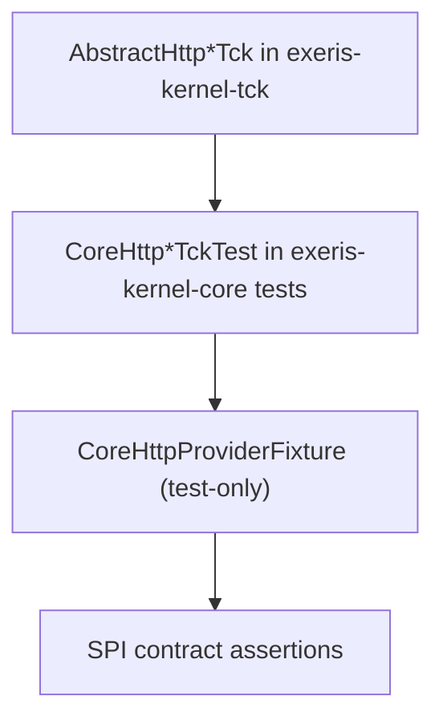

# Physical Tier: TCK (The Judge)

**Module:** `exeris-kernel-tck` (Technology Compatibility Kit)
**Dependencies:** `exeris-kernel-spi` (compile); JUnit Jupiter, AssertJ, Mockito and JMH, also at
compile scope, because the suites are this module's main sources.

> **Dependency direction:** the only Exeris module `exeris-kernel-tck` depends on is
> `exeris-kernel-spi`. It is `exeris-kernel-core`, `exeris-kernel-community` and
> `exeris-kernel-community-kafka` that consume `exeris-kernel-tck`, at `test` scope — not the other
> way around. They take its main jar; the module publishes no test-jar.

## 🗺️ Contract Verification Architecture: One Suite, Many Bindings

An abstract suite states a contract once, in SPI types, and leaves the provider under test to its
template methods. An implementation binds the suite with a concrete subclass that supplies that
provider, so each binding is judged by the suite's assertions rather than its own. The bindings in
this repository are Core's and Community's. Enterprise is not in this repository
([Enterprise](04-enterprise.md)), and its bindings are not described here.

The diagram shows the suites this page names and the bindings that run them here.

```mermaid
graph TD
    subgraph "exeris-kernel-tck (abstract suites, SPI types only)"
        TLS_TCK["AbstractCryptoEngineTck"]
        ZA_TCK["CryptoZeroAllocTck"]
        MEM_TCK["AbstractMemoryAllocatorTck"]
        REPO_TCK["AbstractPersistenceEngineTck"]
    end

    subgraph "exeris-kernel-core src/test (Core types, not published)"
        PAQS_TCK["AbstractPaqsSchedulerTck<br/>eu.exeris.kernel.core.transport.tck"]
    end

    subgraph "Core bindings"
        C_TLS["CoreOffHeapTlsEngineTckTest<br/>OffHeapTlsEngine"]
        C_ZA["CoreOffHeapTlsEngineZeroAllocTckTest<br/>OffHeapTlsEngine, guard path"]
        C_PAQS["CorePaqsSchedulerTckTest<br/>Core PaqsScheduler, stub allocator"]
    end

    subgraph "Community bindings"
        M_TLS["CommunityKernelCryptoProviderTckTest<br/>CommunityKernelCryptoProvider"]
        M_MEM["CommunityMemoryAllocatorTckTest<br/>CommunityMemoryProvider"]
        M_REPO["CommunityPersistenceEngineTckTest<br/>CommunityPersistenceProvider"]
    end

    TLS_TCK  -->|"bound by"| C_TLS & M_TLS
    ZA_TCK   -->|"bound by"| C_ZA
    MEM_TCK  -->|"bound by"| M_MEM
    REPO_TCK -->|"bound by"| M_REPO
    PAQS_TCK -->|"bound by"| C_PAQS

    style TLS_TCK  fill:#1a3a2a,color:#e0e0ff,stroke:#2ecc71
    style ZA_TCK   fill:#1a3a2a,color:#e0e0ff,stroke:#2ecc71
    style MEM_TCK  fill:#1a3a2a,color:#e0e0ff,stroke:#2ecc71
    style REPO_TCK fill:#1a3a2a,color:#e0e0ff,stroke:#2ecc71
    style PAQS_TCK fill:#1a3a2a,color:#e0e0ff,stroke:#2ecc71
    style C_TLS  fill:#2a1a4a,color:#e0e0ff,stroke:#9b59b6
    style C_ZA   fill:#2a1a4a,color:#e0e0ff,stroke:#9b59b6
    style C_PAQS fill:#2a1a4a,color:#e0e0ff,stroke:#9b59b6
    style M_TLS  fill:#0f3460,color:#e0e0ff,stroke:#4a90d9
    style M_MEM  fill:#0f3460,color:#e0e0ff,stroke:#4a90d9
    style M_REPO fill:#0f3460,color:#e0e0ff,stroke:#4a90d9
```

## 📊 What the Suites Assert

Allocation and buffer leaks are asserted from measurements, and a breach fails the bound test with
an assertion error:

| Contract | Suite | Assertion | In-repository binding |
| :-- | :-- | :-- | :-- |
| Allocation on the TLS path | `CryptoZeroAllocTck`, over `JfrAllocationMonitor` (JFR) | No `eu.exeris.*` heap allocation per iteration when the binding overrides `supportsZeroGcHotPath()` to return `true`; otherwise at most `maxExerisAllocationsPerIteration()` per iteration (default 5) | `CoreOffHeapTlsEngineZeroAllocTckTest`: the zero contract, measured on the guard path; the steady-state cipher path is not measured |
| `LoanedBuffer` leaks | `AbstractMemoryLeakDetectionTck` | The allocator runs in `LeakDetectionMode.PARANOID`; `allocatedBytes()` returns to 0 once every chunk is closed; `leakCount()` rises after GC for a buffer left open on purpose | `CommunityMemoryLeakDetectionParanoidTckTest` |

`CryptoZeroAllocTck` extends `AbstractSubsystemZeroAllocTck`, the base other subsystems' allocation
suites share; each binding chooses its tier and its per-iteration budget.

Latency, load-shedding time, bootstrap time and allocator complexity are not TCK gates. The abstract
JMH benchmarks in `eu.exeris.kernel.tck.perf` measure those paths against targets their own Javadoc
states, and assert nothing.

> **Adding a new SPI contract?** You MUST implement a corresponding `Abstract*Tck` class in `exeris-kernel-tck`
> before the PR is mergeable. A contract without a TCK suite is an unverified contract.

## ⚖️ Architectural Rules

1. **Verification, Not Implementation:** TCK provides test suites that verify if a given Driver (Community/Enterprise)
   correctly implements the SPI.
2. **Measured, then asserted:** allocation and carrier pinning are asserted from JFR recordings
   (`JfrAllocationMonitor`; `AbstractCarrierPinningTck` over `JfrPinningMonitor`). The benchmarks
   measure and do not assert (above).
3. **Leak Detection:** `AbstractMemoryLeakDetectionTck` forces `LeakDetectionMode.PARANOID` to catch
   unclosed off-heap memory segments; `AbstractLeakDetectionSampledTck` states the `SAMPLED` contract.

## HTTP TCK (Current Repository State)

HTTP SPI contract coverage is present in `exeris-kernel-tck` via abstract suites:

- `AbstractHttpProviderTck`
- `AbstractHttpServerEngineTck`
- `AbstractHttpClientEngineTck`
- `AbstractHttpHandlerTck`
- `AbstractHttpExchangeTck`

These suites validate provider discovery, lifecycle semantics, and handler/exchange contract behavior at SPI level.

`AbstractHttpClientTlsPeerVerificationTck` (since 0.12) judges the TLS clause of `HttpClientEngine#send`:
the server is verified against the engine's trust and against the host of the effective authority before
any request byte is sent. It is a suite apart from `AbstractHttpClientEngineTck`, so a provider binds it
when its client verifies; the Community client binds it (`CommunityHttpClientTlsPeerVerificationTckTest`),
and the Core fixture client, which speaks no TLS, does not. Its servers are the JDK's TLS stack and a
ClientHello probe, so no case depends on the provider's own server.

### Current Core Binding Coverage (HTTP)

Concrete Core bindings now present:

- `CoreHttpProviderTckTest` → `AbstractHttpProviderTck`
- `CoreHttpServerEngineTckTest` → `AbstractHttpServerEngineTck`
- `CoreHttpClientEngineTckTest` → `AbstractHttpClientEngineTck`
- `CoreHttpHandlerTckTest` → `AbstractHttpHandlerTck`
- `CoreHttpExchangeTckTest` → `AbstractHttpExchangeTck`

Community binds the same five suites in `exeris-kernel-community` (`CommunityHttpProviderTckTest`,
`CommunityHttpServerEngineTckTest`, `CommunityHttpClientEngineTckTest`, `CommunityHttpHandlerTckTest`,
`CommunityHttpExchangeTckTest`).

Binding mechanics:

- `CoreHttpProviderFixture` provides test-only minimal SPI fixtures for provider/server/client/exchange.
- `META-INF/services/eu.exeris.kernel.spi.http.HttpProvider` in Core test resources wires ServiceLoader contract assertions.

```mermaid
graph TD
    A[AbstractHttp*Tck in exeris-kernel-tck] --> B[CoreHttp*TckTest in exeris-kernel-core tests]
    B --> C["CoreHttpProviderFixture (test-only)"]
    C --> D[SPI contract assertions]
```

Non-goal of these bindings:

- They do not certify a production-grade HTTP transport runtime.
- They certify executable SPI behavior and contract conformance for HTTP interfaces.

## Stability

The 'TCK coverage' column of the [SPI Stability Matrix](../stability-matrix.md) names, per SPI
package, the `Abstract*Tck` suites that pin its behavior; this page describes how those suites are
built and bound.
