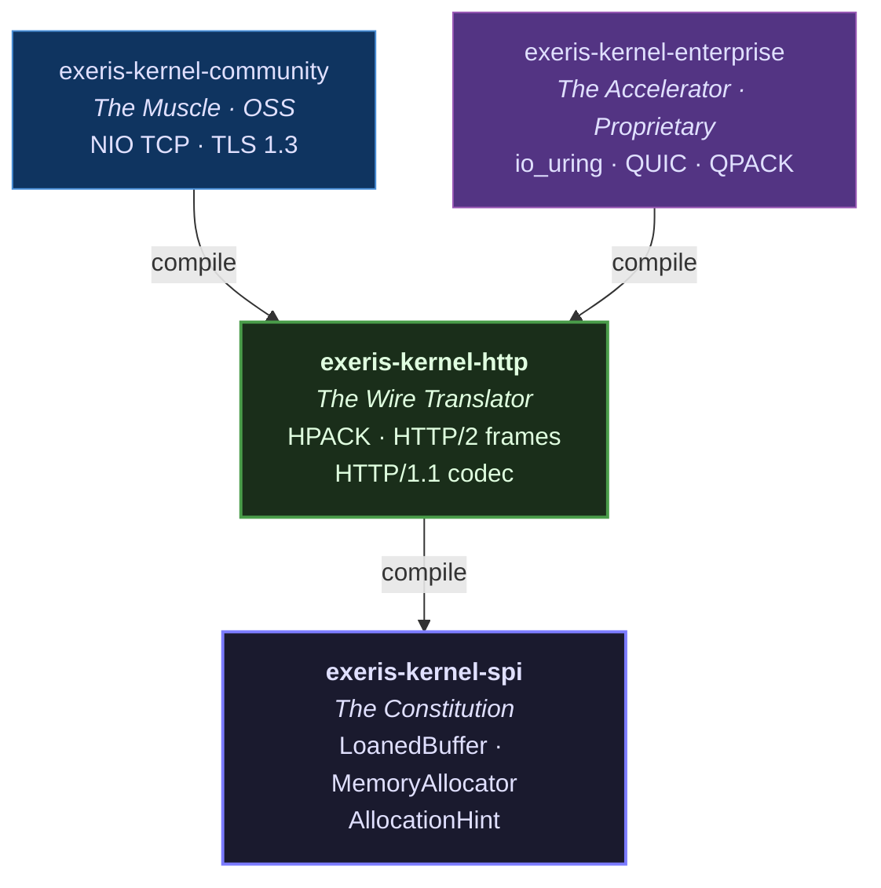
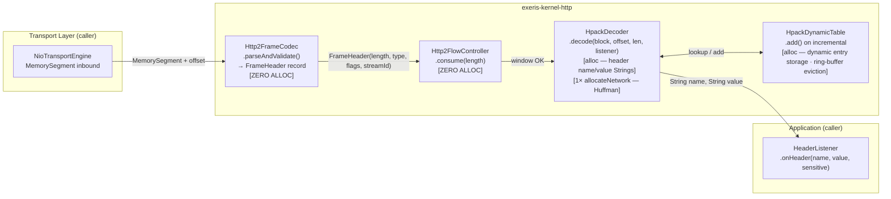
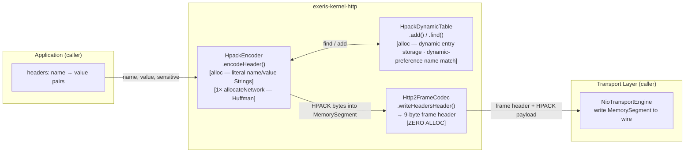
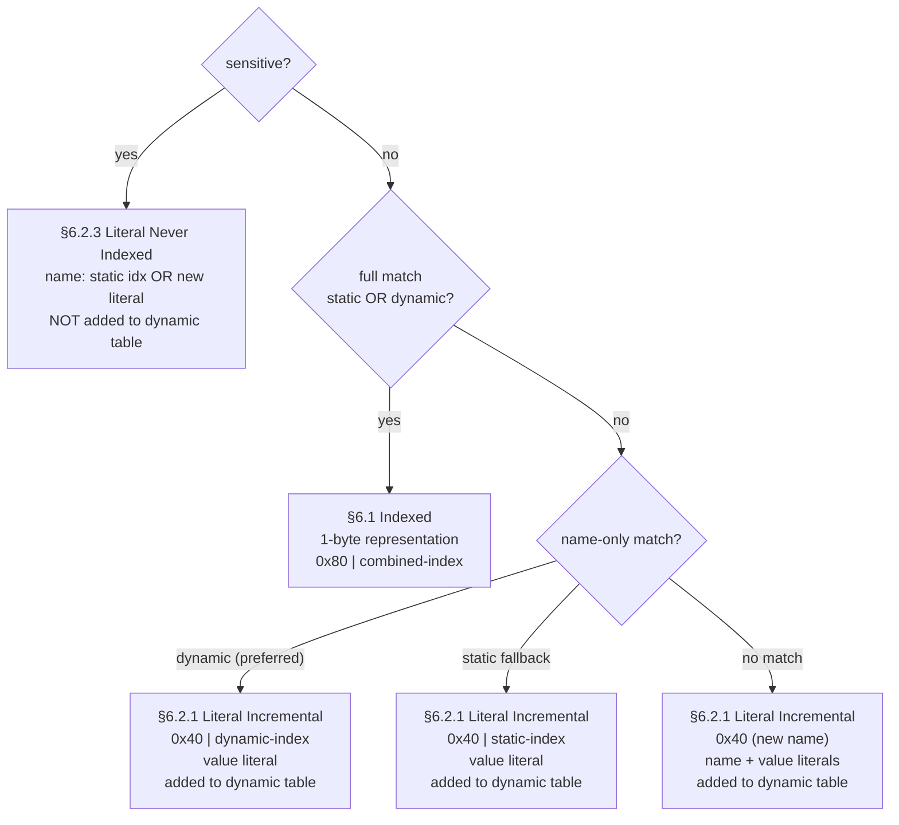

# Physical Tier: HTTP (The Wire Translator)

**Module:** `exeris-kernel-http`
**Dependencies:**
- `compile`: `exeris-kernel-spi` (`LoanedBuffer`, `MemoryAllocator`, `AllocationHint`)
- `test`: JUnit 5, AssertJ, `TestAllocator` (module-local Arena stub)

> **Implementation status:** All classes described below are fully implemented and
> production-ready as of `v0.5.0-SNAPSHOT` (`2026-03-11`). The four v0.5 transport
> integration blockers (CONTINUATION frames, connection preface, h2c upgrade,
> stream multiplexing) are owned by `exeris-kernel-community`, not by this module.
> See [ADR-009](../adr/ADR-009%20HTTP%20Codec%20module.md) for the full rationale.

---

## 🗺️ Position in the Dependency Graph

`exeris-kernel-http` sits between the SPI contracts and the transport implementations.
It is the only module that may implement HTTP wire-format logic. Neither Community nor
Enterprise may re-implement HPACK, HTTP/2 framing, or HTTP/1.1 parsing — they consume
this module's APIs exclusively.



**The Wall at this boundary:**
- `exeris-kernel-http` must never import `exeris-kernel-core`, Community, or Enterprise classes.
- Community and Enterprise must never re-implement wire-format logic — all HPACK/HTTP/2/HTTP/1.1
  logic belongs here.
- QPACK (RFC 9204) is **explicitly excluded** — it is QUIC-entangled and belongs in Enterprise.

---

## 🗺️ Data Flow: Inbound Header Block

How an inbound HPACK-compressed HTTP/2 HEADERS frame travels through this module.



---

## 🗺️ Data Flow: Outbound Response (HTTP/2)



---

## 🗺️ HPACK Encoding Decision Tree



Dynamic name-only match is preferred over static name-only to maximise compression for
recently added custom headers (e.g. `x-request-id`, `x-trace-id`).

---

## 🧩 Component Contracts

### HPACK — Header Compression (RFC 7541)

| Class | State | Thread Safety | RFC section |
|:---|:---|:---|:---|
| `Huffman` | Stateless | Thread-safe | Appendix B |
| `HuffmanTable` | Static `int[]` | Thread-safe | Appendix B |
| `HpackStaticTable` | Static `String[]` | Thread-safe | Appendix A |
| `HpackDynamicTable` | Per-connection | Not thread-safe | §4 |
| `HpackEncoder` | Per-connection | Not thread-safe | §6 |
| `HpackDecoder` | Per-connection | Not thread-safe | §3 |

**`HpackDynamicTable` invariants:**
- Index 0 = most recently added entry (RFC §2.3.2).
- `byteSize()` never exceeds `maxSize()`.
- After `setMaxSize(0)` the table is empty.
- `find()` priority: static full match > dynamic full match > dynamic name-only > static name-only.

**`HpackDecoder` limits:**
- `MAX_STRING_LITERAL = 65 536` bytes — strings larger than this throw `HpackDecodingException`.
- `MAX_INTEGER_SHIFT = 28` — protects against maliciously large multi-byte integers.
- `maxHeaderListSize` — cumulative decoded header list size limit (caller-configured).
- `protocolMaxTableSize` — SETTINGS_HEADER_TABLE_SIZE ceiling; a `§6.3` size update exceeding
  this throws `HpackDecodingException`. Updated via `setProtocolMaxTableSize(long)` after
  SETTINGS acknowledgement.
- `sizeUpdateAllowed` — per-block flag; a `§6.3` size update after any non-size-update
  representation throws `HpackDecodingException` (RFC §4.2 position rule).

### HTTP/2 Frame Codec (RFC 7540)

| Class | State | Allocation | RFC section |
|:---|:---|:---|:---|
| `Http2FrameParser` | Stateless | Zero | §4.1 |
| `Http2FrameEncoder` | Stateless | Zero | §4.1, §6 |
| `Http2FrameCodec` | Per-connection (`maxFrameSize`) | Zero | §4.2 |
| `Http2FlowController` | Per-direction (`windowSize`) | Zero | §5.2 |
| `Http2Settings` | Immutable record | Zero | §6.5 |
| `Http2HeaderBlockAssembler` | Per-connection (fragment buffer) | `allocateNetwork` on grow | §6.2, §6.10 |

**`Http2FrameEncoder` write methods:**

| Method | Frame type | Wire size | RFC |
|:---|:---|:---|:---|
| `writeHeader()` | any | 9 B | §4.1 |
| `writeSettings()` | SETTINGS | 9 + 6×N B | §6.5 |
| `writeWindowUpdate()` | WINDOW\_UPDATE | 13 B | §6.9 |
| `writeRstStream()` | RST\_STREAM | 13 B | §6.4 |
| `writeGoAway()` | GOAWAY | 17 B (no debug data) | §6.8 |
| `writeContinuation()` | CONTINUATION | 9 B (header only) | §6.10 |

**`Http2FlowController` semantics:**
- `consume(n)` returns `false` and leaves window unchanged if `n > windowSize`.
- `increment(n)` returns `false` if the result would exceed `Integer.MAX_VALUE`.
- `updateInitialWindowSize(old, new)` applies `windowSize += new - old`; the window **may go negative** after a SETTINGS reduction. This is correct per RFC 7540 §6.9.2 — the sender must pause until WINDOW\_UPDATE restores a positive window.

**`Http2Settings` sentinel:** `maxConcurrentStreams == -1` and `maxHeaderListSize == -1` mean "no limit". The SETTINGS frame encoder omits these parameters rather than sending a wire sentinel (RFC §6.5.2).

**`Http2HeaderBlockAssembler` contract:**
- `beginHeaders(header, payload, offset, length)` — starts a new header block from a HEADERS frame fragment. If `header.isEndHeaders()` is `true` the block is immediately complete.
- `appendContinuation(header, payload, offset, length)` — appends a CONTINUATION fragment. MUST be called for every frame while `isAwaitingContinuation()` is `true`.
- `validateContinuationMode(header)` — call for every inbound frame when `isAwaitingContinuation()`. Throws `ContinuationViolationException` on §6.10 violations; the transport MUST send GOAWAY(PROTOCOL\_ERROR).
- `completeBlock()` — returns the assembled `MemorySegment` slice when `isComplete()`. Valid until `reset()`.
- `reset()` — releases the internal `LoanedBuffer` and clears all state. MUST be called after the block is consumed by `HpackDecoder`.
- Maximum assembled block size: `65 536` bytes. Exceeding this is a connection error.

### HTTP/1.1 Codec (RFC 9112)

| Class | State | Thread Safety |
|:---|:---|:---|
| `Http1RequestParser` | Stateless | Thread-safe |
| `Http1ResponseEncoder` | Stateless | Thread-safe |
| `Http1ChunkedEncoder` | Stateless | Thread-safe |
| `Http1Codec` | Per-connection | Not thread-safe |

**`Http1RequestParser` DoS limits:**

| Limit | Default | Configurable via |
|:---|:---|:---|
| Max header fields | 100 | `parseHeaders(seg, off, len, maxHeaders, maxHeaderSize, visitor)` |
| Max header field size | 8 192 B | same overload |

Both limits throw `Http1RequestParser.Http1ParseException` on violation.
The default `parseHeaders(seg, off, len, visitor)` overload applies the defaults.

**`Http1Codec` lifecycle:**
1. `parseRequestLine()` — returns `null` if CRLF not yet received.
2. `parseHeaders()` — returns `-1` if block incomplete; updates `isKeepAlive()`, `pendingContentLength()`, and `upgradeState()`.
3. **h2c upgrade path:** if `upgradeState() == H2C_REQUESTED`:
   - Call `writeH2cSwitchingProtocols()` to emit `101 Switching Protocols`.
   - Base64url-decode `h2cSettingsPayload()` and apply as initial remote SETTINGS.
   - Switch to HTTP/2 framing; stream 1 carries the original request.
4. **Standard path:** application reads body if `pendingContentLength() != NO_BODY`.
5. `writeStatusAndConnection()` — emits status-line + `Connection` header.
6. Repeat from step 1 for next request (keep-alive path).

---

## 🧪 Testing Contract

The module follows the **Test Triad** mandated by the Exeris Kernel engineering protocol.
All 169 tests pass with zero PMD violations (as of `2026-03-11`).

### L0 — Unit Tests

Each class has a dedicated test file pinning its hot-path contract:

```
HuffmanTest              ← round-trip + 8 RFC Appendix C reference byte vectors
HuffmanTableTest         ← nibble FSM walk, packed-int layout
HpackStaticTableTest     ← 61 entries, index bounds, find() packed-result
HpackDynamicTableTest    ← add/evict/FIFO, circular buffer wrap, find() priority
HpackDecoderTest         ← §6.1 (incl. Huffman path), §6.2.2, §6.2.3, §6.3, errors
HpackEncoderTest         ← §6.1, §6.2.1, §6.2.3 (multi-byte integer), Huffman, §6.3
Http2FrameCodecTest      ← frame header round-trip, FRAME_SIZE_ERROR, constructor guards
Http2SupplementaryTest   ← RST_STREAM, GOAWAY, negative window §6.9.2, StreamState
Http1RequestParserTest   ← request-line, headers, colon-in-value, DoS limits
Http1ResponseEncoderTest ← status codes, header accumulation, terminal CRLF
Http1CodecTest           ← keep-alive, Content-Length reset, chunked edge cases
```

### L1 — Integration Tests

```
HpackRoundTripTest  ← Encoder → Decoder over shared dynamic table,
                      multi-header blocks, Huffman toggle
```

### L2 — RFC Conformance

```
HpackRfc7541AppendixCTest  ← 9 byte-exact vectors from RFC 7541 Appendix C.2–C.4
                              C.2.1 (literal incremental new name)
                              C.2.2 (literal no-index, indexed name)
                              C.2.3 (literal never-indexed)
                              C.2.4 (indexed field 0x82)
                              C.3.1–C.3.3 (3-request sequence with dynamic table state)
                              C.4.1 and C.4.3 (Huffman-encoded fields)
```

> **Why L2 tests are mandatory:** A round-trip test can pass even when encoder and decoder
> share a symmetric bug. Only byte-level assertions against the RFC normative vectors
> guarantee wire compatibility with external implementations (nghttp2, Netty, Go `net/http2`).

---

## 🧱 Architectural Rules (L0 Enforcement)

1. **No transport imports.** This module must never import `java.net.*`, `java.io.*`,
   `ByteBuffer`, NIO channels, or any class from Core/Community/Enterprise.

2. **No Arena in business logic.** `Arena.ofConfined()` and `Arena.ofShared()` are banned
   in production code. All allocation goes through `MemoryAllocator` — the allocator
   selects the appropriate tier (Community heap-pool or Enterprise slab).

3. **allocateNetwork() for variable-size scratch.** Huffman encode/decode scratch buffers
   must use `allocator.allocateNetwork(estimatedBytes)`, not a fixed `AllocationHint`,
   because header value sizes can reach `MAX_STRING_LITERAL` (64 KB).

4. **Per-connection instances.** `HpackEncoder`, `HpackDecoder`, `HpackDynamicTable`, and
   `Http1Codec` are stateful and not thread-safe. Each connection must own one instance of
   each. Sharing across connections is a protocol violation (RFC 7541 §2.2).

5. **Big-endian always.** All multi-byte HTTP/2 wire fields (payload length, stream ID,
   error codes, window increments) are big-endian per RFC 7540 §4.1. Never use
   `ValueLayout.JAVA_INT_UNALIGNED` (native byte order) for HTTP/2 integer fields on x86.

6. **`HpackDecodingException` is a connection error.** Any `HpackDecodingException` must
   cause the transport layer to send `GOAWAY` with `COMPRESSION_ERROR` and close the
   connection (RFC 7541 §6, RFC 7540 §4.3). The decoder does not recover.

