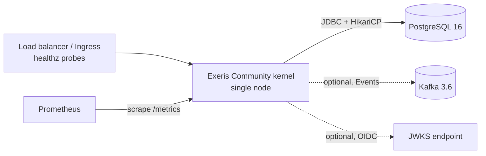

# Exeris Kernel — Reference Deployment (single-node Community)

> Operator-facing reference for deploying the **open-core (Community)** kernel as a single node.
> Pre-1.0 / TRL-3 — this is the validated baseline shape, not a hardened production HA topology.
> Multi-node and the Enterprise overlay (`io_uring`, slab pools, QUIC) are a separate concern; see the
> [Support Matrix](../support-matrix.md) for what is in vs out of open-core scope.

## Topology

- **Kernel** — one JVM, one node. Horizontal scale is the host application's concern (no built-in clustering).
- **PostgreSQL 16** — required for Persistence, Flow snapshot store, and the transactional outbox. Pooled via HikariCP.
- **Kafka 3.6** *(optional)* — only when the Events subsystem uses the Kafka driver (`exeris-kernel-community-kafka`). Without it, Events runs on the in-memory bus.
- **JWKS endpoint** *(optional)* — only when OIDC/JWT validation is enabled (Security subsystem); supports key rotation with an overlap window.

## Runtime profile

| Setting | Value |
|:--------|:------|
| **JDK** | Java 25 LTS or newer — **no `--enable-preview`** (Loom VTs, Panama FFM and `ScopedValue` are all GA). Pass `--enable-native-access=ALL-UNNAMED` for the FFM transport/crypto paths. |
| **Profile** | `kernel.profile=PROD` (opaque error codes; DEV exposes stack traces — keep PROD in deployment) |
| **TLS** | OpenSSL 3.0 – 4.x (fd-owner engine); 3.x floor retained for FIPS-provider compatibility (ADR-008) |
| **HTTP** | HTTP/1.1 + HTTP/2 (h2 + h2c), TLS 1.2 / 1.3 |
| **GC** | G1 is the safe default; size the heap to the working set (see envelope). |

Run the kernel JVM on **JDK 25 LTS or newer**. The distributed artifact is preview-clean since 0.11 (ADR-066), so the flag this document previously mandated is not merely unnecessary — passing it is not what the shipped jar is built for. The separate `-preview` artifact tracks the newest JDK and does require the flag; it is a different coordinate, chosen deliberately, and this deployment is not it. See [`support-matrix.md`](../support-matrix.md), which this table must agree with.

If you build on the box, Maven needs a JDK matching the build's own baseline; a lower one fails with an opaque classworlds trace.

## Resource envelope (reference baseline — validate per workload)

These are **starting baselines**, not guarantees. Validate against your own workload — the dedicated
benchmark harness (the separate `exeris-benchmarks` repository, run per machine + driver) is the
authority for measured throughput/latency; this doc deliberately quotes no fixed RPS/latency figure.

| Resource | Reference baseline |
|:---------|:-------------------|
| Heap | ~512 MiB (`-Xmx512m`) for a typical mid-size domain; grow with aggregate count + outbox depth |
| Total RAM | ~1 GiB (heap + off-heap network buffers + JVM overhead) |
| CPU | 1 vCPU minimum; 2+ recommended (reactor + VT scheduler + DB pool) |
| Disk | Postgres-sized; the kernel itself is near-stateless apart from JFR recordings |

**Boot SLO** (performance contract, measured via the `KernelBootReady` JFR event): cold-start **P99 ≤ 500 ms (Community) / ≤ 800 ms (Enterprise)** — see [`../whitepaper.md`](../whitepaper.md). Do **not** set a nonzero probe `initialDelay`; use `initialDelaySeconds: 0` plus a `startupProbe` (the manifest in [`bootstrap.md`](../subsystems/bootstrap.md) budgets a generous cold-start window via `startupProbe` while readiness/liveness poll from t=0).

## Observability

- **Health probes** — `GET /healthz/readiness` and `GET /healthz/liveness` (bodyless; status in the `X-Exeris-Health` header). Readiness is `200` only when the kernel is `STARTED` and every required subsystem is `RUNNING`; a required subsystem gone **`DEGRADED`** post-boot (e.g. its DB/broker dropped) returns readiness `503` (drain the instance) while liveness stays `200` (don't kill it) — it recovers automatically when the dependency returns. Wire `readinessProbe` + `livenessProbe` to these; see [`bootstrap.md`](../subsystems/bootstrap.md) for the full state semantics and the manifest snippet.
- **Metrics** — Prometheus pull sink; scrape the kernel's metrics endpoint. (OTLP export + distributed tracing are deferred — ADR-031; there is no tracing logic in the kernel today.)
- **JFR** — the kernel is JFR-first (bootstrap, allocation, transport, lifecycle/state-change, exception-mapping events). For an operator baseline, run a continuous recording with the default JFR config; raise specific event categories when diagnosing. Lifecycle/failure points (incl. the post-boot `SubsystemHealthTransition` DEGRADED↔RUNNING event) leave a typed trail.

## Continuity (upgrade / restart / recovery)

Validated by the v0.9 operational-continuity suite (the `recovery-continuity-gate` CI job):

- **Restart recovery** — parked Flow/saga snapshots survive a full engine restart (state lives in Postgres); on cold start the kernel resumes parked sagas from their checkpoint step.
- **Degraded mode** — losing a required dependency (DB/broker) drives the subsystem to `DEGRADED` → readiness drains, liveness holds, automatic recovery on return.
- Drain on rolling update: keep `readinessProbe.periodSeconds` ≤ 5 s so a draining pod is removed from rotation quickly (see [`bootstrap.md`](../subsystems/bootstrap.md) graceful-shutdown notes).

## Known operational limits (Community)

- **Single-node, NIO carrier** — no `io_uring`, no slab pools (Enterprise overlay). Best-effort performance contract.
- **Server push is SSE-only** — one-directional `HttpStreamExchange` since 0.10 ([ADR-043](../adr/ADR-043-kernel-http-streaming-spi.md)); no WebSocket, so full-duplex clients still poll. The SSE body is HTTP/1.1 close-delimited today, which matters for reverse proxies that buffer length-unknown responses — see [`subsystems/http.md`](../subsystems/http.md).
- **Events do not cross the node boundary on the default driver** — the in-heap bus is single-node and the Outbox is durable *emission*, not cross-node delivery; fanning out to peers means running the Kafka driver. See [`subsystems/events.md`](../subsystems/events.md) → *Delivery Boundary*.
- **No cross-node coordination seam** — distributed lock / leader election / singleton execution are the host application's concern today.
- **No cache of any kind ships with the kernel** — no in-process cache dependency is declared anywhere in the reactor, and there is no `CacheProvider` SPI. An application that needs caching brings its own.

## See also
- [`../support-matrix.md`](../support-matrix.md) — supported runtime, SPI status, Community vs Enterprise scope, deferred capabilities.
- [`../stability-matrix.md`](../stability-matrix.md) — per-SPI-surface stability + TCK evidence.
- [`../subsystems/bootstrap.md`](../subsystems/bootstrap.md) — readiness/liveness/DEGRADED semantics + Kubernetes manifest snippet.
