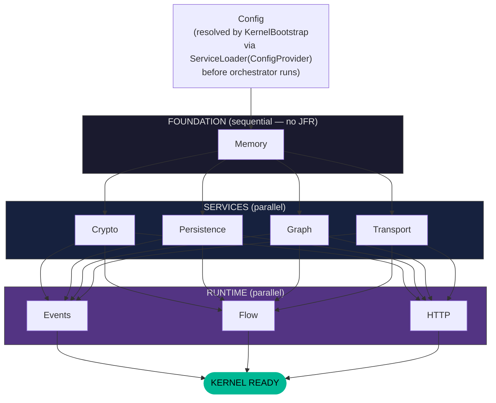
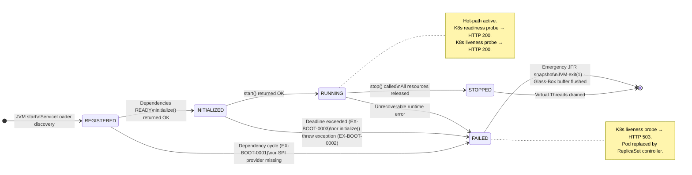
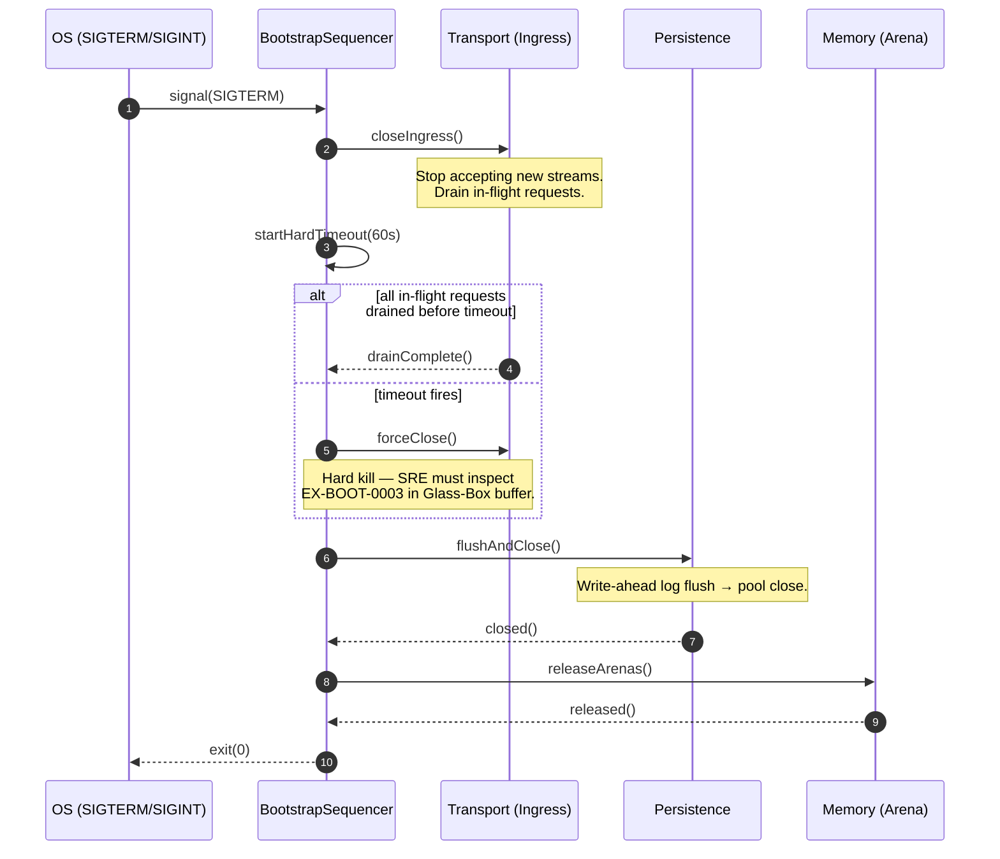
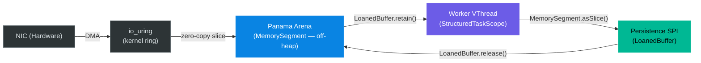
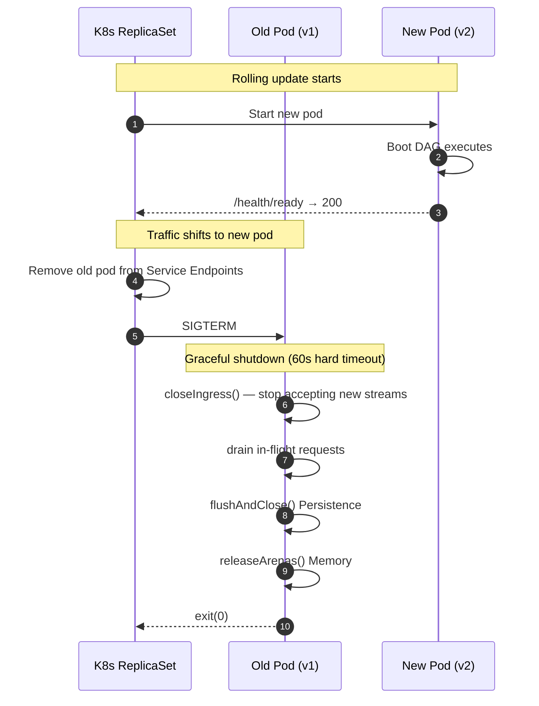

# Kernel Subsystem: Bootstrap (L0 Orchestration)

**Physical Layout:**

- **SPI:** `eu.exeris.kernel.spi.bootstrap.*`  
  *(Subsystem contracts, Lifecycle, Registry)*

- **Core:** `eu.exeris.kernel.core.bootstrap.*`  
  *(Sequence Manager, Health Monitor, Failure Policies)*

> `KernelBootstrap` (entry point) lives in `eu.exeris.kernel.core.bootstrap`. 
> Signal handling (SIGTERM/SIGINT) is not yet implemented; 
> callers are responsible for invoking `boot()` and managing JVM shutdown.

**Layer:** L0 (Orchestration)  
**Status:** Validated Architectural Prototype (TRL‑3) — targeting JDK 26 GA / Valhalla EA

---

## Overview

The **Bootstrap subsystem** is the central orchestrator of the Exeris Kernel.  
It manages the strictly ordered initialization sequence of all subsystems, ensuring that foundational layers (Config,
Memory) are fully operational before higher‑level logic (Transport, Flow) is activated.

> **L0 / L1 Boundary:** L0 Foundation subsystems (Config, Memory, Exceptions) initialize in total silence — no
> telemetry infrastructure is yet available. Telemetry (L1) is the first system to attach after L0 is READY,
> providing the **"Glass Box"** visibility for all subsequent layers (L1–L4). Any failure during L0 is recorded
> via the pre-allocated **Glass-Box deterministic buffer** — JFR events are unavailable until Telemetry completes
> its own init.

### Key Characteristics

- **Dependency‑Ordered Init**  
  Directed acyclic graph (DAG) resolves subsystem order.  
  Config always first → Memory seconds → everything else follows.

- **Virtual Thread Parallelization**  
  L1 and L2 subsystems (Security, Persistence, Graph, Transport) initialize in parallel using `StructuredTaskScope`.

- **Fail‑Fast vs Degrade**  
  Configurable failure policies:
    - *FAIL_FAST* → Strict Mode (Target Standard) for high-density edge environments
    - *DEGRADE* → ideal for local dev or emergency maintenance

- **Graceful Shutdown**  
  Transport closes Ingress, awaits deterministic hard timeout (60 s), then Persistence flushes and closes pools.

---

## Diagram 1 — Boot DAG (Flowchart)



---

## Diagram 1b — Subsystem State Machine

Each subsystem registered in the Boot DAG transitions through this state machine independently.
Core's `SubsystemOrchestrator` drives transitions; transitions are irreversible — there is no `RESTART`.



---

## Diagram 2 — Graceful Teardown (Sequence)



---

## Diagram 3 — Zero-Copy Ingest Pipeline



> **Zero-Copy Contract:** Data crosses the NIC → JVM boundary exactly **once** via DMA into the Panama Arena.  
> Every downstream step operates on `MemorySegment` slices. No `byte[]` copies. No `ByteBuffer` wrapping.  
> The `LoanedBuffer.release()` call at the Persistence layer is the sole deallocation point.

---

## The "Holy Order" of Initialization

A layer can only start if all layers below it are **READY**.

```
FOUNDATION:   Memory (sequential)
SERVICES:     Crypto & Persistence & Graph & Transport (parallel)
RUNTIME:      Events & Flow & HTTP (parallel)
```

> **Config** is resolved by `KernelBootstrap` via `ServiceLoader<ConfigProvider>` before the orchestrator runs — it is not a `Subsystem`. `Exceptions` is not a Subsystem layer.

---

## Core Philosophy

### 1. Deterministic Startup

No classpath magic.  
Every subsystem must be explicitly registered or discovered via `ServiceLoader`.

### 2. Failure Sovereignty

Bootstrap decides the fate of the Kernel:

- **FAIL_FAST** → Strict Mode (Target Standard). Mandatory for high-density edge environments.
- **DEGRADE** → Reserved for local dev or emergency maintenance only. Never deploy to production in this mode.

> Exeris targets **JDK 26 LTS** with **Valhalla Readiness (JEP 401 EA Preview)**. The heap-allocation budgets
> in `performance-contract.md` are met today via C2 JIT Escape Analysis scalarisation of `record`/`final class`
> data carriers. Migration to `value record`/`value class` (requiring `value` keyword) is deferred until
> JEP 401 reaches mainline GA — at that point, object-header elimination will further reduce memory pressure
> without any architectural change.

### 3. Signal Awareness

Bootstrap translates OS signals (`SIGTERM`, `SIGINT`) into a controlled, reverse‑ordered shutdown sequence
with deterministic hard timeouts at each layer boundary (see Diagram 2).

---

## Responsibilities

### What Bootstrap SPI **does**

- Defines `Subsystem` (lifecycle contract: `initialize()`, `start()`, `stop()`, `dependsOn()`, `phase()`, `isOptional()`, `providerBindings()`)
- Defines `SubsystemProvider` (ServiceLoader discovery; `priority()` default=100)
- Defines `BootstrapSelector` (immutable record: which subsystems to activate)
- Defines `BootstrapPhase` enum (`FOUNDATION`, `SERVICES`, `RUNTIME`)
- Config is NOT a Subsystem — resolved by `KernelBootstrap` via `ServiceLoader<ConfigProvider>` before the orchestrator runs
- Health state is tracked by `KernelHealthMonitor` (Core). The class implements the SPI read-only contract `eu.exeris.kernel.spi.bootstrap.HealthProbe` (introduced in 0.7.0) so HTTP handlers, sidecar reporters, and Enterprise observers can consume probe state without coupling to the Core orchestrator class.

### What Bootstrap Core **does**

- Resolves dependency graph of all subsystems
- Manages subsystem state machine:  
  `INIT → STARTING → READY → SHUTTING_DOWN`
- Provides Health Check Registry for Kubernetes probes

---

## Error Codes (Deterministic Telemetry)

| Code             | Severity               | Meaning                        | Action                                                        |
|------------------|------------------------|--------------------------------|---------------------------------------------------------------|
| **EX‑BOOT‑0001** | `[FATAL_BUILD_DEFECT]` | Dependency cycle detected      | Kernel cannot boot. Treat as a CI/CD error, **not** a production anomaly. This code means the application will never open a port. Fix the `dependsOn()` graph before shipping. |
| **EX‑BOOT‑0002** | FATAL                  | Bootstrap failure (opaque)     | Fatal exit. `rawArgs` layout is variable — treat as opaque payload for hex/string dump. Glass-Box decoder cannot rely on field ordering for this code. |
| **EX‑BOOT‑0003** | CRITICAL               | Bootstrap deadline exceeded    | Subsystem did not complete init within the deadline. Kill or degrade. |
| **EX‑BOOT‑0004** | CRITICAL               | Memory provider init failure   | `MemoryProvider` could not initialise its off-heap tier (e.g., `mmap` permission denied, insufficient system memory, missing native library). `rawArgs[0]=String providerName`, `rawArgs[1]=long requestedBytes`. Inspect Glass-Box deterministic buffer. |
| **EX‑BOOT‑3001** | CRITICAL               | Telemetry provider init failure | `TelemetryProvider` failed to initialize. Check `rawArgs[0]=providerName`, `rawArgs[1]=reason`. |

> **EX‑BOOT‑0001 is not a runtime event.** A dependency cycle is a build defect.  
> If this code surfaces in production, your deployment pipeline has failed. Gate on it in CI with `mvn clean install`.

---

## Code Examples

### 1. Subsystem Registration (SPI)

```java
public class PersistenceSubsystem implements Subsystem {

    @Override
    public List<String> dependsOn() {
        return List.of("memory");
    }

    @Override
    public BootstrapPhase phase() {
        return BootstrapPhase.SERVICES;
    }

    @Override
    public void initialize() {
        ConfigProvider config = KernelProviders.CURRENT_CONFIG.get();
        // Setup connection pools using config
    }

    @Override
    public void start() { /* activate */ }

    @Override
    public void stop() { /* flush and release */ }
}
```

---

### 2. Parallel Boot Strategy (Core — JDK 26 Joiner API)

Exeris targets JDK 26 LTS / Valhalla EA. Parallel layers (L1/L2) are joined using
`awaitAllSuccessfulOrThrow`, ensuring that a single failure in any native module triggers an immediate,
safe cancellation of the entire boot sequence.

```java
import java.util.concurrent.StructuredTaskScope;
import java.util.concurrent.StructuredTaskScope.Joiner;

try (var scope = StructuredTaskScope.open(Joiner.awaitAllSuccessfulOrThrow())) {
    scope.fork(() -> security.start());
    scope.fork(() -> persistence.start());

    scope.join();

} catch (StructuredTaskScope.FailedException e) {
    throw new KernelBootstrapException(KernelErrorCodes.EX_BOOT_0002, e.getCause());
}
```

---

## Testing Strategy

### Unit Tests

- DAG resolver detects circular dependencies → asserts `EX‑BOOT‑0001` is thrown at construction time, not at runtime
- Failure policy correctness (FAIL_FAST / Strict Mode vs DEGRADE)

### Integration Tests

- Full boot trace with JFR timing
- Signal handling (SIGTERM → correct shutdown order per Diagram 2)
- Hard timeout fires correctly when in-flight drain exceeds 60 s
- Health probe accuracy (`/health/ready` returns 503 until L4 READY)

> **Note:** `AbstractBootstrapOrchestratorTck` and `BootstrapZeroAllocTck` require concrete bindings in `exeris-kernel-community` tests (binding missing as of current state — open TCK debt).

---

## Summary

The Bootstrap subsystem is the guardian of the Kernel's lifecycle. By enforcing a strict, dependency-aware boot sequence
and using JDK 26 Joiner-based `StructuredTaskScope`, it ensures that the Exeris Kernel starts fast, fails safely,
and shuts down gracefully with **deterministic hard timeouts** at every layer boundary, maintaining system integrity
at all times.

---

## Kubernetes Health Probes

> **Status (0.7.0):** Probe state and an HTTP handler are implemented; an auto-bound embedded HTTP health server on a dedicated port is still **🚧 Planned (TRL-4 target)**. Operators wire the handler into their HTTP server engine themselves until the auto-bind landing.

### Probe contract

`KernelHealthMonitor` (Core) implements `eu.exeris.kernel.spi.bootstrap.HealthProbe` and exposes two snapshots:

- **Readiness** — UP only when the kernel has transitioned to `STARTED` and every required subsystem is `RUNNING`. Returns `STARTING` while the Boot DAG is in progress, while a required subsystem is still initializing, and during `SHUTTING_DOWN`. Returns `DEGRADED` (not ready) when a **required** subsystem has gone `DEGRADED` — live but impaired after boot, e.g. its broker died — so the load balancer drains the instance; a still-initializing required subsystem outranks `DEGRADED` for the status label. A **degraded optional** subsystem never sheds readiness. Returns `FAILED` after `FAILED` state.
- **Liveness** — UP after the kernel has transitioned to `INITIALIZED`. Returns `STARTING` before that point. Returns `DOWN` only after `FAILED` state. A `DEGRADED` subsystem never affects liveness — the process stays alive so it can recover (`DEGRADED → RUNNING` is reversible).

### `HealthEndpointHandler` (Community)

`eu.exeris.kernel.community.health.HealthEndpointHandler` is an `HttpHandler` that surfaces the probe over HTTP. Construct it with any `HealthProbe` implementation (the orchestrator-owned `KernelHealthMonitor` is the canonical caller) and register it with the HTTP server engine:

```java
HealthEndpointHandler health = new HealthEndpointHandler(orchestrator.healthMonitor());
httpServerEngine.setHandler(health);   // or compose into an application router
httpServerEngine.start();
```

| Probe         | Default path             | Healthy            | Not healthy                                            |
|:--------------|:-------------------------|:-------------------|:-------------------------------------------------------|
| **Readiness** | `/healthz/readiness`     | `200 OK`           | `503 Service Unavailable`                              |
| **Liveness**  | `/healthz/liveness`      | `200 OK`           | `503 Service Unavailable`                              |

Custom paths are available via `new HealthEndpointHandler(probe, readinessPath, livenessPath)`. The textual probe status (`READY`, `STARTING`, `DEGRADED`, `UP`, `DOWN`, `FAILED`) is mirrored into the response header `X-Exeris-Health` for human diagnostics — Kubernetes probes evaluate the status code only, so responses are bodyless. A required-subsystem `DEGRADED` surfaces as readiness `503` + `X-Exeris-Health: DEGRADED` while liveness stays `200`.

The handler returns:
- `404 Not Found` for paths that match neither probe, without invoking the probe;
- `405 Method Not Allowed` with `Allow: GET` for non-`GET` methods on a probe path.

The contract is pinned by `eu.exeris.kernel.tck.contract.health.AbstractHealthEndpointTck` plus the Community binding `CommunityHealthEndpointTckTest`. End-to-end behavior with the real `KernelHealthMonitor` is pinned by `HealthEndpointHandlerKernelMonitorIntegrationTest`.

### `CommunitySubsystemHealthWatcher` (Community, host-wired)

`KernelHealthMonitor` only marks a subsystem `RUNNING` at boot; it does not re-poll afterwards. To drop readiness when a dependency dies *after* boot (and restore it on recovery), `eu.exeris.kernel.community.bootstrap.CommunitySubsystemHealthWatcher` runs a background poll that reconciles each live subsystem's health into the monitor's reversible `RUNNING ↔ DEGRADED` axis. It transitions **only** that axis — never resurrecting `FAILED`/`STOPPED` nor racing the boot DAG — and treats a throwing health source as impaired.

Like `HealthEndpointHandler`, the watcher is **wired by the host**, not by kernel `main` — it stays Wall-clean by knowing the *concrete* Community subsystems and pushing state through the public `markSubsystemState` (no generic subsystem-health method is added to the SPI; that is deferred to v0.10). Construct it after boot, register each subsystem's health source (e.g. persistence's `canServiceRequest()` — the same signal that deterministically denies requests under ADR-012), `start()` it, and `stop()` it on shutdown:

```java
KernelHealthMonitor monitor = bootstrap.healthMonitor();
var watcher = new CommunitySubsystemHealthWatcher(monitor, Duration.ofSeconds(5).toNanos());
watcher.register("persistence", persistenceEngine::canServiceRequest);
watcher.start();                 // after the kernel reaches STARTED
// ... on shutdown:
watcher.stop();
```

The reconciliation + lifecycle is pinned by `CommunitySubsystemHealthWatcherTest`; the full `health-source → watcher → monitor → /healthz/readiness` path (503 + `X-Exeris-Health: DEGRADED` and recovery) by `HealthEndpointHandlerKernelMonitorIntegrationTest`.

### Kubernetes manifest snippet

```yaml
livenessProbe:
  httpGet:
    path: /healthz/liveness
    port: 8080                     # data-plane port, until the auto-bound health port lands
  initialDelaySeconds: 0
  periodSeconds: 5
  failureThreshold: 3

readinessProbe:
  httpGet:
    path: /healthz/readiness
    port: 8080
  initialDelaySeconds: 0
  periodSeconds: 2
  failureThreshold: 60             # 60 × 2s = 120s max tolerated boot time

startupProbe:
  httpGet:
    path: /healthz/readiness
    port: 8080
  failureThreshold: 30
  periodSeconds: 5                 # 30 × 5s = 150s cold-start budget
```

> **Dedicated port (planned, TRL-4):** A future revision will auto-bind the handler on a dedicated, non-data-plane port (`exeris.bootstrap.healthPort`, default `9090`) so probes can observe lifecycle state from the very first millisecond — even before the data-plane transport binds. Until then, operators register the handler with the application HTTP engine and probe the data-plane port.

---

## Boot Observability

Bootstrap completion is tracked via `BootstrapJfrEvents.KernelBootReadyEvent`. The event records `totalDurationMs` and `activeSubsystemCount` for the completed startup sequence.

**Sequence included in `totalDurationMs`:**
- L0 foundation init (Config → Memory → Exceptions)
- L1 parallel init (Security + Persistence)
- L2 parallel init (Graph + Transport — includes native library loading)
- L3/L4 parallel init (Events + Flow)
- Health server bind

> **JVM warm-up note:** The first requests after boot will experience JIT compilation overhead while C2 compiles the hot path. This is expected and distinct from bootstrap completion — the readiness probe reflects DAG completion, not first-request throughput.

---

## Rolling Deployment Strategy (Kubernetes)

In a rolling update, K8s terminates old pods only after new pods pass the readiness probe. The interaction
between Bootstrap graceful shutdown and the readiness probe must be precisely understood:



> **Critical invariant:** The old pod's `/health/ready` returns `503` immediately when `closeIngress()` is
> called (within milliseconds of receiving SIGTERM). This prevents K8s from routing any new request to the
> shutting-down pod. The `readinessProbe` periodSeconds must be ≤ 5 s to ensure fast endpoint removal.

> **`terminationGracePeriodSeconds`:** Set to `75` seconds (60 s hard drain timeout + 15 s buffer for
> Persistence flush and Arena release). Setting it lower than `60` risks `SIGKILL` before drain completes,
> resulting in `EX-BOOT-0003` in the crash buffer.

---

## L0 Crash Observability — Memory-Mapped Crash Buffer (TRL-4 Requirement)

**Status:** Required for TRL-4 certification. Not yet implemented (TRL-3 baseline uses in-RAM Glass-Box buffer only).

### Problem

The pre-allocated Glass-Box deterministic buffer (L0, pre-JFR) lives exclusively in JVM heap/off-heap RAM.
If the JVM crashes fatally (`SIGSEGV`, `OutOfMemoryError` before JFR starts, hardware fault), the diagnostic
data in the buffer is lost permanently. The operator has no post-mortem data.

### Contract

The L0 Glass-Box buffer **MUST** be backed by a memory-mapped file (`mmap`/`MapViewOfFile`) so that the OS
kernel guarantees durability of written bytes even on a hard JVM crash.

| Property        | Value                                                                                               |
|:----------------|:----------------------------------------------------------------------------------------------------|
| **Default path** | `/tmp/exeris-crash/kernel-<pid>.ring`                                                              |
| **Override ENV** | `EXERIS_CRASH_DIR` — if set, replaces `/tmp/exeris-crash/`                                        |
| **File size**    | Fixed-size, pre-allocated at L0 boot (default: 4 MB). Never grown dynamically.                    |
| **Format**       | Binary Glass-Box frames (same layout as `GlassBoxSerializer` ring buffer — see `telemetry.md`)    |
| **Lifecycle**    | Created at L0 init, closed (and optionally renamed to `kernel-<pid>-<timestamp>.ring`) on graceful shutdown. Survives JVM crash. |
| **Permissions**  | Owner read/write only (`0600`). File is not rotated — a new PID gets a new file.                  |

### Durability Contract

Exeris does **not** call `msync` on the hot write path. Maintaining Zero-Syscall semantics on L0 is a
non-negotiable invariant (see `performance-contract.md`). Instead, each frame is written with
`VarHandle.releaseFence()` after the final field to enforce JVM-level store ordering.

The OS page-dirty mechanism then handles asynchronous persistence of dirty pages to the filesystem
cache. **This does not constitute a hard durability guarantee.** On a sudden power failure or hard
kernel panic before the OS has flushed dirty pages, frames written after the last OS-driven page flush
may be lost. Operators requiring power-loss durability must ensure OS-level journaling or use a UPS.

For graceful JVM crashes (`SIGSEGV`, uncaught exception), the OS signal handler will typically flush
dirty pages before process termination — but this is a best-effort OS behaviour, not a contract.

The canonical open crash-file decoder is designed to tolerate partial frames at the end of the
crash buffer (ring-wrap corruption) and skip undecodable frames silently.

### Operator Recovery

The kernel is producer-only here: the L0 buffer writes `.ring` files in the shared `exeris-telemetry-spec`
wire format. Decoding is done by the **single canonical open decoder** — the open subset of the
`exeris-enterprise-observability` decoder/forensics path (`FrameDecoder`, `FrameValidator`,
`CrashBufferReader`), which reads the binary `kernel-<pid>.ring` file and decodes each Glass-Box frame into
human-readable error reports using the `rawArgs` binary layout defined in `telemetry.md`. The kernel ships
no duplicate decoder. The file=open / live=enterprise decoder cut is recorded in
[ADR-039](../adr/ADR-039-open-core-observability-boundary.md) (Open-Core Observability Boundary); the
state-vs-event split (state via `KernelDiagnostics`, events via this binary format) is recorded in ADR-033.

```
$ exeris-decode /tmp/exeris-crash/kernel-12345.ring
[0000ns] EX-BOOT-0001: DAG cycle detected — cycleMembers=[Security, Flow]
[0042ns] EX-MEM-1002: Arena leak detected — segmentAddress=0x7f3a00000000, segmentByteSize=65536
```

### Implementation Notes (for Kernel Engineers)

- The mapped segment MUST be allocated through `MemoryAllocator` (infrastructure tier) — never via
  `Arena.ofConfined()` or `Arena.ofShared()` directly.
- Write pointer is a `VarHandle`-managed `int` at offset 0 of the segment — atomic, no lock.
- Each frame is written with `VarHandle.releaseFence()` after the last field to ensure ordering.
- The buffer wraps around on overflow (ring semantics) — oldest frames are overwritten.

---

## Stability

This subsystem's SPI surface (`eu.exeris.kernel.spi.bootstrap.*`) is classified **stable** in the
[SPI Stability Matrix](../stability-matrix.md). See the matrix for the semver policy and TCK
coverage status.

