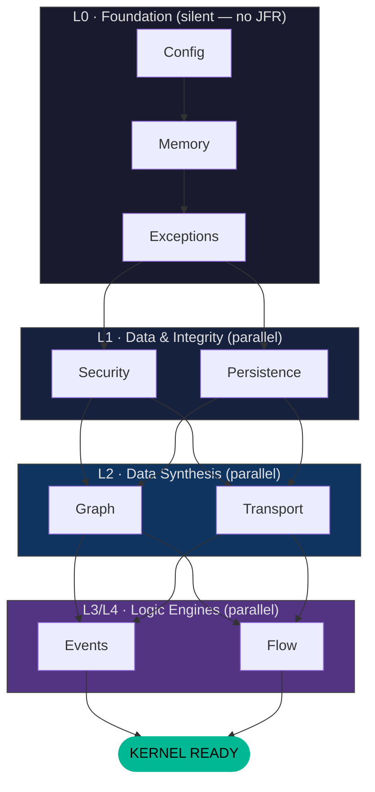
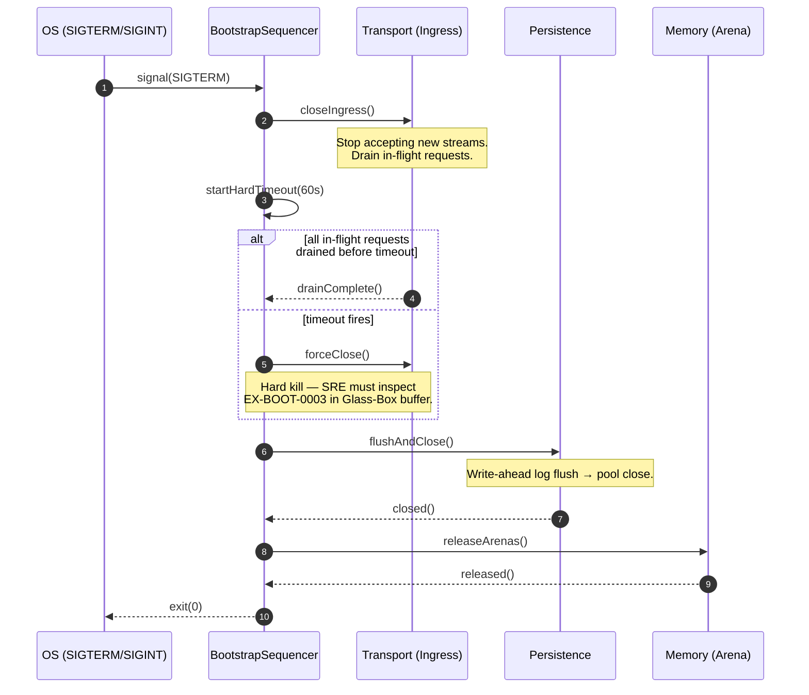
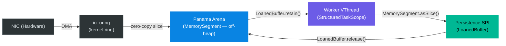

# Kernel Subsystem: Bootstrap (L0 Orchestration)

**Physical Layout:**

- **SPI:** `eu.exeris.kernel.spi.bootstrap.*`  
  *(Subsystem contracts, Lifecycle, Registry)*

- **Core:** `eu.exeris.kernel.core.bootstrap.*`  
  *(Sequence Manager, Health Monitor, Failure Policies)*

- **Runner:** `eu.exeris.kernel.launcher.*`  
  *(CLI, Main-Class, Signal Handling)*

**Layer:** L0 (Orchestration)  
**Status:** Validated Architectural Prototype (TRL‑3) — targeting JDK 26 GA / Valhalla EA

---

## Overview

The **Bootstrap subsystem** is the central orchestrator of the Exeris Kernel.  
It manages the strictly ordered initialization sequence of all subsystems, ensuring that foundational layers (Config,
Memory) are fully operational before higher‑level logic (Transport, Flow) is activated.

> **L0 / L1 Boundary:** L0 Foundation subsystems (Config, Memory, Exceptions) initialize in total silence — no
> telemetry infrastructure is yet available. Telemetry (L1) is the first system to attach after L0 is READY,
> providing the **"Glass Box"** visibility for all subsequent layers (L1–L4). Any failure during L0 is recorded
> via the pre-allocated **Glass-Box deterministic buffer** — JFR events are unavailable until Telemetry completes
> its own init.

### Key Characteristics

- **Dependency‑Ordered Init**  
  Directed acyclic graph (DAG) resolves subsystem order.  
  Config always first → Memory seconds → everything else follows.

- **Virtual Thread Parallelization**  
  L1 and L2 subsystems (Security, Persistence, Graph, Transport) initialize in parallel using `StructuredTaskScope`.

- **Fail‑Fast vs Degrade**  
  Configurable failure policies:
    - *FAIL_FAST* → Strict Mode (Target Standard) for high-density edge environments
    - *DEGRADE* → ideal for local dev or emergency maintenance

- **Graceful Shutdown**  
  Transport closes Ingress, awaits deterministic hard timeout (60 s), then Persistence flushes and closes pools.

---

## Diagram 1 — Boot DAG (Flowchart)



---

## Diagram 2 — Graceful Teardown (Sequence)



---

## Diagram 3 — Zero-Copy Ingest Pipeline



> **Zero-Copy Contract:** Data crosses the NIC → JVM boundary exactly **once** via DMA into the Panama Arena.  
> Every downstream step operates on `MemorySegment` slices. No `byte[]` copies. No `ByteBuffer` wrapping.  
> The `LoanedBuffer.release()` call at the Persistence layer is the sole deallocation point.

---

## The "Holy Order" of Initialization

A layer can only start if all layers below it are **READY**.

```
Foundation (L0):   Config → Memory → Exceptions
Data & Integrity (L1):   Security & Persistence
Data Synthesis (L2):     Graph & Transport
Logic Engines (L3/L4):   Events & Flow
```

---

## Core Philosophy

### 1. Deterministic Startup

No classpath magic.  
Every subsystem must be explicitly registered or discovered via `ServiceLoader`.

### 2. Failure Sovereignty

Bootstrap decides the fate of the Kernel:

- **FAIL_FAST** → Strict Mode (Target Standard). Mandatory for high-density edge environments.
- **DEGRADE** → Reserved for local dev or emergency maintenance only. Never deploy to production in this mode.

> Exeris targets **JDK 26 LTS / Valhalla EA** because without `value record` scalarization and JEP 401 object-header
> elimination, the heap-allocation budgets in `performance-contract.md` cannot be met.

### 3. Signal Awareness

Bootstrap translates OS signals (`SIGTERM`, `SIGINT`) into a controlled, reverse‑ordered shutdown sequence
with deterministic hard timeouts at each layer boundary (see Diagram 2).

---

## Responsibilities

### What Bootstrap SPI **does**

- Defines `KernelSubsystem` and `Lifecycle`
- Provides `KernelContext` during boot
- Defines `HealthStatus` and `SubsystemPriority`

### What Bootstrap Core **does**

- Resolves dependency graph of all subsystems
- Manages subsystem state machine:  
  `INIT → STARTING → READY → SHUTTING_DOWN`
- Provides Health Check Registry for Kubernetes probes

---

## Error Codes (Deterministic Telemetry)

| Code             | Severity               | Meaning                   | Action                                                        |
|------------------|------------------------|---------------------------|---------------------------------------------------------------|
| **EX‑BOOT‑0001** | `[FATAL_BUILD_DEFECT]` | Dependency cycle detected | Kernel cannot boot. Treat as a CI/CD error, **not** a production anomaly. This code means the application will never open a port. Fix the `dependsOn()` graph before shipping. |
| **EX‑BOOT‑0002** | FATAL                  | Foundation failure        | Fatal exit                                                    |
| **EX‑BOOT‑0003** | CRITICAL               | Timeout during init       | Kill or degrade                                               |
| **EX‑BOOT‑0004** | CRITICAL               | Shutdown hook interrupted | Inspect Glass-Box deterministic buffer                        |

> **EX‑BOOT‑0001 is not a runtime event.** A dependency cycle is a build defect.  
> If this code surfaces in production, your deployment pipeline has failed. Gate on it in CI with `mvn clean install`.

---

## Code Examples

### 1. Subsystem Registration (SPI)

```java
public class PersistenceSubsystem implements KernelSubsystem {

    @Override
    public List<Class<? extends KernelSubsystem>> dependsOn() {
        return List.of(ConfigSubsystem.class, MemorySubsystem.class);
    }

    @Override
    public void initialize(KernelContext ctx) {
        // Setup Connection Pools using Config
    }
}
```

---

### 2. Parallel Boot Strategy (Core — JDK 26 Joiner API)

Exeris targets JDK 26 LTS / Valhalla EA. Parallel layers (L1/L2) are joined using
`awaitAllSuccessfulOrThrow`, ensuring that a single failure in any native module triggers an immediate,
safe cancellation of the entire boot sequence.

```java
import java.util.concurrent.StructuredTaskScope;
import java.util.concurrent.StructuredTaskScope.Joiner;

try (var scope = StructuredTaskScope.open(Joiner.awaitAllSuccessfulOrThrow())) {
    scope.fork(() -> security.start());
    scope.fork(() -> persistence.start());

    scope.join();

} catch (StructuredTaskScope.FailedException e) {
    throw new KernelBootstrapException(KernelErrorCodes.EX_BOOT_0002, e.getCause());
}
```

---

## Testing Strategy

### Unit Tests

- DAG resolver detects circular dependencies → asserts `EX‑BOOT‑0001` is thrown at construction time, not at runtime
- Failure policy correctness (FAIL_FAST / Strict Mode vs DEGRADE)

### Integration Tests

- Full boot trace with JFR timing
- Signal handling (SIGTERM → correct shutdown order per Diagram 2)
- Hard timeout fires correctly when in-flight drain exceeds 60 s
- Health probe accuracy (`/health/ready` returns 503 until L4 READY)

---

## Summary

The Bootstrap subsystem is the guardian of the Kernel's lifecycle. By enforcing a strict, dependency-aware boot sequence
and using JDK 26 Joiner-based `StructuredTaskScope`, it ensures that the Exeris Kernel starts fast, fails safely,
and shuts down gracefully with **deterministic hard timeouts** at every layer boundary, maintaining system integrity
at all times.
