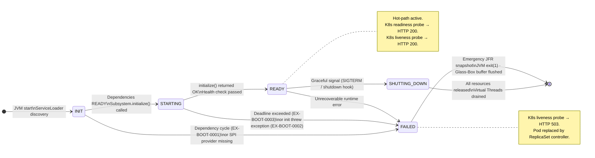
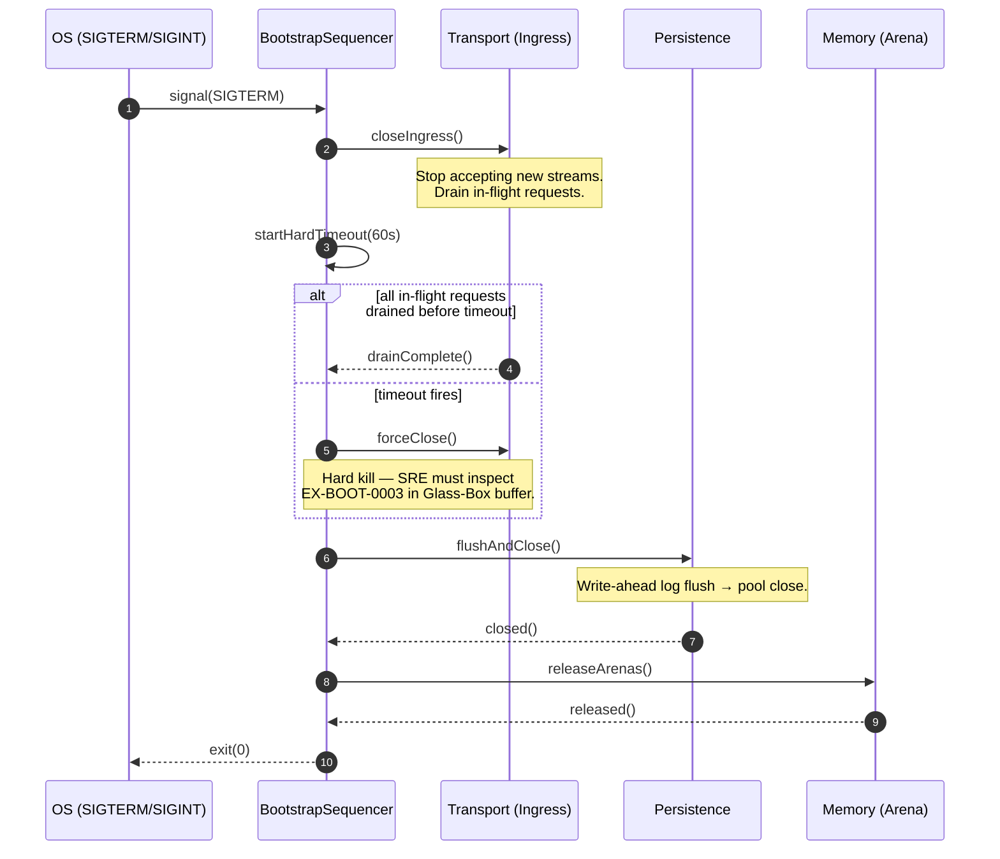
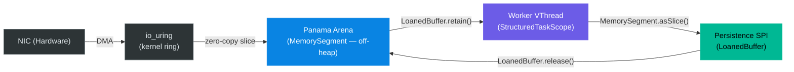
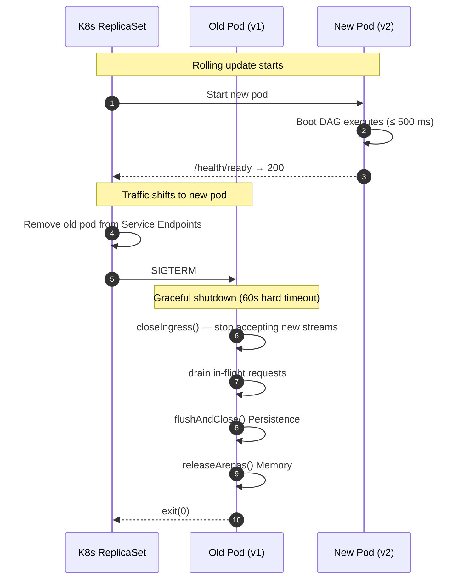

# Kernel Subsystem: Bootstrap (L0 Orchestration)

**Physical Layout:**

- **SPI:** `eu.exeris.kernel.spi.bootstrap.*`  
  *(Subsystem contracts, Lifecycle, Registry)*

- **Core:** `eu.exeris.kernel.core.bootstrap.*`  
  *(Sequence Manager, Health Monitor, Failure Policies)*

- **Runner:** `eu.exeris.kernel.launcher.*`  
  *(CLI, Main-Class, Signal Handling)*

**Layer:** L0 (Orchestration)  
**Status:** Validated Architectural Prototype (TRL‑3) — targeting JDK 26 GA / Valhalla EA

---

## Overview

The **Bootstrap subsystem** is the central orchestrator of the Exeris Kernel.  
It manages the strictly ordered initialization sequence of all subsystems, ensuring that foundational layers (Config,
Memory) are fully operational before higher‑level logic (Transport, Flow) is activated.

> **L0 / L1 Boundary:** L0 Foundation subsystems (Config, Memory, Exceptions) initialize in total silence — no
> telemetry infrastructure is yet available. Telemetry (L1) is the first system to attach after L0 is READY,
> providing the **"Glass Box"** visibility for all subsequent layers (L1–L4). Any failure during L0 is recorded
> via the pre-allocated **Glass-Box deterministic buffer** — JFR events are unavailable until Telemetry completes
> its own init.

### Key Characteristics

- **Dependency‑Ordered Init**  
  Directed acyclic graph (DAG) resolves subsystem order.  
  Config always first → Memory seconds → everything else follows.

- **Virtual Thread Parallelization**  
  L1 and L2 subsystems (Security, Persistence, Graph, Transport) initialize in parallel using `StructuredTaskScope`.

- **Fail‑Fast vs Degrade**  
  Configurable failure policies:
    - *FAIL_FAST* → Strict Mode (Target Standard) for high-density edge environments
    - *DEGRADE* → ideal for local dev or emergency maintenance

- **Graceful Shutdown**  
  Transport closes Ingress, awaits deterministic hard timeout (60 s), then Persistence flushes and closes pools.

---

## Diagram 1 — Boot DAG (Flowchart)


---

## Diagram 1b — Subsystem State Machine

Each subsystem registered in the Boot DAG transitions through this state machine independently.
Core's `BootstrapSequencer` drives transitions; transitions are irreversible — there is no `RESTART`.



---

## Diagram 2 — Graceful Teardown (Sequence)



---

## Diagram 3 — Zero-Copy Ingest Pipeline



> **Zero-Copy Contract:** Data crosses the NIC → JVM boundary exactly **once** via DMA into the Panama Arena.  
> Every downstream step operates on `MemorySegment` slices. No `byte[]` copies. No `ByteBuffer` wrapping.  
> The `LoanedBuffer.release()` call at the Persistence layer is the sole deallocation point.

---

## The "Holy Order" of Initialization

A layer can only start if all layers below it are **READY**.

```
Foundation (L0):   Config → Memory → Exceptions
Data & Integrity (L1):   Security & Persistence
Data Synthesis (L2):     Graph & Transport
Logic Engines (L3/L4):   Events & Flow
```

---

## Core Philosophy

### 1. Deterministic Startup

No classpath magic.  
Every subsystem must be explicitly registered or discovered via `ServiceLoader`.

### 2. Failure Sovereignty

Bootstrap decides the fate of the Kernel:

- **FAIL_FAST** → Strict Mode (Target Standard). Mandatory for high-density edge environments.
- **DEGRADE** → Reserved for local dev or emergency maintenance only. Never deploy to production in this mode.

> Exeris targets **JDK 26 LTS** with **Valhalla Readiness (JEP 401 EA Preview)**. The heap-allocation budgets
> in `performance-contract.md` are met today via C2 JIT Escape Analysis scalarisation of `record`/`final class`
> data carriers. Migration to `value record`/`value class` (requiring `value` keyword) is deferred until
> JEP 401 reaches mainline GA — at that point, object-header elimination will further reduce memory pressure
> without any architectural change.

### 3. Signal Awareness

Bootstrap translates OS signals (`SIGTERM`, `SIGINT`) into a controlled, reverse‑ordered shutdown sequence
with deterministic hard timeouts at each layer boundary (see Diagram 2).

---

## Responsibilities

### What Bootstrap SPI **does**

- Defines `KernelSubsystem` and `Lifecycle`
- Provides `KernelContext` during boot
- Defines `HealthStatus` and `SubsystemPriority`

### What Bootstrap Core **does**

- Resolves dependency graph of all subsystems
- Manages subsystem state machine:  
  `INIT → STARTING → READY → SHUTTING_DOWN`
- Provides Health Check Registry for Kubernetes probes

---

## Error Codes (Deterministic Telemetry)

| Code             | Severity               | Meaning                        | Action                                                        |
|------------------|------------------------|--------------------------------|---------------------------------------------------------------|
| **EX‑BOOT‑0001** | `[FATAL_BUILD_DEFECT]` | Dependency cycle detected      | Kernel cannot boot. Treat as a CI/CD error, **not** a production anomaly. This code means the application will never open a port. Fix the `dependsOn()` graph before shipping. |
| **EX‑BOOT‑0002** | FATAL                  | Bootstrap failure (opaque)     | Fatal exit. `rawArgs` layout is variable — treat as opaque payload for hex/string dump. Glass-Box decoder cannot rely on field ordering for this code. |
| **EX‑BOOT‑0003** | CRITICAL               | Bootstrap deadline exceeded    | Subsystem did not complete init within the deadline. Kill or degrade. |
| **EX‑BOOT‑0004** | CRITICAL               | Memory provider init failure   | `MemoryProvider` could not initialise its off-heap tier (e.g., `mmap` permission denied, insufficient system memory, missing native library). `rawArgs[0]=String providerName`, `rawArgs[1]=long requestedBytes`. Inspect Glass-Box deterministic buffer. |

> **EX‑BOOT‑0001 is not a runtime event.** A dependency cycle is a build defect.  
> If this code surfaces in production, your deployment pipeline has failed. Gate on it in CI with `mvn clean install`.

---

## Code Examples

### 1. Subsystem Registration (SPI)

```java
public class PersistenceSubsystem implements KernelSubsystem {

    @Override
    public List<Class<? extends KernelSubsystem>> dependsOn() {
        return List.of(ConfigSubsystem.class, MemorySubsystem.class);
    }

    @Override
    public void initialize(KernelContext ctx) {
        // Setup Connection Pools using Config
    }
}
```

---

### 2. Parallel Boot Strategy (Core — JDK 26 Joiner API)

Exeris targets JDK 26 LTS / Valhalla EA. Parallel layers (L1/L2) are joined using
`awaitAllSuccessfulOrThrow`, ensuring that a single failure in any native module triggers an immediate,
safe cancellation of the entire boot sequence.

```java
import java.util.concurrent.StructuredTaskScope;
import java.util.concurrent.StructuredTaskScope.Joiner;

try (var scope = StructuredTaskScope.open(Joiner.awaitAllSuccessfulOrThrow())) {
    scope.fork(() -> security.start());
    scope.fork(() -> persistence.start());

    scope.join();

} catch (StructuredTaskScope.FailedException e) {
    throw new KernelBootstrapException(KernelErrorCodes.EX_BOOT_0002, e.getCause());
}
```

---

## Testing Strategy

### Unit Tests

- DAG resolver detects circular dependencies → asserts `EX‑BOOT‑0001` is thrown at construction time, not at runtime
- Failure policy correctness (FAIL_FAST / Strict Mode vs DEGRADE)

### Integration Tests

- Full boot trace with JFR timing
- Signal handling (SIGTERM → correct shutdown order per Diagram 2)
- Hard timeout fires correctly when in-flight drain exceeds 60 s
- Health probe accuracy (`/health/ready` returns 503 until L4 READY)

---

## Summary

The Bootstrap subsystem is the guardian of the Kernel's lifecycle. By enforcing a strict, dependency-aware boot sequence
and using JDK 26 Joiner-based `StructuredTaskScope`, it ensures that the Exeris Kernel starts fast, fails safely,
and shuts down gracefully with **deterministic hard timeouts** at every layer boundary, maintaining system integrity
at all times.

---

## Kubernetes Health Probes

Bootstrap registers an embedded HTTP health server on a dedicated, non-data-plane port. The server binds before
the Boot DAG executes — K8s can observe lifecycle state from the very first millisecond.

| Probe            | Path            | Port (default) | Behaviour                                                                                                          |
|:-----------------|:----------------|:--------------:|:-------------------------------------------------------------------------------------------------------------------|
| **Liveness**     | `/health/live`  | `9090`         | Returns `HTTP 200 {"status":"UP"}` once `KernelBootstrap` has transitioned past `INIT`. Returns `HTTP 503` only if the JVM is in `FAILED` state (unrecoverable). Never returns 503 during normal boot — K8s must not restart a pod that is still starting. |
| **Readiness**    | `/health/ready` | `9090`         | Returns `HTTP 200 {"status":"READY"}` **only** after all L4 subsystems have reached `READY` state (Boot DAG complete). Returns `HTTP 503 {"status":"STARTING"}` during boot. K8s routes traffic to this pod only when the readiness probe is 200. |
| **Startup probe**| `/health/ready` | `9090`         | Use as K8s `startupProbe` target. Prevents liveness probe from timing out during a slow cold start (native lib loading). |

**Kubernetes manifest snippet:**

```yaml
livenessProbe:
  httpGet:
    path: /health/live
    port: 9090
  initialDelaySeconds: 0     # Probe starts immediately — see Boot SLO below
  periodSeconds: 5
  failureThreshold: 3

readinessProbe:
  httpGet:
    path: /health/ready
    port: 9090
  initialDelaySeconds: 0
  periodSeconds: 2
  failureThreshold: 60       # 60 × 2s = 120s max tolerated boot time

startupProbe:
  httpGet:
    path: /health/ready
    port: 9090
  failureThreshold: 30
  periodSeconds: 5           # 30 × 5s = 150s budget before K8s kills the pod
```

> **Port override:** The health port is configurable via `exeris.bootstrap.healthPort` (default `9090`).
> The data-plane transport port is configured separately — never share ports between health and data traffic.

---

## Boot SLO (Cold Start Latency Contract)

| Tier              | Target P99 Cold Start | JFR Measurement                              | K8s `readinessProbe` failureThreshold |
|:------------------|:---------------------:|:---------------------------------------------|:-------------------------------------:|
| **Community**     | ≤ 500 ms              | `KernelBootstrapEvent.durationNanos` (total) | 60 × 2 s = 120 s budget              |
| **Enterprise**    | ≤ 800 ms              | Same (includes native `io_uring` ring init)  | 60 × 2 s = 120 s budget              |

The 500 ms / 800 ms figures include:
- L0 foundation init (Config → Memory → Exceptions)
- L1 parallel init (Security + Persistence)
- L2 parallel init (Graph + Transport — includes native library loading)
- L3/L4 parallel init (Events + Flow)
- Health server bind

> **JVM warm-up note:** The first requests after boot will experience JIT compilation overhead (~50 ms for
> C2 to compile the hot path). This is expected and does not constitute a Boot SLO violation. The SLO
> measures time until the readiness probe returns `200`, not time until first request is served at full speed.

---

## Rolling Deployment Strategy (Kubernetes)

In a rolling update, K8s terminates old pods only after new pods pass the readiness probe. The interaction
between Bootstrap graceful shutdown and the readiness probe must be precisely understood:



> **Critical invariant:** The old pod's `/health/ready` returns `503` immediately when `closeIngress()` is
> called (within milliseconds of receiving SIGTERM). This prevents K8s from routing any new request to the
> shutting-down pod. The `readinessProbe` periodSeconds must be ≤ 5 s to ensure fast endpoint removal.

> **`terminationGracePeriodSeconds`:** Set to `75` seconds (60 s hard drain timeout + 15 s buffer for
> Persistence flush and Arena release). Setting it lower than `60` risks `SIGKILL` before drain completes,
> resulting in `EX-BOOT-0003` in the crash buffer.

---

## L0 Crash Observability — Memory-Mapped Crash Buffer (TRL-4 Requirement)

**Status:** Required for TRL-4 certification. Not yet implemented (TRL-3 baseline uses in-RAM Glass-Box buffer only).

### Problem

The pre-allocated Glass-Box deterministic buffer (L0, pre-JFR) lives exclusively in JVM heap/off-heap RAM.
If the JVM crashes fatally (`SIGSEGV`, `OutOfMemoryError` before JFR starts, hardware fault), the diagnostic
data in the buffer is lost permanently. The operator has no post-mortem data.

### Contract

The L0 Glass-Box buffer **MUST** be backed by a memory-mapped file (`mmap`/`MapViewOfFile`) so that the OS
kernel guarantees durability of written bytes even on a hard JVM crash.

| Property        | Value                                                                                               |
|:----------------|:----------------------------------------------------------------------------------------------------|
| **Default path** | `/tmp/exeris-crash/kernel-<pid>.bin`                                                               |
| **Override ENV** | `EXERIS_CRASH_DIR` — if set, replaces `/tmp/exeris-crash/`                                        |
| **File size**    | Fixed-size, pre-allocated at L0 boot (default: 4 MB). Never grown dynamically.                    |
| **Format**       | Binary Glass-Box frames (same layout as `GlassBoxSerializer` ring buffer — see `telemetry.md`)    |
| **Lifecycle**    | Created at L0 init, closed (and optionally renamed to `kernel-<pid>-<timestamp>.bin`) on graceful shutdown. Survives JVM crash. |
| **Permissions**  | Owner read/write only (`0600`). File is not rotated — a new PID gets a new file.                  |

### Durability Contract

Exeris does **not** call `msync` on the hot write path. Maintaining Zero-Syscall semantics on L0 is a
non-negotiable invariant (see `performance-contract.md`). Instead, each frame is written with
`VarHandle.releaseFence()` after the final field to enforce JVM-level store ordering.

The OS page-dirty mechanism then handles asynchronous persistence of dirty pages to the filesystem
cache. **This does not constitute a hard durability guarantee.** On a sudden power failure or hard
kernel panic before the OS has flushed dirty pages, frames written after the last OS-driven page flush
may be lost. Operators requiring power-loss durability must ensure OS-level journaling or use a UPS.

For graceful JVM crashes (`SIGSEGV`, uncaught exception), the OS signal handler will typically flush
dirty pages before process termination — but this is a best-effort OS behaviour, not a contract.

The operator recovery tool (`exeris-decoder`) is designed to tolerate partial frames at the end of the
crash buffer (ring-wrap corruption) and skip undecodable frames silently.

### Operator Recovery

The `exeris-decoder` CLI tool reads the binary `kernel-<pid>.bin` file and decodes each Glass-Box frame
into human-readable error reports using the `rawArgs` binary layout defined in `telemetry.md`.

```
$ exeris-decoder /tmp/exeris-crash/kernel-12345.bin
[0000ns] EX-BOOT-0001: DAG cycle detected — cycleMembers=[Security, Flow]
[0042ns] EX-MEM-1002: Arena leak detected — segmentAddress=0x7f3a00000000, segmentByteSize=65536
```

### Implementation Notes (for Kernel Engineers)

- The mapped segment MUST be allocated through `MemoryAllocator` (infrastructure tier) — never via
  `Arena.ofConfined()` or `Arena.ofShared()` directly.
- Write pointer is a `VarHandle`-managed `int` at offset 0 of the segment — atomic, no lock.
- Each frame is written with `VarHandle.releaseFence()` after the last field to ensure ordering.
- The buffer wraps around on overflow (ring semantics) — oldest frames are overwritten.


