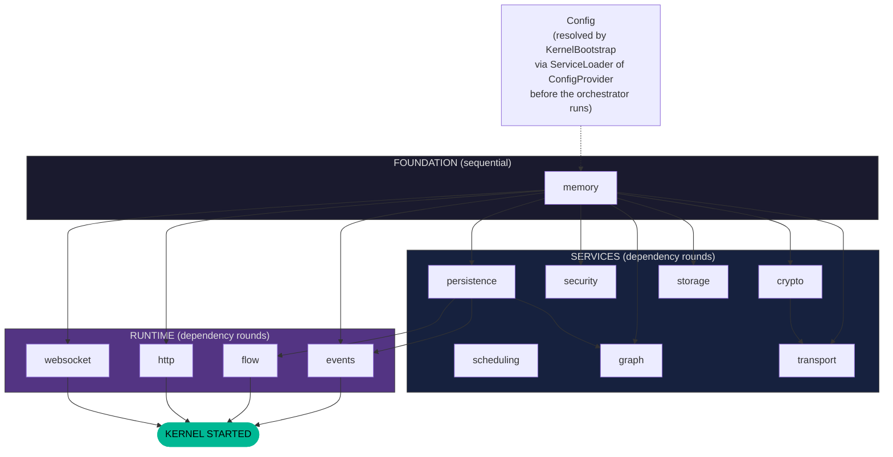
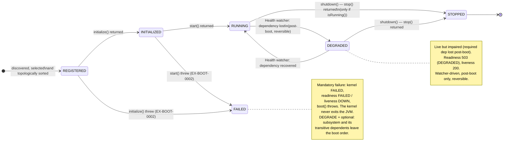
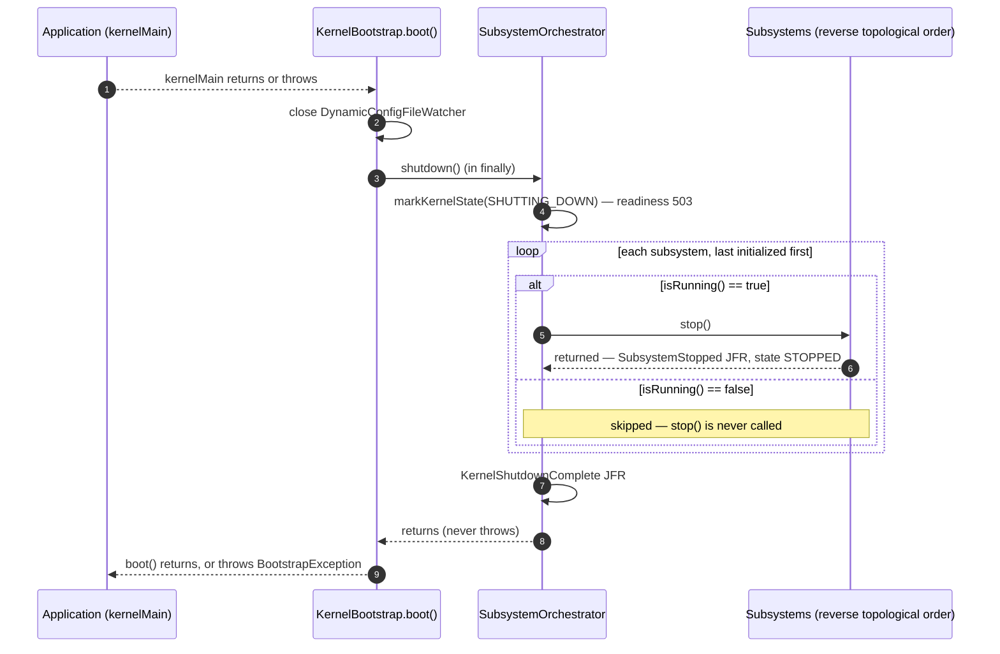
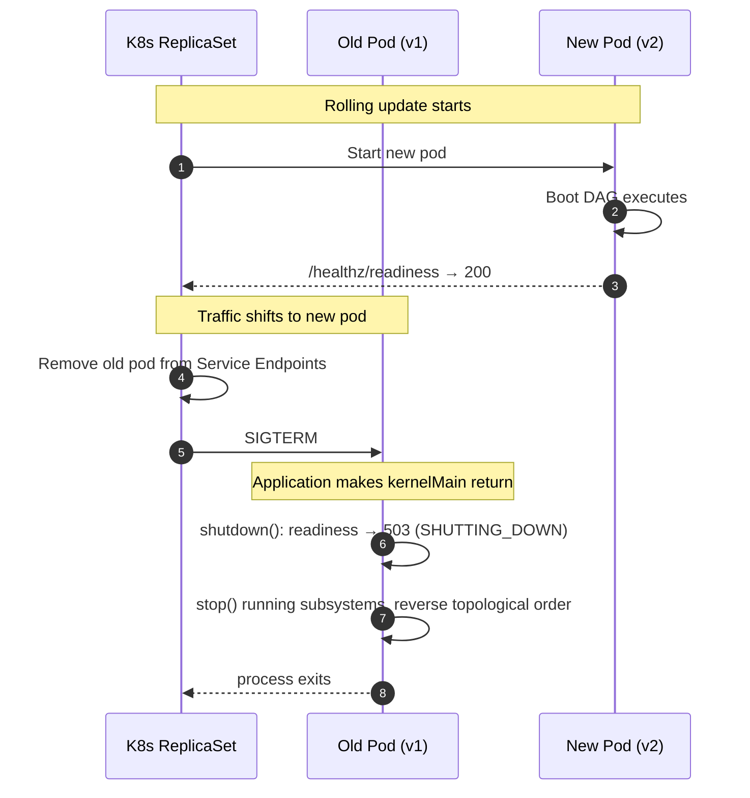

# Kernel Subsystem: Bootstrap (L0 Orchestration)

**Physical Layout:**

- **SPI:** `eu.exeris.kernel.spi.bootstrap.*`  
  *(`Subsystem`, `SubsystemProvider`, `BootstrapSelector`, `BootstrapPhase`, `HealthProbe`)*  
  Exceptions: `eu.exeris.kernel.spi.exceptions.SubsystemException`,
  `eu.exeris.kernel.spi.exceptions.bootstrap.SubsystemCircularDependencyException`

- **Core:** `eu.exeris.kernel.core.bootstrap.*`  
  *(`KernelBootstrap`, `SubsystemOrchestrator` with its nested `FailurePolicy`, the package-private
  `SubsystemRegistryLoader` and `SubsystemTopologicalSorter`; `health.KernelHealthMonitor`;
  `jfr.BootstrapJfrEvents`, `jfr.KernelStartEvent`)*

- **Community:** `eu.exeris.kernel.community.bootstrap.*`  
  *(`CommunitySubsystemProvider` and its twelve subsystems, `CommunitySubsystemHealthWatcher`)*;
  `eu.exeris.kernel.community.health.HealthEndpointHandler`

> `KernelBootstrap` (entry point) lives in `eu.exeris.kernel.core.bootstrap`.
> The kernel installs no signal handler and no JVM shutdown hook. `boot()` runs the application's
> `kernelMain` on the calling thread and calls `shutdown()` in a `finally` once `kernelMain` returns or
> throws; turning `SIGTERM`/`SIGINT` into that return is the caller's job.

**Layer:** L0 (Orchestration)  
**Status:** Validated Architectural Prototype (TRL‑3) — JDK 25 LTS baseline

---

## Overview

The **Bootstrap subsystem** is the central orchestrator of the Exeris Kernel.  
It manages the ordered initialization and start of all subsystems, ensuring that foundational layers (Config,
Memory) are operational before higher‑level logic (Transport, Flow) is activated. It runs once per JVM and
never on a request path.

> **Diagnostics during boot:** Bootstrap reports through `System.Logger` and the JFR events listed under
> "Boot Observability". Those events are emitted from the first line of `KernelBootstrap.boot()` whenever
> Flight Recorder is initialized and the event type is enabled — they do not wait for a Telemetry
> subsystem, and there is none in the Boot DAG. Bootstrap writes to no pre-allocated crash buffer; the
> memory-mapped crash buffer below is target state.

### Key Characteristics

- **Dependency‑Ordered Init**  
  A directed acyclic graph (DAG) built from each subsystem's `dependsOn()` resolves the order.  
  Config is resolved first, before the orchestrator runs; Memory is the only `FOUNDATION` subsystem in
  Community.

- **Dependency-Round Start**  
  `SERVICES` and `RUNTIME` subsystems start in dependency-safe rounds on the booting thread — see "Phase
  Start Strategy" below for why no subsystem is started on a thread of its own. Community ships
  `CommunitySecuritySubsystem`, which binds `KernelProviders.SECURITY_PROVIDER` when a `SecurityProvider`
  is discovered and leaves it unbound otherwise (ADR-061 §4).

- **Fail‑Fast vs Degrade**  
  `SubsystemOrchestrator.FailurePolicy`, set through the `KernelBootstrap` builder:
    - *FAIL_FAST* (the default) → any `initialize()` or `start()` failure aborts the boot.
    - *DEGRADE* → a failing subsystem that is outside `FOUNDATION` **and** reports `isOptional() == true` is
      dropped together with its transitive dependents; every other failure still aborts. No Community
      subsystem declares itself optional, so on the Community tier alone `DEGRADE` boots exactly like
      `FAIL_FAST`.

- **Ordered Shutdown**  
  `shutdown()` calls `stop()` in reverse topological order, and only on subsystems whose `isRunning()`
  reports `true`. The orchestrator imposes no deadline of its own: each `stop()` does whatever its
  subsystem does, and one that throws is logged at `WARNING` and skipped. The transport subsystem's
  `stop()` is the one that drains: `NativeTcpCarrier.stop()` closes ingress, keeps the reactors serving
  while `PaqsScheduler.close()` waits for streams in service to finish under a 60-second hard deadline,
  and only then force-closes what is left.

---

## Diagram 1 — Boot DAG (Flowchart)

The Community subsystem set as `CommunitySubsystemProvider` registers it. Arrows are declared
`dependsOn()` edges; the subgraphs are `BootstrapPhase` values.


```mermaid
flowchart TD
    CFG["Config<br/>(resolved by KernelBootstrap<br/>via ServiceLoader of ConfigProvider<br/>before the orchestrator runs)"]

    subgraph FOUNDATION["FOUNDATION (sequential)"]
        MEM[memory]
    end

    subgraph SERVICES["SERVICES (dependency rounds)"]
        CRP[crypto]
        SEC[security]
        PER[persistence]
        SCH[scheduling]
        STO[storage]
        GRP[graph]
        TRP[transport]
    end

    subgraph RUNTIME["RUNTIME (dependency rounds)"]
        EVT[events]
        FLW[flow]
        HTTP[http]
        WS[websocket]
    end

    CFG -.-> MEM
    MEM --> CRP & SEC & PER & STO & GRP & TRP
    CRP --> TRP
    PER --> GRP
    MEM --> EVT & HTTP & WS
    PER --> EVT & FLW

    EVT & FLW & HTTP & WS --> RDY([KERNEL STARTED])

    style FOUNDATION fill:#1a1a2e,color:#e0e0e0,stroke:#444
    style SERVICES fill:#16213e,color:#e0e0e0,stroke:#444
    style RUNTIME fill:#533483,color:#e0e0e0,stroke:#444
    style RDY fill:#00b894,color:#000,stroke:#00b894
```

`scheduling` declares no dependency. Being in the DAG does not make a subsystem active: `transport` stays
inert unless `transport.mode`/`network.transportMode` is set, `http` unless an HTTP mode or port is
configured, `websocket` unless `websocket.enabled=true`, and `crypto`/`security` unless a provider is
discovered. Such a subsystem still passes through `initialize()` and `start()`, but reports
`isRunning() == false`, so it is never stopped.

---

## Diagram 1b — Subsystem State Machine

These are the per-subsystem states `KernelHealthMonitor.SubsystemState` tracks. Core's
`SubsystemOrchestrator` drives the boot transitions, which are irreversible — there is no `RESTART`. The one
reversible axis is the post-boot health state `RUNNING ↔ DEGRADED`, driven not by the orchestrator but by the
Community `CommunitySubsystemHealthWatcher` (see "Kubernetes Health Probes" below): a live-but-impaired
dependency degrades readiness and recovers when it returns, without killing the process.


```mermaid
stateDiagram-v2
    direction LR
    [*] --> REGISTERED : discovered, selected\nand topologically sorted

    REGISTERED --> INITIALIZED : initialize() returned
    REGISTERED --> FAILED      : initialize() threw (EX-BOOT-0002)

    INITIALIZED --> RUNNING    : start() returned
    INITIALIZED --> FAILED     : start() threw (EX-BOOT-0002)

    RUNNING --> STOPPED        : shutdown() — stop() returned\n(only if isRunning())
    RUNNING --> DEGRADED       : Health watcher: dependency lost\n(post-boot, reversible)
    DEGRADED --> RUNNING       : Health watcher: dependency recovered
    DEGRADED --> STOPPED       : shutdown() — stop() returned

    STOPPED --> [*]

    note right of FAILED
        Mandatory failure: kernel FAILED,
        readiness FAILED / liveness DOWN,
        boot() throws. The kernel never exits the JVM.
        DEGRADE + optional: subsystem and its
        transitive dependents leave the boot order.
    end note

    note right of DEGRADED
        Live but impaired (required dep lost post-boot).
        Readiness 503 (DEGRADED), liveness 200.
        Watcher-driven, post-boot only, reversible.
    end note
```

A dependency cycle (`EX-BOOT-0001`) or a `dependsOn()` name no provider supplies aborts the boot before any
subsystem is registered with the monitor, so neither appears in this diagram. Kernel-level state is separate:
`KernelHealthMonitor.KernelState` latches `INITIALIZED`, `STARTED`, `SHUTTING_DOWN` and `FAILED`.

---

## Diagram 2 — Shutdown (Sequence)


```mermaid
sequenceDiagram
    autonumber
    participant APP as Application (kernelMain)
    participant KB  as KernelBootstrap.boot()
    participant ORC as SubsystemOrchestrator
    participant SUB as Subsystems (reverse topological order)

    APP-->>KB: kernelMain returns or throws
    KB->>KB: close DynamicConfigFileWatcher
    KB->>ORC: shutdown()  (in finally)
    ORC->>ORC: markKernelState(SHUTTING_DOWN) — readiness 503
    loop each subsystem, last initialized first
        alt isRunning() == true
            ORC->>SUB: stop()
            SUB-->>ORC: returned — SubsystemStopped JFR, state STOPPED
        else isRunning() == false
            Note over ORC,SUB: skipped — stop() is never called
        end
    end
    ORC->>ORC: KernelShutdownComplete JFR
    ORC-->>KB: returns (never throws)
    KB-->>APP: boot() returns, or throws BootstrapException
```

`shutdown()` has no timeout and no second attempt. A `stop()` that throws is caught, logged at `WARNING`, and
the subsystem is not marked `STOPPED`.

---

## The "Holy Order" of Initialization

`initialize()` runs for every subsystem first, in one topological order, before any `start()`; phases govern
only the start. A phase starts only after every subsystem of the phase before it has returned from `start()`.

```
initialize:   all subsystems, topological order (Kahn's algorithm, ties broken by name)
start:
  FOUNDATION: memory (sequential)
  SERVICES:   crypto, persistence, scheduling, security, storage   → then graph, transport
  RUNTIME:    http, events, flow, websocket
stop:         reverse of the initialize order, running subsystems only
```

For the Community set the initialize order is `memory, crypto, http, persistence, events, flow, graph,
scheduling, security, storage, transport, websocket`, so the stop order is its reverse. Stop order follows
declared `dependsOn()` edges and the name tie-break, not phases: `http` declares only `memory`, so it stops
after `persistence`, `events`, `flow` and `transport`. A subsystem that must outlive another at shutdown has
to declare it.

> **Config** is resolved by `KernelBootstrap` via `ServiceLoader<ConfigProvider>` (highest `priority()` wins)
> before the orchestrator runs — it is not a `Subsystem`. `Exceptions` is not a Subsystem layer.

---

## Core Philosophy

### 1. Deterministic Startup

No classpath scanning.  
Subsystems are discovered only through `ServiceLoader<SubsystemProvider>`; the orchestrator has no
registration API. Providers are sorted by `priority()` descending, and on a name collision the
higher-priority provider's subsystem is kept (Community = 0, Enterprise = 100).

### 2. Failure Sovereignty

Bootstrap decides whether the Kernel comes up:

- **FAIL_FAST** → the default, and the policy the `FailurePolicy` Javadoc recommends for production.
- **DEGRADE** → recommended there for dev and canary environments. It only ever saves an optional,
  non-`FOUNDATION` subsystem, and the cost is silent: the dropped subsystem takes every transitive dependent
  out of the boot with it.

A dependency cycle is fatal under either policy.

### 3. Shutdown Is Driven by the Caller

The kernel does not listen for OS signals. Ordered shutdown happens when `kernelMain` returns; an application
that must stop cleanly on `SIGTERM` has to make `kernelMain` return and let `boot()` finish before the JVM
halts.

---

## Responsibilities

### What Bootstrap SPI **does**

- Defines `Subsystem` (lifecycle contract: `name()`, `dependsOn()`, `phase()`, `initialize()`, `start()`,
  `stop()`, `isRunning()`, `isOptional()`, `providerBindings()`)
- Defines `SubsystemProvider` (ServiceLoader discovery; `priority()` default = 0)
- Defines `BootstrapSelector` (immutable record: `all()`, `none()`, `forNames(...)` — expanded by the
  orchestrator to its transitive dependency closure)
- Defines `BootstrapPhase` enum (`FOUNDATION`, `SERVICES`, `RUNTIME`)
- Config is NOT a Subsystem — resolved by `KernelBootstrap` via `ServiceLoader<ConfigProvider>` before the orchestrator runs
- Health state is tracked by `KernelHealthMonitor` (Core). The class implements the SPI read-only contract
  `eu.exeris.kernel.spi.bootstrap.HealthProbe` (since 0.7) so HTTP handlers, sidecar reporters, and
  Enterprise observers can consume probe state without coupling to the Core orchestrator class.

### What Bootstrap Core **does**

- Discovers providers, applies the selector closure, and topologically sorts the result
  (`SubsystemRegistryLoader`, `SubsystemTopologicalSorter`)
- Initializes, starts and stops subsystems, and enforces the failure policy (`SubsystemOrchestrator`)
- Composes each subsystem's `providerBindings()` into the `ScopedValue` scope that `start()` and
  `kernelMain` run in, and binds `KernelProviders.SUBSYSTEMS` for the `KernelDiagnostics` SPI (ADR-033)
- Tracks kernel state (`INITIALIZED → STARTED → SHUTTING_DOWN`, or `FAILED`) and per-subsystem state for
  probes (`KernelHealthMonitor`)
- Offers `KernelBootstrap.inspect(Runnable)`, which resolves the sorted subsystem inventory without calling
  any `initialize()` or `start()`

---

## Error Codes (Deterministic Telemetry)

| Code             | Carried by | `rawArgs` | When |
|------------------|------------|-----------|------|
| **EX‑BOOT‑0001** | `SubsystemCircularDependencyException` — a plain `RuntimeException`, not an `ExerisKernelException` | None. Members are read from `cycleMembers()` (insertion-ordered `Set<String>`); the JFR event `eu.exeris.kernel.bootstrap.CircularDependencyDetected` carries them as one `String` joined with `", "`, plus `errorCode`. | Dependency cycle found by the sort, during `SubsystemOrchestrator.initialize()` or `resolveTopology()`, before any subsystem is initialized. The set holds every subsystem the sort could not order, including those that only depend on the cycle. `KernelBootstrap` rethrows it unwrapped. |
| **EX‑BOOT‑0002** | `SubsystemException` | `[0] String subsystemName`, `[1] SubsystemException.Phase phase`, `[2] String detail` | `initialize()` or `start()` threw. The orchestrator wraps any other unchecked exception in one (`detail` = its message, original as cause) and, unless `DEGRADE` drops the subsystem, throws `SubsystemOrchestrator.BootstrapException` with it as cause. The orchestrator never raises it for `stop()`. The sorter's "depends on missing subsystem" `BootstrapException` cites this code in its message only, with no `rawArgs`. |
| **EX‑BOOT‑0003** | — | Registry layout: `[0] String subsystemName`, `[1] long deadlineMs` | Defined in `KernelErrorCodes` only. The orchestrator enforces no deadline and nothing in this repository throws it. |
| **EX‑BOOT‑0004** | `MemoryBootstrapException` | `[0] String providerName`, `[1] long requestedBytes` (`-1` if unknown); the message-only constructor leaves `rawArgs` empty | `CommunityMemoryProvider` cannot create its allocator. Raised inside `memory`'s `initialize()`, so the caller sees it as the cause of an `EX-BOOT-0002`. |
| **EX‑BOOT‑3001** | `TelemetryBootstrapException` | `[0] String providerName`, `[1] String reason` | `CommunityTelemetryProvider` cannot construct a sink. Telemetry is not a Boot DAG subsystem. |

> **EX‑BOOT‑0001 is not a runtime event.** A dependency cycle is a build defect: the kernel cannot boot,
> under any failure policy. Fix the `dependsOn()` graph before shipping; `KernelBootstrap.inspect(...)`
> surfaces it without touching infrastructure.

A boot failure reaches the caller of `KernelBootstrap.boot()` as `KernelBootstrap.BootstrapException`
wrapping `SubsystemOrchestrator.BootstrapException`; a missing `ConfigProvider` fails with a
`KernelBootstrap.BootstrapException` whose message cites `EX-CFG-0001`.

---

## Code Examples

### 1. Subsystem Registration (SPI)

```java
public class PersistenceSubsystem implements Subsystem {

    private volatile boolean running;

    @Override
    public String name() {
        return "persistence";
    }

    @Override
    public List<String> dependsOn() {
        return List.of("memory");
    }

    @Override
    public BootstrapPhase phase() {
        return BootstrapPhase.SERVICES;
    }

    @Override
    public void initialize() {
        ConfigProvider config = KernelProviders.CURRENT_CONFIG.get();
        // Setup connection pools using config
    }

    @Override
    public void start() { running = true; /* activate */ }

    @Override
    public void stop() { running = false; /* flush and release */ }

    @Override
    public boolean isRunning() {
        return running;   // the default is false, and then stop() is never called
    }
}
```

The subsystem is returned from a `SubsystemProvider.getSubsystems(ConfigProvider)` registered under
`META-INF/services/eu.exeris.kernel.spi.bootstrap.SubsystemProvider`.

---

### 2. Phase Start Strategy (Core — on the booting thread)

Subsystems start in dependency-safe rounds, and **every round runs on the thread that called
`boot()`** rather than one virtual thread per subsystem. The reason is a hard limit rather than a
preference ([ADR-066](../adr/ADR-066-preview-clean-ga-baseline.md)).

A subsystem's `start()` reads `ScopedValue` bindings established by two callers the orchestrator
cannot see through: `KernelBootstrap` binds `CURRENT_CONFIG` around the boot, and the **application**
binds its own — `HTTP_SERVER_HANDLER` is the load-bearing example, and an application is free to bind
values the kernel has never heard of. A plain virtual thread inherits none of them, and a
`ScopedValue.Carrier` can only carry values named in advance. Forking with a rebuilt kernel carrier was
rejected for that reason: it starts the HTTP subsystem with no handler bound, and every route answers 404.

```java
// SubsystemOrchestrator.startParallel: one dependency-safe round, in order, on the booting thread.
for (Subsystem subsystem : ready) {
    if (Thread.interrupted()) {
        Thread.currentThread().interrupt();
        throw new BootstrapException("Bootstrap interrupted during phase " + phase);
    }
    doStart(subsystem, phase, profile);   // a failure that is not dropped under DEGRADE propagates here
}
```

**Failure semantics.** `doStart` routes a failure through the failure policy. Under `DEGRADE`, an optional
subsystem is removed with its dependents and the round continues. Otherwise the orchestrator marks the kernel
`FAILED` and throws `BootstrapException` naming the subsystem, with its `SubsystemException` as cause, at once:
the rest of the round is not started, so no socket-binding subsystem comes up on a boot already known to have
failed. A round in which no pending subsystem has its dependencies started throws `BootstrapException`
("cannot make progress").

**Cost:** a phase takes the sum of its subsystems' start times rather than the longest. It is paid
once per JVM, and `FOUNDATION` is sequential either way.

After each `start()` that leaves `isRunning() == true`, the orchestrator initializes that subsystem's Core
hot-path JFR event classes on the booting thread (`CoreJfrEventCatalogue.warmHotPath`), so a virtual thread
never pins its carrier inside their `<clinit>`. The cost is counted in the subsystem's start time; a warm-up
failure is logged and never fails the subsystem.

---

## Testing Strategy

### Unit and TCK Tests (Core)

- `SubsystemOrchestratorKahnTest` — ordering, and `EX‑BOOT‑0001` thrown by `initialize()` before any
  subsystem is initialized
- `CoreBootstrapOrchestratorTckTest`, `CoreBootstrapOrchestratorRealSortTckTest` — `AbstractBootstrapOrchestratorTck`
- `CoreFailurePolicyTckTest` — `AbstractFailurePolicyTck` (FAIL_FAST vs DEGRADE)
- `CoreBootstrapZeroAllocTckTest` — `BootstrapZeroAllocTck`
- `CoreHealthMonitorTckTest`, `CoreProviderBindingLifecycleTckTest`, `KernelBootstrapTest`, `ScopedValueBindingTest`

### Integration Tests (Community)

- `SubsystemInitOrderIntegrationTest`, `KernelBootstrapIntegrationTest`, `CommunityDegradedModeIntegrationTest`
- `AbstractSubsystemLifecycleTck` bindings for `memory`, `transport`, `http` and `websocket`
- `HealthEndpointHandlerKernelMonitorIntegrationTest`, `CommunitySubsystemHealthWatcherTest`

> **Note:** `AbstractGracefulShutdownTck` has no concrete binding in this repository, and there is no test
> of signal handling, because the kernel handles no signal. The transport drain is covered by
> `PaqsSchedulerTest`, `DrainCoordinatorTest` and `CommunityHttpDrainIntegrationTest`, not by this
> subsystem's tests.

---

## Summary

The Bootstrap subsystem is the guardian of the Kernel's lifecycle. It enforces a dependency-aware boot
sequence, starts each phase in dependency-safe rounds on the booting thread, fails the boot on the first
mandatory failure, and stops running subsystems in reverse topological order when `kernelMain` returns. It
does not handle signals or exit the JVM, and bounds shutdown time only where the transport drains its
streams (60 s) — turning a signal into shutdown stays with the host.

---

## Kubernetes Health Probes

> **Status:** Probe state and an HTTP handler are implemented. An auto-bound health server on a dedicated
> port is **not implemented**; operators wire the handler into an HTTP server engine themselves.

### Probe contract

`KernelHealthMonitor` (Core) implements `eu.exeris.kernel.spi.bootstrap.HealthProbe` and exposes two snapshots:

- **Readiness** — UP only when the kernel has transitioned to `STARTED` and every required subsystem is `RUNNING`. Returns `STARTING` while the Boot DAG is in progress, while a required subsystem is still initializing, and during `SHUTTING_DOWN`. Returns `DEGRADED` (not ready) when a **required** subsystem has gone `DEGRADED` — live but impaired after boot, e.g. its broker died — so the load balancer drains the instance; a still-initializing required subsystem outranks `DEGRADED` for the status label. A **degraded optional** subsystem never sheds readiness. Returns `FAILED` after `FAILED` state.
- **Liveness** — UP after the kernel has transitioned to `INITIALIZED`. Returns `STARTING` before that point. Returns `DOWN` only after `FAILED` state. A `DEGRADED` subsystem never affects liveness — the process stays alive so it can recover (`DEGRADED → RUNNING` is reversible).

A subsystem is required when it is in `FOUNDATION` or reports `isOptional() == false`.

### `HealthEndpointHandler` (Community)

`eu.exeris.kernel.community.health.HealthEndpointHandler` is an `HttpHandler` that surfaces the probe over HTTP. Construct it with any `HealthProbe` implementation (the orchestrator-owned `KernelHealthMonitor` is the canonical caller) and register it with the HTTP server engine:

```java
HealthEndpointHandler health = new HealthEndpointHandler(bootstrap.healthMonitor());
httpServerEngine.setHandler(health);   // or compose into an application router
httpServerEngine.start();
```

`KernelBootstrap.healthMonitor()` answers only while `boot()` is running and throws
`IllegalStateException` otherwise; `SubsystemOrchestrator.healthMonitor()` returns the same monitor.

| Probe         | Default path             | Healthy            | Not healthy                                            |
|:--------------|:-------------------------|:-------------------|:-------------------------------------------------------|
| **Readiness** | `/healthz/readiness`     | `200 OK`           | `503 Service Unavailable`                              |
| **Liveness**  | `/healthz/liveness`      | `200 OK`           | `503 Service Unavailable`                              |

Custom paths are available via `new HealthEndpointHandler(probe, readinessPath, livenessPath)`. The textual probe status (`READY`, `STARTING`, `DEGRADED`, `UP`, `DOWN`, `FAILED`) is mirrored into the response header `X-Exeris-Health` for human diagnostics — Kubernetes probes evaluate the status code only, so responses are bodyless. A required-subsystem `DEGRADED` surfaces as readiness `503` + `X-Exeris-Health: DEGRADED` while liveness stays `200`.

The handler returns:
- `404 Not Found` for paths that match neither probe, without invoking the probe;
- `405 Method Not Allowed` with `Allow: GET` for non-`GET` methods on a probe path.

The contract is pinned by `eu.exeris.kernel.tck.contract.health.AbstractHealthEndpointTck` plus the Community binding `CommunityHealthEndpointTckTest`. End-to-end behavior with the real `KernelHealthMonitor` is pinned by `HealthEndpointHandlerKernelMonitorIntegrationTest`.

> **Not the same as the default HTTP routes.** When no `HTTP_SERVER_HANDLER` is bound, `CommunityHttpSubsystem`
> installs `/health`, `/health/live`, `/health/ready` and `/db/ping`. That `/health/ready` reports only
> whether the `http` subsystem itself is running, not `KernelHealthMonitor`; `/health` and `/health/live`
> always answer `200`. Point Kubernetes probes at `HealthEndpointHandler`.

### `CommunitySubsystemHealthWatcher` (Community, host-wired)

`KernelHealthMonitor` only marks a subsystem `RUNNING` at boot; it does not re-poll afterwards. To drop readiness when a dependency dies *after* boot (and restore it on recovery), `eu.exeris.kernel.community.bootstrap.CommunitySubsystemHealthWatcher` runs a background poll on a daemon platform thread that reconciles each registered subsystem's health into the monitor's reversible `RUNNING ↔ DEGRADED` axis. It transitions **only** that axis — never resurrecting `FAILED`/`STOPPED` nor racing the boot DAG — and treats a throwing health source as impaired. Each flip into or out of `DEGRADED` emits the JFR event `SubsystemHealthTransition`.

Like `HealthEndpointHandler`, the watcher is **wired by the host**, not by kernel `main` — it stays Wall-clean by knowing the *concrete* Community subsystems and pushing state through the public `markSubsystemState`; the SPI has no generic subsystem-health method. Construct it after boot, register each subsystem's health source (e.g. persistence's `canServiceRequest()` — the same signal that deterministically denies requests under ADR-012), `start()` it, and `stop()` it on shutdown:

```java
KernelHealthMonitor monitor = bootstrap.healthMonitor();
var watcher = new CommunitySubsystemHealthWatcher(monitor, Duration.ofSeconds(5).toNanos());
watcher.register("persistence", persistenceEngine::canServiceRequest);
watcher.start();                 // after the kernel reaches STARTED
// ... on shutdown:
watcher.stop();
```

The reconciliation + lifecycle is pinned by `CommunitySubsystemHealthWatcherTest`; the full `health-source → watcher → monitor → /healthz/readiness` path (503 + `X-Exeris-Health: DEGRADED` and recovery) by `HealthEndpointHandlerKernelMonitorIntegrationTest`.

### Kubernetes manifest snippet

```yaml
livenessProbe:
  httpGet:
    path: /healthz/liveness
    port: 8080                     # the application HTTP engine serving HealthEndpointHandler
  initialDelaySeconds: 0
  periodSeconds: 5
  failureThreshold: 3

readinessProbe:
  httpGet:
    path: /healthz/readiness
    port: 8080
  initialDelaySeconds: 0
  periodSeconds: 2
  failureThreshold: 60             # 60 × 2s = 120s max tolerated boot time

startupProbe:
  httpGet:
    path: /healthz/readiness
    port: 8080
  failureThreshold: 30
  periodSeconds: 5                 # 30 × 5s = 150s cold-start budget
```

> **Dedicated port (target state, not implemented):** a dedicated, non-data-plane health port that probes
> lifecycle state before the data-plane transport binds does not exist; no configuration key for it is read.
> Operators register the handler with the application HTTP engine and probe that port.

---

## Boot Observability

Bootstrap completion is recorded by the JFR event `eu.exeris.kernel.bootstrap.KernelBootReady`
(`BootstrapJfrEvents.KernelBootReadyEvent`), with fields `totalDurationMs`, `subsystemCount`, `profile`,
`nodeId` (the `exeris.node.id` system property, default `local`) and `selector`. `subsystemCount` is the
number of subsystems still in the boot order when start completes; subsystems dropped under `DEGRADE` are
not counted.

**Included in `totalDurationMs`** — from the start of `SubsystemOrchestrator.initialize()` to the end of
`start()`:
- provider discovery, selector closure and topological sort
- every `initialize()`, in topological order
- sealing the config registry, starting the dynamic config watcher, and building the provider scope
- every `start()`, phase by phase, including the per-subsystem JFR class warm-up

**Not included:** the `KernelStart` event and `ConfigProvider` resolution before it (timed by
`ConfigSettingsResolved.durationMs`), and `kernelMain`.

The full event set, all in category `Exeris Kernel / Bootstrap`: `KernelStart`, `ConfigSettingsResolved`,
`SubsystemInitialized` (also emitted on failure, with `success=false` and `errorMessage`),
`SubsystemStarted`, `KernelBootReady`, `SubsystemStopped`, `KernelShutdownComplete`,
`CircularDependencyDetected`, `SubsystemHealthTransition`.

> **JVM warm-up note:** The first requests after boot will experience JIT compilation overhead while C2 compiles the hot path. This is expected and distinct from bootstrap completion — the readiness probe reflects DAG completion, not first-request throughput.

---

## Rolling Deployment Strategy (Kubernetes)

In a rolling update, K8s terminates old pods only after new pods pass the readiness probe. What the kernel
contributes on the old pod is limited to what `shutdown()` does:


```mermaid
sequenceDiagram
    autonumber
    participant K8s as K8s ReplicaSet
    participant OLD as Old Pod (v1)
    participant NEW as New Pod (v2)

    Note over K8s,NEW: Rolling update starts
    K8s->>NEW: Start new pod
    NEW->>NEW: Boot DAG executes
    NEW-->>K8s: /healthz/readiness → 200

    Note over K8s,OLD: Traffic shifts to new pod
    K8s->>K8s: Remove old pod from Service Endpoints
    K8s->>OLD: SIGTERM
    Note over OLD: Application makes kernelMain return
    OLD->>OLD: shutdown(): readiness → 503 (SHUTTING_DOWN)
    OLD->>OLD: stop() running subsystems, reverse topological order
    OLD-->>K8s: process exits
```

> **What holds:** with `HealthEndpointHandler`, readiness turns `503` as soon as `shutdown()` begins, before any
> `stop()` runs. Nothing happens on `SIGTERM` by itself — the kernel installs no handler, so until the
> application makes `kernelMain` return, readiness stays `200`.

> **`terminationGracePeriodSeconds`:** the orchestrator imposes no overall deadline; the transport's `stop()`
> drains streams in service for up to 60 s. Size the grace period to the application's own drain plus that
> transport drain plus the slowest other `stop()`; a `SIGKILL` before `shutdown()` finishes leaves the
> remaining subsystems unstopped.

---

## L0 Crash Observability — Memory-Mapped Crash Buffer (TRL-4 Requirement)

**Status: target state, not implemented.** Nothing in this repository maps a crash file, writes `.ring`
frames, or reads `EXERIS_CRASH_DIR`. The bootstrap path records failures through `System.Logger`, JFR and
the exception it throws. The contract below is what a producer has to meet to reach TRL-4.

### Problem

Diagnostic data held only in process memory is lost on a fatal JVM crash (`SIGSEGV`, `OutOfMemoryError`
before a JFR recording is dumped, hardware fault). The operator then has no post-mortem data.

### Contract

The L0 Glass-Box buffer **MUST** be backed by a memory-mapped file (`mmap`/`MapViewOfFile`) so that the OS
kernel keeps written bytes even on a hard JVM crash.

| Property        | Value                                                                                               |
|:----------------|:----------------------------------------------------------------------------------------------------|
| **Default path** | `/tmp/exeris-crash/kernel-<pid>.ring`                                                              |
| **Override ENV** | `EXERIS_CRASH_DIR` — if set, replaces `/tmp/exeris-crash/`                                        |
| **File size**    | Fixed-size, pre-allocated at L0 boot (default: 4 MB). Never grown dynamically.                    |
| **Format**       | Binary Glass-Box frames (same layout as the `GlassBoxSerializer` ring buffer — see `telemetry.md`) |
| **Lifecycle**    | Created at L0 init, closed (and optionally renamed to `kernel-<pid>-<timestamp>.ring`) on graceful shutdown. Survives JVM crash. |
| **Permissions**  | Owner read/write only (`0600`). File is not rotated — a new PID gets a new file.                  |

### Durability Contract

The producer does **not** call `msync` on the hot write path; L0 stays zero-syscall (see
`performance-contract.md`). Each frame is written with `VarHandle.releaseFence()` after the final field to
enforce JVM-level store ordering.

The OS page-dirty mechanism then handles asynchronous persistence of dirty pages to the filesystem
cache. **This does not constitute a hard durability guarantee.** On a sudden power failure or hard
kernel panic before the OS has flushed dirty pages, frames written after the last OS-driven page flush
may be lost. Operators requiring power-loss durability must ensure OS-level journaling or use a UPS.

For JVM crashes (`SIGSEGV`, uncaught exception) the dirty pages of a shared file mapping remain in the OS
page cache after the process dies — but this is OS behaviour, not a contract.

The canonical open crash-file decoder is expected to tolerate partial frames at the end of the
crash buffer (ring-wrap corruption) and skip undecodable frames.

### Operator Recovery

The kernel's role is producer-only: the L0 buffer will write `.ring` files in the shared
`exeris-telemetry-spec` wire format. Decoding belongs to the **single canonical open decoder** — the open
subset of the `exeris-enterprise-observability` decoder/forensics path (`FrameDecoder`, `FrameValidator`,
`CrashBufferReader`), which reads a `kernel-<pid>.ring` file and decodes each Glass-Box frame using the
`rawArgs` binary layout defined in `telemetry.md`. The kernel ships no decoder. The file=open /
live=enterprise decoder cut is recorded in
[ADR-039](../adr/ADR-039-open-core-observability-boundary.md) (Open-Core Observability Boundary); the
state-vs-event split (state via `KernelDiagnostics`, events via this binary format) is recorded in
[ADR-033](../adr/ADR-033-kernel-diagnostics-spi.md).

Illustrative: the decoder is not part of this repository and no producer writes `.ring` files yet, so this
block shows the shape of decoded frames rather than a captured run. Only a code thrown with `rawArgs` can
appear with a payload; `EX-BOOT-0001` carries none.

```
$ exeris-decode /tmp/exeris-crash/kernel-12345.ring
[0000000042ns] EX-BOOT-0002 [FATAL] Subsystem lifecycle failure
               rawArgs[0]: subsystemName=flow
               rawArgs[1]: phase=INITIALIZE
               rawArgs[2]: detail=Snapshot store unreachable

[0000000107ns] EX-MEM-1001 [CRITICAL] Off-heap exhausted
               rawArgs[0]: requestedBytes=65536
               rawArgs[1]: availableBytes=4096
```

### Implementation Notes (for Kernel Engineers)

- The mapped segment MUST be allocated through `MemoryAllocator` (infrastructure tier) — never via
  `Arena.ofConfined()` or `Arena.ofShared()` directly.
- Write pointer is a `VarHandle`-managed `int` at offset 0 of the segment — atomic, no lock.
- Each frame is written with `VarHandle.releaseFence()` after the last field to ensure ordering.
- The buffer wraps around on overflow (ring semantics) — oldest frames are overwritten.

---

## Stability

This subsystem's SPI surface (`eu.exeris.kernel.spi.bootstrap.*`) is classified **stable** in the
[SPI Stability Matrix](../stability-matrix.md). See the matrix for the semver policy and TCK
coverage status.

---

## Owning ADRs

- [ADR-005](../adr/ADR-005-jfr-first-telemetry-strategy.md) — JFR-first telemetry: bootstrap lifecycle and health transitions are JFR events.
- [ADR-007](../adr/ADR-007-next-gen-runtime-architecture.md) — runtime architecture; owning ADR of `…spi.bootstrap` in the stability matrix.
- [ADR-033](../adr/ADR-033-kernel-diagnostics-spi.md) — `KernelProviders.SUBSYSTEMS` and `KernelBootstrap.inspect(...)` feed the diagnostics SPI.
- [ADR-039](../adr/ADR-039-open-core-observability-boundary.md) — crash-file decoder cut (target-state crash buffer).
- [ADR-061](../adr/ADR-061-declarable-http-route-authorization-policy.md) — §4: Community security subsystem binding `SECURITY_PROVIDER`.
- [ADR-066](../adr/ADR-066-preview-clean-ga-baseline.md) — subsystems start on the booting thread, not in forked scopes.
