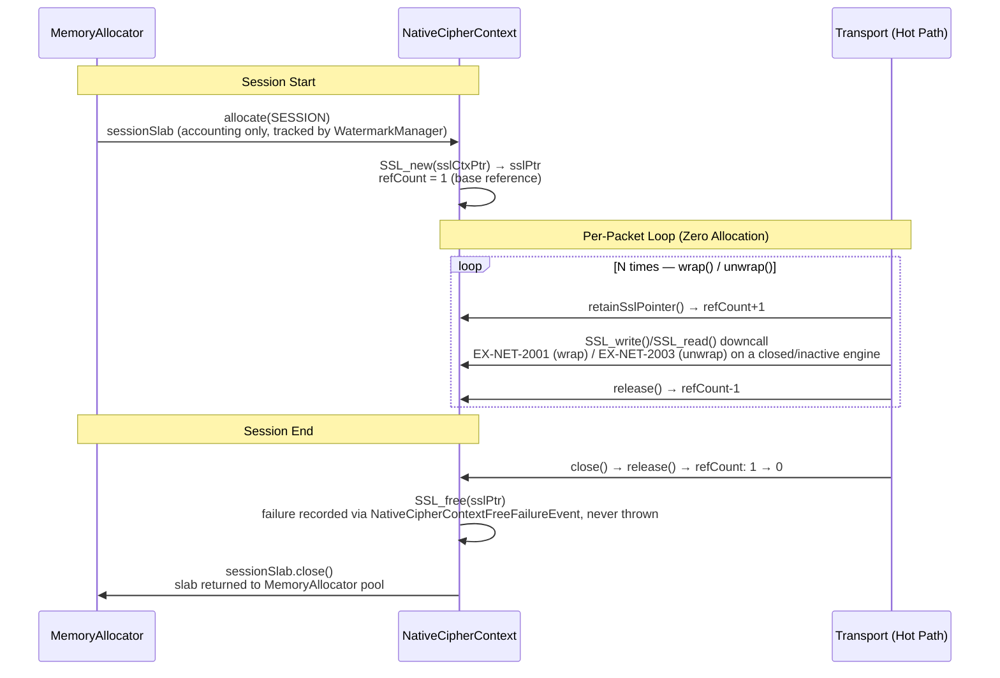

# Kernel Subsystem: Crypto (L1 Citadel Extension)

**Physical Layout:**

- SPI: `eu.exeris.kernel.spi.crypto.*` (`KernelCryptoProvider`, `TlsEngine`, `TlsStatus`, `CryptoProviderConfig`, `TlsHandshakeResult`, `TlsPhase`, `TlsSessionState`, `TlsShutdownResult`)
- Core: `eu.exeris.kernel.core.crypto.*` (`CoreOpenSslLoader`, `NativeCipherContext`, `TlsStateMachine`, `OffHeapTlsEngine`, `CoreSslHandles`, `CoreOpenSslRuntime`; plus internal helpers: `AlpnReader`, `CipherNameReader`, `FfmErrors`)
- Community: Portable Off-Heap TLS (OpenSSL 3.x/4.x via Panama FFM on standard TCP)

**Layer:** L1 (Data & Integrity)  
**Status:** Integration-Tested Prototype (TRL-4)

---

## Overview

The **Crypto subsystem** delivers **zero-allocation TLS and symmetric cipher operations** for all
transport pipelines. The central design constraint is:

> **Every packet encryption/decryption cycle must produce zero heap objects.**

Standard approaches (`javax.net.ssl.SSLEngine`) generate enormous GC pressure through continuous
`ByteBuffer` wrapper creation and `byte[]` array allocation per record. Under 100k packets/second
this sustained churn conflicts with the "No Waste Compute" philosophy.

Exeris eliminates this overhead by sending **raw `long` memory addresses** from `LoanedBuffer`
directly to native OpenSSL functions via Panama FFM. No Java wrapper object is created between the
`LoanedBuffer` and the native call.

---

## Design Principles

| Principle                  | Implementation                                                                       |
|:---------------------------|:-------------------------------------------------------------------------------------|
| Zero objects per cipher op | `MemorySegment` address passed directly to OpenSSL FFM call handle                   |
| Zero-Copy Handover         | Ciphertext written directly into transport's `LoanedBuffer` — no intermediate copies |
| SPI Isolation (The Wall)   | `KernelCryptoProvider` SPI has zero knowledge of OpenSSL, Panama, or `io_uring`      |
| Static Handle Inlining     | All `MethodHandle` instances are `static final` — JIT constant-folds them on hot-path|
| Session-Level Contexts     | `SSL*` and BIO structs allocated once per session via `NativeCipherContext`           |
| JFR-First                  | Handshake start/end and cipher errors emit typed JFR events                          |

---

## Zero-Arena Policy (Architectural Constraint)

Crypto (L1) has a **total ban on direct native Arena management**. This is not a style guideline —
it is an enforced architectural constraint.

| Risk                       | Why raw `Arena` is banned                                                             |
|:---------------------------|:--------------------------------------------------------------------------------------|
| **Invisible Leaks**        | A raw `Arena` does not report to Telemetry (L1). Leaks are invisible to JFR until OOM |
| **Watermark Bypass**       | Direct allocation bypasses `WatermarkManager` and `ResourceArbiter` — the Kernel      |
|                            | cannot detect that Crypto is exhausting memory and cannot shed load (`EX-MEM-1001`)   |
| **Thread-Local Penalty**   | `Arena.ofShared().close()` forces a global JVM thread-local handshake. `NativeCipherContext` |
|                            | avoids this entirely via `VarHandle`-based reference counting                         |

**The contract:** `OffHeapTlsEngine` obtains all native memory from the injected `MemoryAllocator`.
`NativeCipherContext` draws exactly one `SESSION`-hint `LoanedBuffer` from that allocator at
construction and closes it exactly once — not via `LoanedBuffer.retain()`, but when its own
`VarHandle`-CAS reference count (a separate counter from the `LoanedBuffer`'s own) drops from 1 to
0. See NativeCipherContext Lifecycle below for the exact sequence.

| Feature          | Standard Panama (JSSE/Netty)  | Exeris Off-Heap TLS                            |
|:-----------------|:------------------------------|:-----------------------------------------------|
| Lifecycle        | Manual / Cleaner-based        | RAII (`NativeCipherContext` ref-count)         |
| Leak Tracking    | Glass-Box (OS level)          | Glass-Box (JFR + `LeakTracker`)                |
| Memory Pressure  | Unbounded                     | Arbiter-aware (backpressure at L0)             |

---

## OpenSSL FFM Integration Architecture

### Why FFM instead of JNI?

| Aspect              | JNI                               | Panama FFM                                           |
|:--------------------|:----------------------------------|:-----------------------------------------------------|
| Allocation per call | `jbyteArray` copy into JVM heap   | Zero — `MemorySegment` is a direct native pointer    |
| Safety              | Unchecked C pointer, SIGSEGV risk | Arena-bound; JVM validates access                    |
| Overhead            | `GetPrimitiveArrayCritical` pin   | Zero pin — off-heap segment is already native memory |
| Valhalla-readiness  | No                                | `MemorySegment` value-typed layout compatible        |

### Linker Bootstrap (Core — `CoreOpenSslLoader`)

`CoreOpenSslLoader.load(Arena)` does not bind a single hardcoded library path: it walks
newest-major-first OS candidate lists for `libssl`/`libcrypto` (`.so.4` before `.so.3` on Linux,
equivalent DLL names on Windows), honours the `EXERIS_OPENSSL_SSL_PATH` /
`EXERIS_OPENSSL_CRYPTO_PATH` / `EXERIS_OPENSSL_PATH` environment overrides first, and version-gates
the result to `3 <= OPENSSL_version_major() <= 4` with a packed-version floor of `0x30000000`
(OpenSSL 3.0.0). The resolved handles use the provider-aware `SSL_CTX_new_ex` constructor, not the
legacy `SSL_CTX_new`, and every pointer-typed parameter is bound as a raw `JAVA_LONG` — not
`ADDRESS` — so a downcall exchanges a bare `long`, never a `MemorySegment` wrapper:

```java
Linker linker = Linker.nativeLinker();
SymbolLookup ssl = /* resolved candidate, e.g. libssl.so.4 or libssl.so.3 */;

static final MethodHandle sslCtxNewEx =
        linker.downcallHandle(ssl.find("SSL_CTX_new_ex").orElseThrow(),
                FunctionDescriptor.of(JAVA_LONG, JAVA_LONG, JAVA_LONG, JAVA_LONG));

static final MethodHandle sslWrite =
        linker.downcallHandle(ssl.find("SSL_write").orElseThrow(),
                FunctionDescriptor.of(JAVA_INT, JAVA_LONG, JAVA_LONG, JAVA_INT));

static final MethodHandle sslRead =
        linker.downcallHandle(ssl.find("SSL_read").orElseThrow(),
                FunctionDescriptor.of(JAVA_INT, JAVA_LONG, JAVA_LONG, JAVA_INT));
```

All `MethodHandle` instances are `static final` — the JIT constant-folds them, eliminating
virtual dispatch on the cipher hot-path. The `JAVA_LONG` layout choice (rather than `ADDRESS`) is
deliberate: it is what lets `wrap()`/`unwrap()` pass a raw address without the JVM constructing a
`MemorySegment` for the call, matching the zero-wrapper-object claim in Overview above.

### Per-Packet Encrypt Path (Zero Allocation)

`OffHeapTlsEngine.wrap()` below is the actual Core implementation. Note two things that a
generic sketch would get wrong: it returns a `TlsStatus`, not `void`, and — in the Community
fd-owner BIO mode described under "Operator Notes" below — `SSL_write` pushes bytes straight into
the kernel socket buffer, so `ciphertext` is never written and `ciphertext.setSize(...)` is never
called; only the Enterprise Memory-BIO mode drains ciphertext into the caller's buffer, and it does
so itself, outside this method. See the SPI Contract section for the full buffer-ownership split.

```
Transport layer calls:
  tlsEngine.wrap(plaintext: LoanedBuffer, ciphertext: LoanedBuffer)

  1. plaintext.segment().address() → raw long (no MemorySegment wrapper on this call)
  2. SSL_write(ssl_ptr, srcAddr, plaintext.size())
       fd-owner BIO (Community): writes straight to the kernel socket buffer; ciphertext untouched
       Memory-BIO (Enterprise):  writes into the write-BIO; caller drains it into ciphertext after return
  3. Return TlsStatus.OK on success — zero heap objects created
```

```java
@Override
public TlsStatus wrap(LoanedBuffer plaintext, LoanedBuffer ciphertext) {
    checkNotClosed();
    checkActive();

    long sslPtr = cipherCtx.retainSslPointer();
    try {
        long srcAddr = plaintext.segment().address();
        int  len     = (int) Math.min(plaintext.size(), Integer.MAX_VALUE);

        int bytesWritten = handles.ioHandles().invokeWrite(sslPtr, srcAddr, len);
        if (bytesWritten > 0) {
            return TlsStatus.OK;
        }

        int sslErr = handles.ioHandles().invokeGetError(sslPtr, bytesWritten);
        return mapSslError(sslErr); // NEED_WRAP / NEED_UNWRAP, or CLOSED — see mapSslError()
    } finally {
        cipherCtx.release();
    }
}
```

The guard checks above (`checkNotClosed()`, `checkActive()`) are what throw
`TlsHandshakeException` (`EX-NET-2001`) — via a pre-allocated, stack-trace-free sentinel instance,
not a freshly constructed exception — when `wrap()` is called on a closed engine or one that has
not completed its handshake.

### Per-Packet Decrypt Path (Zero Allocation)

`unwrap()` mirrors `wrap()`, with the sentinel exception type swapped to `TlsDecryptException`
(`EX-NET-2003`) so a Glass-Box decoder can tell the two directions apart without parsing the
message string:

```java
@Override
public TlsStatus unwrap(LoanedBuffer ciphertext, LoanedBuffer plaintext) {
    checkNotClosedForDecrypt();
    checkActiveForDecrypt();

    long sslPtr = cipherCtx.retainSslPointer();
    try {
        long dstAddr = plaintext.segment().address();
        int  maxLen  = (int) Math.min(plaintext.segment().byteSize(), Integer.MAX_VALUE);

        int bytesRead = handles.ioHandles().invokeRead(sslPtr, dstAddr, maxLen);
        if (bytesRead > 0) {
            plaintext.setSize(bytesRead);
            return TlsStatus.OK;
        }

        int sslErr = handles.ioHandles().invokeGetError(sslPtr, bytesRead);
        if (sslErr == CoreOpenSslLoader.SSL_ERROR_ZERO_RETURN) {
            return TlsStatus.CLOSED; // clean peer close_notify
        }
        return mapSslError(sslErr);
    } finally {
        cipherCtx.release();
    }
}
```

Both methods bracket the native downcall with `cipherCtx.retainSslPointer()` /
`cipherCtx.release()` — see NativeCipherContext Lifecycle below — so the `SSL*` pointer cannot be
freed by a concurrent `close()` while a downcall is in flight.

---

## NativeCipherContext Lifecycle

The `NativeCipherContext` wraps a single `SSL*` pointer returned by `SSL_new()`.
It is allocated **once per TLS session** — not per record. The `SSL*` struct itself lives on
OpenSSL's own native heap, outside the Kernel's accounting; what `NativeCipherContext` obtains from
the injected `MemoryAllocator` is a separate `AllocationHint.SESSION` `LoanedBuffer` used purely to
make that session's off-heap footprint visible to `WatermarkManager` for backpressure — it is not
the memory `SSL_new` writes into. Never a directly opened `Arena` either way.

`NativeCipherContext` runs its **own** `VarHandle`-CAS reference count (a plain `int` field, base
value 1 at construction) — distinct from the `LoanedBuffer`'s own ref-count, which is never
`retain()`-ed here. Every call that touches the raw `sslPtr` — `wrap()`, `unwrap()`,
`beginHandshake()`, `initiateShutdown()`, `bindTransportFd()` — brackets its downcall with
`retainSslPointer()` (count+1) and `release()` (count-1) in a `finally` block, so the pointer
cannot be freed by a concurrent `close()` mid-downcall. The diagram below shows that per-call
retain/release cycle repeating across the hot loop — not a single retain held for the session.



> **RAII Invariant:** `NativeCipherContext` is the **sole** ref-count authority for both the
> `sslPtr` lifetime and the session slab's return to the pool. Transport code calls
> `wrap()`/`unwrap()`, which retain/release around each downcall — it borrows, not owns.

```
Session Start:
  allocator.allocate(AllocationHint.SESSION) → sessionSlab (LoanedBuffer, accounting-only, tracked by WatermarkManager)
  SSL_new(sslCtxPtr) → sslPtr   (opaque native pointer; struct itself lives on OpenSSL's own heap)
  refCount = 1 (BASE_REF_COUNT, set at construction — no explicit retain() call here)

Per-Record (each wrap()/unwrap() call):
  retainSslPointer() → refCount+1 → SSL_write()/SSL_read() → release() → refCount-1
  Net allocation: ZERO — no MemorySegment wrapper, no heap object

Session End:
  close() → release() → refCount: 1 → 0
    → SSL_free(sslPtr) invoked; a failure is recorded via NativeCipherContextFreeFailureEvent, never thrown
    → sessionSlab.close() → returned to MemoryAllocator pool
  If another virtual thread still holds a retain when close() runs, the actual SSL_free/slab-close
  is deferred until that thread's release() brings the count to zero — close() from a
  try-with-resources block is safe even while a downcall is in flight.
```

### Arena Discipline

| Object                    | Memory Owner                         | Lifecycle Authority                                    |
|:--------------------------|:--------------------------------------|:--------------------------------------------------------|
| `SSL_CTX`                 | `Arena.global()`                     | `CoreOpenSslLoader` (bootstrap, lives until JVM exit)  |
| `SSL*` per session        | OpenSSL's own native heap; accounted via a `MemoryAllocator` (SESSION hint) slab | `NativeCipherContext`'s own `VarHandle`-CAS ref-count |
| Plaintext `LoanedBuffer`  | `MemoryAllocator` (carrier slab)     | Transport pipeline (RAII)                              |
| Ciphertext `LoanedBuffer` | `MemoryAllocator` (network slab)     | Transport pipeline (RAII)                              |

**Rule:** Business logic code MUST NEVER hold a reference to a `NativeCipherContext` or any
`MemorySegment` beyond the scope of a single `wrap()`/`unwrap()` call.

---

## SPI Contract (The Wall)

```java
public interface TlsEngine extends AutoCloseable {
    default void notifyBound() {}
    TlsStatus beginHandshake(LoanedBuffer outbound);
    TlsStatus unwrap(LoanedBuffer ciphertext, LoanedBuffer plaintext);
    TlsStatus wrap(LoanedBuffer plaintext, LoanedBuffer ciphertext);
    boolean isHandshakeComplete();
    String negotiatedProtocol();
    void initiateShutdown(LoanedBuffer outbound);

    @Override
    void close();
}
```

The SPI has zero knowledge of OpenSSL, JSSE, BouncyCastle, or Panama internals.
`notifyBound()` is a default no-op; fd-owner or Memory-BIO pipelines override. Triggers `TlsEngineBindEvent` emission and state-machine transition.
`TlsEngine` implementations are not themselves discovered via `ServiceLoader`: the
`KernelCryptoProvider` that constructs them is (`META-INF/services/eu.exeris.kernel.spi.crypto.KernelCryptoProvider`
lists `CommunityKernelCryptoProvider`). Its `createTlsEngine()` builds a `CommunityTlsEngine`
(which wraps `OffHeapTlsEngine`) directly with `new` — the SPI module never imports either
concrete class.

---

### Code Example: Session Context via MemoryAllocator

```java
public OffHeapTlsEngine(CoreSslHandles handles, long ctxPointer,
                        boolean serverMode, MemoryAllocator allocator) {
    // MemoryExhaustedException (EX-MEM-1001) propagates to caller if budget exceeded
    this.cipherCtx = new NativeCipherContext(handles, ctxPointer, allocator);
    this.stateMachine = new TlsStateMachine();
    this.serverMode = serverMode;
}
```

> `allocator.allocate()` is tracked by `WatermarkManager`. If the off-heap budget is exhausted,
> it throws `MemoryExhaustedException(EX-MEM-1001)` before any native memory is touched —
> this is the backpressure integration point between Crypto (L1) and Memory (L0).

---

## Operator Notes — FD Resolution on Restricted JDKs

The Community TLS pipeline binds an OpenSSL BIO to the underlying socket file descriptor through
`SocketChannelFdAccess.requireFd(channel)` at `CommunityTlsEngine.bindFileDescriptor(...)` time.
On open JDK builds, FD resolution uses reflective access to `sun.nio.ch.SocketChannelImpl` and
`java.io.FileDescriptor`. On JDKs that close those internals (e.g., distributions with strict
`--illegal-access=deny`, modular runtime images that omit the relevant exports), reflective FD
extraction fails with a clear diagnostic.

Two operator-side resolutions exist:

1. **Add JVM flags at startup** — pass:

   ```text
   --add-opens java.base/sun.nio.ch=ALL-UNNAMED
   --add-opens java.base/java.io=ALL-UNNAMED
   ```

   This restores reflective FD access without code changes and is the recommended path for hosts
   the operator controls.

   **These flags have a transport-side consequence.** The same
   `SocketChannelFdAccess.isRuntimeFdAccessAvailable()` probe that gates TLS FD binding is one of
   the three conditions `NativeTcpSocketBackend` requires before it arms the POSIX socket seam, so
   passing them also moves plain-TCP data I/O off NIO and onto `recv`/`send` through Panama FFM.
   The selector and accept path stay on NIO either way. See `docs/subsystems/transport.md`.
2. **Use the explicit FD entry point** — call `CommunityTlsEngine.bindFileDescriptor(int)` directly
   from your transport carrier with an FD obtained outside the closed reflection path (e.g., from
   a native socket library or from a pre-opened descriptor). The reference Community carrier
   already exposes this fallback via `NativeTcpCarrier` / `NativeTcpStream`, and embedders that
   build their own carrier should mirror the contract.

Either path keeps the SPI surface unchanged — `TlsEngine` does not expose JVM internals, and the
fallback is a Community implementation detail.

---

## Error Codes

> **Source of truth:** `KernelErrorCodes.java` in `exeris-kernel-spi`.

| Code          | Path          | Meaning                            | Glass-Box Payload (`rawArgs`)                        |
|:--------------|:--------------|:-----------------------------------|:-----------------------------------------------------|
| `EX-NET-2001` | **wrap** (encrypt) | `SSL_write` failure / BIO error | `[0] int nativeErrorCode, [1] String detail`    |
| `EX-NET-2002` | Bootstrap     | Crypto Provider init failure       | `[0] String providerName, [1] String reason`         |
| `EX-NET-2003` | **unwrap** (decrypt) | `SSL_read` failure / alert received | `[0] int nativeErrorCode, [1] String detail` |

The split between `EX-NET-2001` and `EX-NET-2003` preserves the **one-code-one-schema invariant**
required by the binary Glass-Box telemetry contract: decoders can distinguish encrypt-side from
decrypt-side failures without parsing the `detail` string.

---

## JFR Events

> **Note:** The previous table in this section contained incorrect field names (e.g., `sessionId` does not exist; the actual field is `sslPtr`). The table below reflects actual implementation.

The headings below name each group's JFR event-name prefix (the `@Name` annotation's leading
segments), not the Java package the class file lives in — every Core class in both tables actually
lives under `eu.exeris.kernel.core.crypto.*` (`.openssl` / `.tls` subpackages), and the Community
pair lives under `eu.exeris.kernel.community.crypto`.

**Core — `eu.exeris.kernel.core.crypto` JFR namespace (`eu.exeris.kernel.core.crypto.openssl`):**

| Event Class                           | JFR Category                                              | When Emitted                              | Key Fields                        |
|:--------------------------------------|:----------------------------------------------------------|:------------------------------------------|:----------------------------------|
| `CryptoContextAllocEvent`             | `eu.exeris.kernel.core.crypto.ContextAlloc`                | `NativeCipherContext` creation            | `sslPtr`, `sslCtxPtr`             |
| `NativeCipherContextFreeFailureEvent` | `eu.exeris.kernel.core.crypto.NativeCipherContextFreeFailure` | `SSL_free` failure                    | `sslPtr`, `exceptionClass`        |
| `OpenSslLoadEvent`                    | `eu.exeris.kernel.core.crypto.OpenSslLoad`                 | `CoreOpenSslLoader.load()` success (once, cold bootstrap path) | `versionMajor`, `versionMinor`, `sslPath`, `cryptoPath` |

**Core — `eu.exeris.kernel.tls` JFR namespace (`eu.exeris.kernel.core.crypto.tls`):**

| Event Class                | JFR Category                                         | When Emitted                     | Key Fields                                  |
|:---------------------------|:-----------------------------------------------------|:---------------------------------|:--------------------------------------------|
| `TlsHandshakeEvent`        | `eu.exeris.kernel.tls.TlsHandshake`                  | Handshake start and completion   | `sslPtr`, `mode`, `negotiatedAlpn`, `durationNanos` |
| `TlsHandshakeFailureEvent` | `eu.exeris.kernel.tls.TlsHandshakeFailure`           | Handshake exception              | `sslPtr`, `mode`, `errorCode`, `sslErrorCode` |
| `TlsEngineBindEvent`       | `eu.exeris.kernel.tls.EngineBind`                    | `notifyBound()` call             | `sslPtr`, `mode`                            |
| `TlsEngineCloseEvent`      | `eu.exeris.kernel.tls.EngineClose`                   | `close()` call                   | `sslPtr`, `graceful`, `finalPhase`          |
| `TlsPhaseTransitionEvent`  | `eu.exeris.kernel.tls.PhaseTransition`               | Per state-machine transition     | `fromPhase`, `toPhase`                      |

**Community — `eu.exeris.kernel.crypto` JFR namespace (`eu.exeris.kernel.community.crypto`):**

| Event Class                       | JFR Category                                                   | When Emitted                            | Key Fields |
|:-----------------------------------|:---------------------------------------------------------------|:----------------------------------------|:-----------|
| `CommunityProviderBootstrapEvent` | `eu.exeris.kernel.crypto.CommunityProviderBootstrap`           | Provider creates engine                 | `providerName`, `durationNs` |
| `CommunityTlsHandshakeEvent`      | `eu.exeris.kernel.crypto.CommunityTlsHandshake`                | Per `beginHandshake()` in Community     | `complete`, `opensslError` |

**Rule:** `wrap()` and `unwrap()` on the cipher hot-path MUST NOT emit JFR events per-call.
Use JFR's built-in `MethodProfiling` for cipher throughput analysis.

---

## Banned Patterns

| Pattern                                                          | Reason                               | Replacement                                              |
|:-----------------------------------------------------------------|:-------------------------------------|:---------------------------------------------------------|
| `javax.net.ssl.SSLEngine` in any tier                            | Allocates `ByteBuffer` per record    | `CommunityTlsEngine` or `OffHeapTlsEngine` via FFM      |
| `new byte[n]` for encrypt/decrypt buffer                         | Sustained GC pressure on hot-path    | Pre-allocated `LoanedBuffer` from `MemoryAllocator`      |
| `ByteBuffer.wrap(segment.toArray())`                             | Copies off-heap → heap               | `MemorySegment` address passed directly to `SSL_write`   |
| `Arena.ofConfined()` or `Arena.ofShared()` in Crypto logic       | Bypasses `WatermarkManager`          | `MemoryAllocator.allocate(AllocationHint.SESSION)`       |
| Catching `Throwable` from `invokeExact()` without rethrowing     | Swallows `VirtualMachineError`       | Always rethrow `Error` and `StructuredTaskScope` signals |

---

## Testing Strategy

### Unit Tests

- `OffHeapTlsEngineTest` — lifecycle, guard checks, state machine integration, idempotent close.
  - `notifyBound()` transitions `UNINITIALIZED → HANDSHAKE_IN_PROGRESS`; double-call throws.
  - `beginHandshake()` before `notifyBound()` MUST throw `TlsHandshakeException`.
  - `unwrap()` before handshake / after close MUST throw `TlsDecryptException` (`EX-NET-2003`).
  - `wrap()` before handshake / after close MUST throw `TlsHandshakeException` (`EX-NET-2001`).
- `NativeCipherContextTest` — `retainSslPointer()` increments the context's own ref-count,
  `release()`/`close()` decrement it, `SSL_free` fires exactly once when the count reaches zero, and
  a retain on an already-closed context throws `IllegalStateException`.
- `wrap()`/`unwrap()` round-trip with known plaintext/ciphertext vectors.

### Integration Tests

`*IT` classes are executed by `maven-failsafe-plugin` (bound to `integration-test` + `verify` phases
in the respective module's `pom.xml`) — they are NOT picked up by Surefire. Run with `mvn verify`
or `mvn install`. OpenSSL 3.x or 4.x must be present on the CI host for Linux targets.

- `OffHeapTlsEngineLoopbackIT` (`exeris-kernel-core/src/test/java/eu/exeris/kernel/core/crypto/tls/`):
  full TLS 1.3 handshake and round-trip against `OffHeapTlsEngine` directly, over a real
  `ServerSocketChannel`/`SocketChannel` loopback pair with a self-signed cert generated by the
  `openssl` CLI. Includes `sessionSlabAllocatedViaMemoryAllocator`, which proves
  `NativeCipherContext` calls `allocator.allocate(AllocationHint.SESSION)`, making session memory
  visible to `WatermarkManager` for `EX-MEM-1001` backpressure — and a fatal-handshake case (non-TLS
  bytes on the socket) asserting `beginHandshake()` returns `CLOSED` and the engine forces itself
  to `ERROR` so re-entry fails fast rather than re-driving `SSL_accept`.
- `CommunityTlsEngineLoopbackIntegrationTest` (`exeris-kernel-community/src/test/java/eu/exeris/kernel/community/crypto/`, `@Tag("integration")`, `@EnabledOnOs(OS.LINUX)`):
  - Simulates Community tier: `SSL_set_fd` resolved as a separate Community-owned handle,
    called before `notifyBound()` — Core engine has zero knowledge of the fd.
  - Full TLS 1.3 handshake over a real `ServerSocketChannel`/`SocketChannel` loopback pair
    with a self-signed cert generated by the `openssl` CLI — both engines reach `ACTIVE`.
  - Round-trip: full round-trip in both directions matches for a 512-byte payload.
  - Asserts the `CommunityProviderBootstrap` and `CommunityTlsHandshake` JFR events (see JFR Events
    above) are emitted on bootstrap and on a successful/failed handshake.

### Integration Tests (TCK)

- `CryptoZeroAllocTck` (`hotPathIterations() = 10_000`, preceded by `1_000` warmup iterations):
  the base TCK's default allocation ceiling is ≤ 8 `eu.exeris.*` allocations/iteration; a binding
  overrides `supportsZeroGcHotPath()` to `true` to tighten that to 0 B/op. The one binding that
  exists today, `CoreOffHeapTlsEngineZeroAllocTckTest`, does the latter — but it
  measures the **guard/sentinel failure path** (`wrap()` on an engine bound to a non-existent FD,
  which fails fast through a pre-allocated exception), not a successful steady-state `SSL_write`.
  The successful-write path's allocation profile is not separately gated by this TCK; correctness of
  that path (not its allocation count) is what `OffHeapTlsEngineLoopbackIT` and the Community/
  Enterprise integration tests cover.
- `AbstractCryptoEngineTck` "Error-code:"-prefixed tests (there is no separate `ErrorCodeContract`
  nested class — these are flat `@Test` methods on the abstract TCK class):
  - `unwrap()` on a closed engine MUST throw `TlsDecryptException` (`EX-NET-2003`).
  - `wrap()` and `unwrap()` MUST throw distinct exception types (one-code-one-schema invariant).
- `MemoryExhaustedException(EX-MEM-1001)` is thrown before native allocation when
  `WatermarkManager` reports high watermark breach.
- `NativeCipherContext` lifecycle: `SSL*` pointer freed when `NativeCipherContext`'s own ref-count
  (not the session `LoanedBuffer`'s) reaches zero.
- **`CryptoCarrierPinningTck`** — verifies no carrier thread pinning during `wrap()`/`unwrap()` operations.

> **TCK gap:** No Community binding exists for `CryptoZeroAllocTck` or `CryptoCarrierPinningTck` —
> both are bound only against `OffHeapTlsEngine` directly, in `exeris-kernel-core/src/test/`
> (`CoreOffHeapTlsEngineZeroAllocTckTest`, `CoreOffHeapTlsEngineCarrierPinningTckTest`). `Community`
> is bound only to `AbstractCryptoEngineTck`, via `CommunityKernelCryptoProviderTckTest`. As of
> current state, Community-tier zero-allocation on the TLS hot path (per ADR-008) is documented but
> not TCK-enforced at the Community binding level.

---

## Stability

This subsystem's SPI surface (`eu.exeris.kernel.spi.crypto.*`) is classified **preview** in the
[SPI Stability Matrix](../stability-matrix.md). The OpenSSL 3.0–4.x binding migration itself already
landed (v0.9 Sprint 4b, per ADR-008's repository-state note: `SSL_CTX_new_ex`, `.so.4` candidates,
version band widened to major 3–4, floor kept at 3.0.0 for FIPS-validated 3.1.2 builds); the
preview classification instead reflects that a FIPS provider workstream remains deferred and
unscheduled, so the binding/ABI surface may still move if and when that workstream lands. See the
matrix for the semver policy and TCK coverage status.
