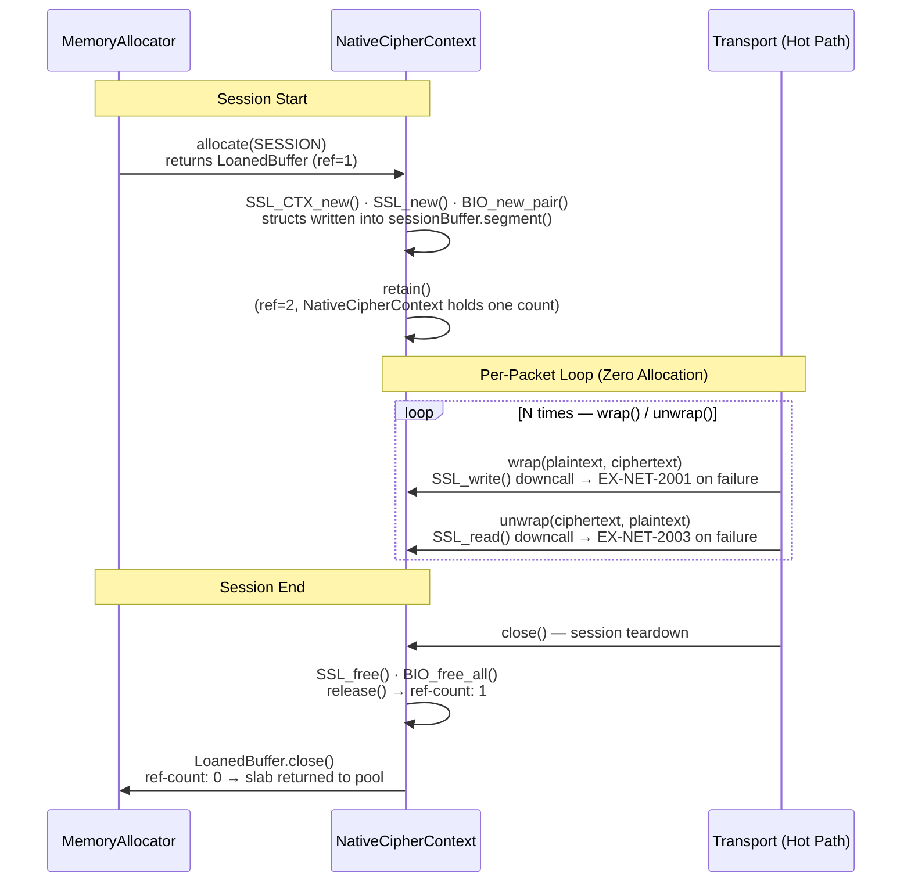

# Kernel Subsystem: Crypto (L1 Citadel Extension)

**Physical Layout:**

- SPI: `eu.exeris.kernel.spi.crypto.*` (`KernelCryptoProvider`, `TlsEngine`, `TlsStatus`, `CryptoProviderConfig`, `TlsHandshakeResult`, `TlsPhase`, `TlsSessionState`, `TlsShutdownResult`)
- Core: `eu.exeris.kernel.core.crypto.*` (`CoreOpenSslLoader`, `NativeCipherContext`, `TlsStateMachine`, `OffHeapTlsEngine`, `CoreSslHandles`, `CoreOpenSslRuntime`; plus internal helpers: `AlpnReader`, `CipherNameReader`, `FfmErrors`)
- Community: Portable Off-Heap TLS (OpenSSL 3.x via Panama FFM on standard TCP)

**Layer:** L1 (Data & Integrity)  
**Status:** Integration-Tested Prototype (TRL-4)

---

## Overview

The **Crypto subsystem** delivers **zero-allocation TLS and symmetric cipher operations** for all
transport pipelines. The central design constraint is:

> **Every packet encryption/decryption cycle must produce zero heap objects.**

Standard approaches (`javax.net.ssl.SSLEngine`) generate enormous GC pressure through continuous
`ByteBuffer` wrapper creation and `byte[]` array allocation per record. Under 100k packets/second
this sustained churn conflicts with the "No Waste Compute" philosophy.

Exeris eliminates this overhead by sending **raw `long` memory addresses** from `LoanedBuffer`
directly to native OpenSSL functions via Panama FFM. No Java wrapper object is created between the
`LoanedBuffer` and the native call.

---

## Design Principles

| Principle                  | Implementation                                                                       |
|:---------------------------|:-------------------------------------------------------------------------------------|
| Zero objects per cipher op | `MemorySegment` address passed directly to OpenSSL FFM call handle                   |
| Zero-Copy Handover         | Ciphertext written directly into transport's `LoanedBuffer` — no intermediate copies |
| SPI Isolation (The Wall)   | `KernelCryptoProvider` SPI has zero knowledge of OpenSSL, Panama, or `io_uring`      |
| Static Handle Inlining     | All `MethodHandle` instances are `static final` — JIT constant-folds them on hot-path|
| Session-Level Contexts     | `SSL*` and BIO structs allocated once per session via `NativeCipherContext`           |
| JFR-First                  | Handshake start/end and cipher errors emit typed JFR events                          |

---

## Zero-Arena Policy (Architectural Constraint)

Crypto (L1) has a **total ban on direct native Arena management**. This is not a style guideline —
it is an enforced architectural constraint.

| Risk                       | Why raw `Arena` is banned                                                             |
|:---------------------------|:--------------------------------------------------------------------------------------|
| **Invisible Leaks**        | A raw `Arena` does not report to Telemetry (L1). Leaks are invisible to JFR until OOM |
| **Watermark Bypass**       | Direct allocation bypasses `WatermarkManager` and `ResourceArbiter` — the Kernel      |
|                            | cannot detect that Crypto is exhausting memory and cannot shed load (`EX-MEM-1001`)   |
| **Thread-Local Penalty**   | `Arena.ofShared().close()` forces a global JVM thread-local handshake. `NativeCipherContext` |
|                            | avoids this entirely via `VarHandle`-based reference counting                         |

**The contract:** `OffHeapTlsEngine` obtains all native memory from the injected `MemoryAllocator`.
`NativeCipherContext` owns the session segment via `LoanedBuffer.retain()` / `LoanedBuffer.close()`.

| Feature          | Standard Panama (JSSE/Netty)  | Exeris Off-Heap TLS                            |
|:-----------------|:------------------------------|:-----------------------------------------------|
| Lifecycle        | Manual / Cleaner-based        | RAII (`LoanedBuffer` ref-count)                |
| Leak Tracking    | Glass-Box (OS level)          | Glass-Box (JFR + `LeakTracker`)                |
| Memory Pressure  | Unbounded                     | Arbiter-aware (backpressure at L0)             |

---

## OpenSSL FFM Integration Architecture

### Why FFM instead of JNI?

| Aspect              | JNI                               | Panama FFM                                           |
|:--------------------|:----------------------------------|:-----------------------------------------------------|
| Allocation per call | `jbyteArray` copy into JVM heap   | Zero — `MemorySegment` is a direct native pointer    |
| Safety              | Unchecked C pointer, SIGSEGV risk | Arena-bound; JVM validates access                    |
| Overhead            | `GetPrimitiveArrayCritical` pin   | Zero pin — off-heap segment is already native memory |
| Valhalla-readiness  | No                                | `MemorySegment` value-typed layout compatible        |

### Linker Bootstrap (Core — `CoreOpenSslLoader`)

```java
Linker linker = Linker.nativeLinker();
SymbolLookup ssl = SymbolLookup.libraryLookup("libssl.so.3", Arena.global());

static final MethodHandle sslCtxNew =
        linker.downcallHandle(ssl.find("SSL_CTX_new").orElseThrow(),
                FunctionDescriptor.of(ADDRESS, ADDRESS));

static final MethodHandle sslWrite =
        linker.downcallHandle(ssl.find("SSL_write").orElseThrow(),
                FunctionDescriptor.of(JAVA_INT, ADDRESS, ADDRESS, JAVA_INT));

static final MethodHandle sslRead =
        linker.downcallHandle(ssl.find("SSL_read").orElseThrow(),
                FunctionDescriptor.of(JAVA_INT, ADDRESS, ADDRESS, JAVA_INT));
```

All `MethodHandle` instances are `static final` — the JIT constant-folds them, eliminating
virtual dispatch on the cipher hot-path.

### Per-Packet Encrypt Path (Zero Allocation)

```
Transport layer calls:
  tlsEngine.wrap(plaintext: LoanedBuffer, ciphertext: LoanedBuffer)

  1. plaintext.segment()  → MemorySegment (off-heap, already native pointer)
  2. ciphertext.segment() → MemorySegment (pre-allocated from MemoryAllocator)
  3. SSL_write(ssl_ptr, plaintext.segment().address(), plaintext.size())
       → writes ciphertext directly into ciphertext.segment() via BIO
  4. ciphertext.setSize(bytesWritten)
  5. Return — zero heap objects created
```

```java
public void wrap(LoanedBuffer plaintext, LoanedBuffer ciphertext) {
    long srcAddr = plaintext.segment().address();
    long dstAddr = ciphertext.segment().address();

    int written;
    try {
        written = (int) SSL_write.invokeExact(sslPtr, srcAddr, (int) plaintext.size());
    } catch (Throwable t) {
        throw new CryptoException(KernelErrorCodes.EX_NET_2001, "SSL_write failed", t);
    }
    if (written <= 0) {
        throw new CryptoException(KernelErrorCodes.EX_NET_2001, "SSL_write returned <= 0");
    }
    ciphertext.setSize(written);
}
```

### Per-Packet Decrypt Path (Zero Allocation)

```java
public void unwrap(LoanedBuffer ciphertext, LoanedBuffer plaintext) {
    int read;
    try {
        read = (int) SSL_read.invokeExact(
                sslPtr,
                plaintext.segment().address(),
                (int) plaintext.capacity());
    } catch (Throwable t) {
        throw new CryptoException(KernelErrorCodes.EX_NET_2003, "SSL_read failed", t);
    }
    if (read <= 0) {
        throw new CryptoException(KernelErrorCodes.EX_NET_2003, "SSL_read returned <= 0");
    }
    plaintext.setSize(read);
}
```

---

## NativeCipherContext Lifecycle

The `NativeCipherContext` wraps a single `SSL*` struct and its associated `BIO` pair.
It is allocated **once per TLS session** — not per record. Memory is obtained from the injected
`MemoryAllocator`, never from a directly opened `Arena`.

The diagram below illustrates the full RAII + ref-count lifecycle from session start to pool reclaim:



> **RAII Invariant:** `NativeCipherContext` is the **sole** ref-count authority for the session slab.
> Transport code calls `wrap()`/`unwrap()` without ever retaining the buffer — it borrows, not owns.

```
Session Start:
  allocator.allocate(AllocationHint.SESSION) → sessionBuffer (LoanedBuffer, tracked by MemoryAllocator)
  SSL_CTX_new()  → ssl_ctx_ptr  (shared per provider, Arena.global() in CoreOpenSslLoader)
  SSL_new()      → ssl_ptr      (per-session, backed by sessionBuffer.segment())
  BIO_new_pair() → rbio, wbio   (per-session, same segment)
  SSL_set_bio()  → attach BIOs
  NativeCipherContext.retainSslPointer() → ref-count: 2 (held by NativeCipherContext)

Per-Record: wrap() / unwrap() calls above — ZERO allocation

Session End:
  NativeCipherContext.close()   → ref-count: 1
  sessionBuffer.close()         → ref-count: 0 → returned to MemoryAllocator pool
```

### Arena Discipline

| Object                    | Memory Owner                         | Lifecycle Authority                                    |
|:--------------------------|:-------------------------------------|:-------------------------------------------------------|
| `SSL_CTX`                 | `Arena.global()`                     | `CoreOpenSslLoader` (bootstrap, lives until JVM exit)  |
| `SSL*` per session        | `MemoryAllocator` (SESSION hint)     | `NativeCipherContext` via `LoanedBuffer` ref-count     |
| Plaintext `LoanedBuffer`  | `MemoryAllocator` (carrier slab)     | Transport pipeline (RAII)                              |
| Ciphertext `LoanedBuffer` | `MemoryAllocator` (network slab)     | Transport pipeline (RAII)                              |

**Rule:** Business logic code MUST NEVER hold a reference to a `NativeCipherContext` or any
`MemorySegment` beyond the scope of a single `wrap()`/`unwrap()` call.

---

## SPI Contract (The Wall)

```java
public interface TlsEngine extends AutoCloseable {
    default void notifyBound() {}
    TlsStatus beginHandshake(LoanedBuffer outbound);
    TlsStatus unwrap(LoanedBuffer ciphertext, LoanedBuffer plaintext);
    TlsStatus wrap(LoanedBuffer plaintext, LoanedBuffer ciphertext);
    boolean isHandshakeComplete();
    String negotiatedProtocol();
    void initiateShutdown(LoanedBuffer outbound);

    @Override
    void close();
}
```

The SPI has zero knowledge of OpenSSL, JSSE, BouncyCastle, or Panama internals.
`notifyBound()` is a default no-op; fd-owner or Memory-BIO pipelines override. Triggers `TlsEngineBindEvent` emission and state-machine transition.
Both `CommunityTlsEngine` and `OffHeapTlsEngine` implementing this interface are discovered
via `ServiceLoader` — the SPI module never imports either.

---

### Code Example: Session Context via MemoryAllocator

```java
public OffHeapTlsEngine(CoreSslHandles handles, long ctxPointer,
                        boolean serverMode, MemoryAllocator allocator) {
    // MemoryExhaustedException (EX-MEM-1001) propagates to caller if budget exceeded
    this.cipherCtx = new NativeCipherContext(handles, ctxPointer, allocator);
    this.stateMachine = new TlsStateMachine();
    this.serverMode = serverMode;
}
```

> `allocator.allocate()` is tracked by `WatermarkManager`. If the off-heap budget is exhausted,
> it throws `MemoryExhaustedException(EX-MEM-1001)` before any native memory is touched —
> this is the backpressure integration point between Crypto (L1) and Memory (L0).

---

## Operator Notes — FD Resolution on Restricted JDKs

The Community TLS pipeline binds an OpenSSL BIO to the underlying socket file descriptor through
`SocketChannelFdAccess.requireFd(channel)` at `CommunityTlsEngine.bindFileDescriptor(...)` time.
On open JDK builds, FD resolution uses reflective access to `sun.nio.ch.SocketChannelImpl` and
`java.io.FileDescriptor`. On JDKs that close those internals (e.g., distributions with strict
`--illegal-access=deny`, modular runtime images that omit the relevant exports), reflective FD
extraction fails with a clear diagnostic.

Two operator-side resolutions exist:

1. **Add JVM flags at startup** — pass:

   ```text
   --add-opens java.base/sun.nio.ch=ALL-UNNAMED
   --add-opens java.base/java.io=ALL-UNNAMED
   ```

   This restores reflective FD access without code changes and is the recommended path for hosts
   the operator controls.
2. **Use the explicit FD entry point** — call `CommunityTlsEngine.bindFileDescriptor(int)` directly
   from your transport carrier with an FD obtained outside the closed reflection path (e.g., from
   a native socket library or from a pre-opened descriptor). The reference Community carrier
   already exposes this fallback via `NativeTcpCarrier` / `NativeTcpStream`, and embedders that
   build their own carrier should mirror the contract.

Either path keeps the SPI surface unchanged — `TlsEngine` does not expose JVM internals, and the
fallback is a Community implementation detail.

---

## Error Codes

> **Source of truth:** `KernelErrorCodes.java` in `exeris-kernel-spi`.

| Code          | Path          | Meaning                            | Glass-Box Payload (`rawArgs`)                        |
|:--------------|:--------------|:-----------------------------------|:-----------------------------------------------------|
| `EX-NET-2001` | **wrap** (encrypt) | `SSL_write` failure / BIO error | `[0] int nativeErrorCode, [1] String detail`    |
| `EX-NET-2002` | Bootstrap     | Crypto Provider init failure       | `[0] String providerName, [1] String reason`         |
| `EX-NET-2003` | **unwrap** (decrypt) | `SSL_read` failure / alert received | `[0] int nativeErrorCode, [1] String detail` |

The split between `EX-NET-2001` and `EX-NET-2003` preserves the **one-code-one-schema invariant**
required by the binary Glass-Box telemetry contract: decoders can distinguish encrypt-side from
decrypt-side failures without parsing the `detail` string.

---

## JFR Events

> **Note:** The previous table in this section contained incorrect field names (e.g., `sessionId` does not exist; the actual field is `sslPtr`). The table below reflects actual implementation.

**Core — `eu.exeris.kernel.core.crypto` package:**

| Event Class                           | JFR Category                                              | When Emitted                              | Key Fields                        |
|:--------------------------------------|:----------------------------------------------------------|:------------------------------------------|:----------------------------------|
| `CryptoContextAllocEvent`             | `eu.exeris.kernel.core.crypto.CryptoContextAllocEvent`    | `NativeCipherContext` creation            | `sslPtr`, `sslCtxPtr`             |
| `NativeCipherContextFreeFailureEvent` | `eu.exeris.kernel.core.crypto.NativeCipherContextFreeFailure` | `SSL_free` failure                    | —                                 |

**Core — `eu.exeris.kernel.tls` package:**

| Event Class                | JFR Category                                         | When Emitted                     | Key Fields                                  |
|:---------------------------|:-----------------------------------------------------|:---------------------------------|:--------------------------------------------|
| `TlsHandshakeEvent`        | `eu.exeris.kernel.tls.TlsHandshake`                  | Handshake completion             | `sslPtr`, `mode`, `negotiatedAlpn`, `durationMs` |
| `TlsHandshakeFailureEvent` | `eu.exeris.kernel.tls.TlsHandshakeFailure`           | Handshake exception              | `sslPtr`, `mode`, `sslErrorCode`            |
| `TlsEngineBindEvent`       | `eu.exeris.kernel.tls.EngineBind`                    | `notifyBound()` call             | —                                           |
| `TlsEngineCloseEvent`      | `eu.exeris.kernel.tls.EngineClose`                   | `close()` call                   | —                                           |
| `TlsPhaseTransitionEvent`  | `eu.exeris.kernel.tls.PhaseTransition`               | Per state-machine transition     | —                                           |

**Community — `eu.exeris.kernel.crypto` package:**

| Event Class                       | JFR Category                                                   | When Emitted                            | Key Fields |
|:----------------------------------|:---------------------------------------------------------------|:----------------------------------------|:-----------|
| `CommunityProviderBootstrapEvent` | `eu.exeris.kernel.crypto.CommunityProviderBootstrap`           | Provider creates engine                 | —          |
| `CommunityTlsHandshakeEvent`      | `eu.exeris.kernel.crypto.CommunityTlsHandshake`                | Per `beginHandshake()` in Community     | —          |

**Rule:** `wrap()` and `unwrap()` on the cipher hot-path MUST NOT emit JFR events per-call.
Use JFR's built-in `MethodProfiling` for cipher throughput analysis.

---

## Banned Patterns

| Pattern                                                          | Reason                               | Replacement                                              |
|:-----------------------------------------------------------------|:-------------------------------------|:---------------------------------------------------------|
| `javax.net.ssl.SSLEngine` in any tier                            | Allocates `ByteBuffer` per record    | `CommunityTlsEngine` or `OffHeapTlsEngine` via FFM      |
| `new byte[n]` for encrypt/decrypt buffer                         | Sustained GC pressure on hot-path    | Pre-allocated `LoanedBuffer` from `MemoryAllocator`      |
| `ByteBuffer.wrap(segment.toArray())`                             | Copies off-heap → heap               | `MemorySegment` address passed directly to `SSL_write`   |
| `Arena.ofConfined()` or `Arena.ofShared()` in Crypto logic       | Bypasses `WatermarkManager`          | `MemoryAllocator.allocate(AllocationHint.SESSION)`       |
| Catching `Throwable` from `invokeExact()` without rethrowing     | Swallows `VirtualMachineError`       | Always rethrow `Error` and `StructuredTaskScope` signals |

---

## Testing Strategy

### Unit Tests

- `OffHeapTlsEngineTest` — lifecycle, guard checks, state machine integration, idempotent close.
  - `notifyBound()` transitions `UNINITIALIZED → HANDSHAKE_IN_PROGRESS`; double-call throws.
  - `beginHandshake()` before `notifyBound()` MUST throw `TlsHandshakeException`.
  - `unwrap()` before handshake / after close MUST throw `TlsDecryptException` (`EX-NET-2003`).
  - `wrap()` before handshake / after close MUST throw `TlsHandshakeException` (`EX-NET-2001`).
  - `NativeCipherContext` ref-count: `retain()` increments, `close()` decrements, segment freed at zero.
- `wrap()`/`unwrap()` round-trip with known plaintext/ciphertext vectors.

### Integration Tests

`*IT` classes are executed by `maven-failsafe-plugin` (bound to `integration-test` + `verify` phases
in `exeris-kernel-core/pom.xml`) — they are NOT picked up by Surefire. Run with `mvn verify`
or `mvn install`. OpenSSL 3.x must be present on the CI host for Linux targets.

- `CommunityTlsEngineLoopbackIntegrationTest` (`exeris-kernel-community/src/test/java/eu/exeris/kernel/community/crypto/`, `@Tag("integration")`, `@EnabledOnOs(OS.LINUX)`):
  - Simulates Community tier: `SSL_set_fd` resolved as a separate Community-owned handle,
    called before `notifyBound()` — Core engine has zero knowledge of the fd.
  - Full TLS 1.3 handshake over a real `ServerSocketChannel`/`SocketChannel` loopback pair
    with a self-signed cert generated by the `openssl` CLI — both engines reach `ACTIVE`.
  - Round-trip: server encrypts 512 bytes of `0xAB`, client decrypts — byte-for-byte equality verified.
  - `sessionSlabAllocatedViaMemoryAllocator`: proves `NativeCipherContext` calls
    `allocator.allocate(AllocationHint.SESSION)`, making session memory visible to
    `WatermarkManager` for `EX-MEM-1001` backpressure.

### Integration Tests (TCK)

- Verify zero heap allocations during 1000 `wrap()` calls
  (JFR GC allocation profiler baseline must show 0 B/op).
- `AbstractCryptoEngineTck.ErrorCodeContract`:
  - `unwrap()` on a closed engine MUST throw `TlsDecryptException` (`EX-NET-2003`).
  - `wrap()` and `unwrap()` MUST throw distinct exception types (one-code-one-schema invariant).
- `MemoryExhaustedException(EX-MEM-1001)` is thrown before native allocation when
  `WatermarkManager` reports high watermark breach.
- `NativeCipherContext` lifecycle: `SSL*` pointer freed when `LoanedBuffer` ref-count reaches zero.
- **`CryptoCarrierPinningTck`** — verifies no carrier thread pinning during `wrap()`/`unwrap()` operations.

> **TCK gap:** No Community binding exists for `CryptoZeroAllocTck`. As of current state, Community tier
> zero-allocation on the TLS hot path (per ADR-008) is documented but not TCK-enforced at the Community
> binding level.

---

## Stability

This subsystem's SPI surface (`eu.exeris.kernel.spi.crypto.*`) is classified **preview** in the
[SPI Stability Matrix](../stability-matrix.md): the OpenSSL 4 migration and FIPS workstream active in
v0.9 may touch the binding/ABI surface. See the matrix for the semver policy and TCK coverage status.
