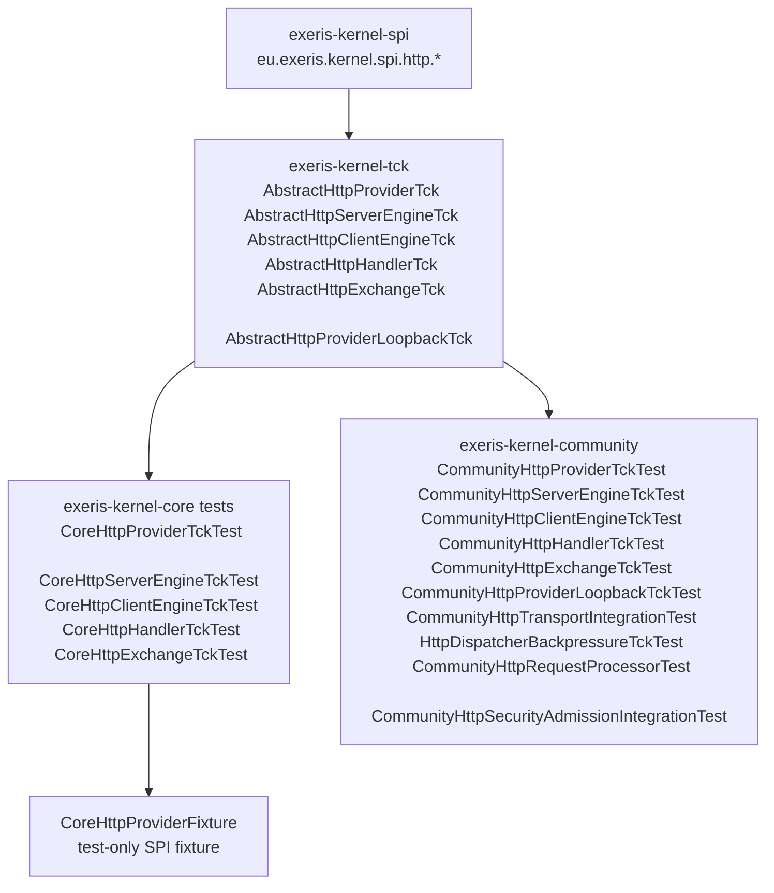

# Kernel Subsystem: HTTP (HPACK + HTTP/2 + HTTP/1.1)

**Layer:** L2 (Wire Translation)  
**Status:** Implemented in `exeris-kernel-core` (`v0.6.0`)

---

## Overview

HTTP in the current repository is implemented as:

- **Contracts (SPI):** `eu.exeris.kernel.spi.http.*` in `exeris-kernel-spi`
- **Codec implementation (Core):** `eu.exeris.kernel.core.http.*` in `exeris-kernel-core`
- **Contract tests (TCK):** `eu.exeris.kernel.tck.contract.http.AbstractHttp*Tck` in `exeris-kernel-tck`

There is intentionally **no separate** `exeris-kernel-spi-http` or `exeris-kernel-http` Maven module
in the root reactor. HTTP contracts are embedded in `exeris-kernel-spi` and the codec
implementation lives in `exeris-kernel-core` — this avoids an extra dependency hop on the hot
path and keeps the module graph flat (see ADR-009).

---

## SPI Scope (exeris-kernel-spi)

HTTP SPI package: `eu.exeris.kernel.spi.http`

Key contracts:

- `HttpProvider`
- `HttpServerEngine`, `HttpClientEngine`
- `HttpHandler`, `HttpExchange`
- `HttpRequest`, `HttpResponse`, `HttpHeader`, `HttpStatus`
- `HttpConfig`, `HttpMode`, `HttpMethod`, `HttpVersion`
- `HttpKernelProviders` (ScopedValue slots)

Typed Response Encoding contracts:

- `HttpTypedResponse` — typed response carrier
- `HttpResponseBodyEncoder` — encoder SPI interface
- `HttpResponseBodyEncoderRegistry` — encoder resolution contract
- `HttpResponseEncodingContext` — encoding parameter carrier
- `HttpEncodedBody` — encoded output carrier

HTTP exceptions in SPI:

- `eu.exeris.kernel.spi.exceptions.http.HttpException`

Wall invariant:

- SPI HTTP remains transport-agnostic and does not expose `io_uring`, QUIC internals,
  NIO channel details, or codec implementation classes.

---

## Core Scope (exeris-kernel-core)

HTTP codec package: `eu.exeris.kernel.core.http`

Implemented components:

- **HPACK / Huffman:** `hpack.*`, `hpack.huffman.*`
- **HTTP/2 framing:** `http2.*`
- **HTTP/1.1 codec:** `http1.*`
- **Routing:** `routing/` — `HttpRouter` — transport-agnostic `HttpHandler` implementation with exact/prefix routing and HEAD→GET fallback (RFC 9110 §9.3.2). `HttpRouterRegisteredEvent` (JFR).

Current placement reality:

- Wire codec code currently lives in Core.
- Community transport implementations are expected to consume these primitives
  via Core in this repository state.

JFR Events (Core):

- `HttpAggregateBufferHeldEvent` (`eu.exeris.kernel.core.http.AggregateBufferHeld`) — emitted when aggregate buffer is held open
- `HttpAggregateBufferForcedReleaseEvent` (`eu.exeris.kernel.core.http.AggregateBufferForcedRelease`) — emitted when aggregate buffer is force-released

---

## TCK Scope (exeris-kernel-tck)

HTTP abstract TCK suites present:

- `AbstractHttpProviderTck`
- `AbstractHttpServerEngineTck`
- `AbstractHttpClientEngineTck`
- `AbstractHttpHandlerTck`
- `AbstractHttpExchangeTck`
- `AbstractHttpProviderLoopbackTck` — verifies real transport round-trip; bound at Community tier (`CommunityHttpProviderLoopbackTckTest`)
- `AbstractHealthEndpointTck` (since 0.7.0) — pins the readiness/liveness endpoint contract for any `HttpHandler` binding that surfaces a `HealthProbe`. Bound at Community tier (`CommunityHealthEndpointTckTest`).

These verify SPI-level HTTP contract behavior and ServiceLoader/provider semantics.

---

## Current Validation Topology (Factual)

At this repository stage, HTTP contract validation is wired as:

- `exeris-kernel-tck`: abstract HTTP contract suites (`AbstractHttp*Tck`)
- `exeris-kernel-core` (test scope): concrete bindings extending those suites
- `exeris-kernel-core` (test scope): minimal fixture provider/engines/exchange used only to satisfy SPI lifecycle contracts

What this currently guarantees:

- SPI contract semantics are executable and verified in CI.
- ServiceLoader selection semantics are verified for HTTP provider contract.
- Production wire engine behavior (socket bind/accept loop, real client transport) — covered by Community integration tests.
- End-to-end runtime transport semantics — covered by Community tier (`CommunityHttpTransportIntegrationTest`).

---

## Core HTTP vs Engine Responsibility

Current `exeris-kernel-core` HTTP package focuses on codec/wire primitives:

- `http1.*`
- `http2.*`
- `hpack.*`
- `hpack.huffman.*`

**Community tier is implemented.** The following production HTTP classes exist in `eu.exeris.kernel.community.http`:
- `CommunityHttpProvider`, `CommunityHttpServerEngine`, `CommunityHttpClientEngine`
- `CommunityHttpRequestProcessor`, `CommunityHttpTransportFactory`
- `CommunityHttpExchange`, `Http2DecodedRequest`, `Http2RequestStreamState`
- `InMemoryHttp2Exchange`, `JsonBodyEncoder`
- `CommunityHttpLifecycleEvent` (JFR)

---

## Architectural Notes (Current State)

- `QPACK` / HTTP/3 implementation is not present in this open repository module set.
- Root Maven modules are currently: `build-config`, `bom`, `parent`, `spi`, `tck`, `core`, `community`.
- Documentation and design discussions that mention dedicated `exeris-kernel-http` module
  should be treated as target/roadmap unless that module appears in the root reactor.

---

## Operational Endpoints

### `HealthEndpointHandler` (Community, since 0.7.0)

`eu.exeris.kernel.community.health.HealthEndpointHandler` is an `HttpHandler` that surfaces an SPI `HealthProbe` (canonically `KernelHealthMonitor`) over HTTP for Kubernetes-style readiness/liveness probes. Default paths: `/healthz/readiness`, `/healthz/liveness`. Status code carries the probe verdict (`200` healthy / `503` not). The textual status from the probe snapshot is mirrored into the `X-Exeris-Health` response header. Non-matching paths return `404`; non-`GET` methods on a probe path return `405` with `Allow: GET`. Full operational contract — including the K8s manifest snippet — lives in [`bootstrap.md` § Kubernetes Health Probes](bootstrap.md#kubernetes-health-probes).