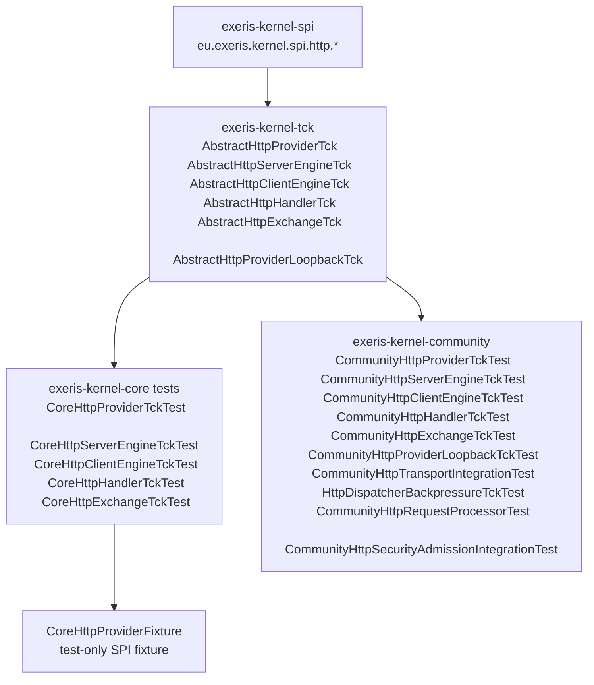

# Kernel Subsystem: HTTP (HPACK + HTTP/2 + HTTP/1.1)

**Layer:** L2 (Wire Translation)  
**Status:** Implemented in `exeris-kernel-core` (`v0.6.0`)

---

## Overview

HTTP in the current repository is implemented as:

- **Contracts (SPI):** `eu.exeris.kernel.spi.http.*` in `exeris-kernel-spi`
- **Codec implementation (Core):** `eu.exeris.kernel.core.http.*` in `exeris-kernel-core`
- **Contract tests (TCK):** `eu.exeris.kernel.tck.contract.http.AbstractHttp*Tck` in `exeris-kernel-tck`

There is intentionally **no separate** `exeris-kernel-spi-http` or `exeris-kernel-http` Maven module
in the root reactor. HTTP contracts are embedded in `exeris-kernel-spi` and the codec
implementation lives in `exeris-kernel-core` — this avoids an extra dependency hop on the hot
path and keeps the module graph flat (see ADR-009).

---

## SPI Scope (exeris-kernel-spi)

HTTP SPI package: `eu.exeris.kernel.spi.http`

Key contracts:

- `HttpProvider`
- `HttpServerEngine`, `HttpClientEngine`
- `HttpHandler`, `HttpExchange`
- `HttpRequest`, `HttpResponse`, `HttpHeader`, `HttpStatus`
- `HttpConfig`, `HttpMode`, `HttpMethod`, `HttpVersion`
- `HttpKernelProviders` (ScopedValue slots)

Typed Response Encoding contracts:

- `HttpTypedResponse` — typed response carrier
- `HttpResponseBodyEncoder` — encoder SPI interface
- `HttpResponseBodyEncoderRegistry` — encoder resolution contract
- `HttpResponseEncodingContext` — encoding parameter carrier
- `HttpEncodedBody` — encoded output carrier

Streaming (server-push) contracts — 🚧 Planned v0.10, ratified by [ADR-043](../adr/ADR-043-kernel-http-streaming-spi.md) (ACCEPTED):

- `HttpStreamExchange` — sibling of `HttpExchange` for SSE server-push; `emit(StreamEvent)` may be called repeatedly until the stream closes. The respond-once `HttpExchange` invariant is left **untouched** — streaming is a separate, opt-in surface selected by route metadata.
- `StreamEvent` — Valhalla-ready record (`event` / `data` / `id` / `retryMillis`) mapping directly to the SSE wire format; event-shaped and implementation-blind (never a raw byte buffer).
- `HttpStreamHandler` — `@FunctionalInterface` sibling of `HttpHandler` (`void handle(HttpStreamExchange)`); disconnect is signalled by `emit()` throwing the unchecked `StreamClosedException` (Loom-idiomatic imperative emit loop, no parked-VT leak).
- `emit()` parks the calling virtual thread under egress backpressure (no on-heap queue), and transfers `LoanedBuffer` ownership to the engine — identical to `HttpExchange.respond()`.
- New error codes: `EX-HTTP-4011` (emit-after-close) and `EX-HTTP-4012` (JWT expired mid-stream, fail-closed per ADR-012 §5). Stream-open admission shedding reuses the existing `EX-NET-4006` + `StreamShedEvent` (see [transport.md](transport.md)), not a new HTTP code.

**v0.10 delivery status (ADR-043).** The SSE mechanism is wired end-to-end in production (Core `HttpStreamEngine` + `SseEventEncoder`, Community dispatch): open → `emit`-N (park-the-VT backpressure) → graceful `close`, peer-disconnect → `StreamClosedException`/`EX-HTTP-4011`, abortive teardown, four single-phase JFR events, all pinned by `AbstractHttpStreamExchangeTck`. Two obligation **mechanisms are built + TCK-pinned but their production binding is deferred**, by design:
- **JWT-expiry fail-closed (`EX-HTTP-4012`)** — the deadline enforcement lives in `HttpStreamEngine`, but production dispatch passes no deadline until the IdentityProvider SPI (ADR-040) surfaces a principal `exp` on the streaming path (ADR-043 §6: Community-internal until then).
- **Streaming-occupancy ceiling** — `StreamAdmissionController` enforces a long-lived-slot ceiling distinct from sub-ms request accounting, but it is not yet wired into production dispatch. The safety property (new stream-opens shed under load) still holds via carrier-edge PAQS; plumbing the dedicated ceiling is a v0.10 follow-up.

HTTP exceptions in SPI:

- `eu.exeris.kernel.spi.exceptions.http.HttpException`

Wall invariant:

- SPI HTTP remains transport-agnostic and does not expose `io_uring`, QUIC internals,
  NIO channel details, or codec implementation classes.

---

## Core Scope (exeris-kernel-core)

HTTP codec package: `eu.exeris.kernel.core.http`

Implemented components:

- **HPACK / Huffman:** `hpack.*`, `hpack.huffman.*`
- **HTTP/2 framing:** `http2.*`
- **HTTP/1.1 codec:** `http1.*`
- **Routing:** `routing/` — `HttpRouter` — transport-agnostic `HttpHandler` implementation with exact/prefix routing and HEAD→GET fallback (RFC 9110 §9.3.2). `HttpRouterRegisteredEvent` (JFR).

Current placement reality:

- Wire codec code currently lives in Core.
- Community transport implementations are expected to consume these primitives
  via Core in this repository state.

JFR Events (Core):

- `HttpAggregateBufferHeldEvent` (`eu.exeris.kernel.core.http.AggregateBufferHeld`) — emitted when aggregate buffer is held open
- `HttpAggregateBufferForcedReleaseEvent` (`eu.exeris.kernel.core.http.AggregateBufferForcedRelease`) — emitted when aggregate buffer is force-released

---

## TCK Scope (exeris-kernel-tck)

HTTP abstract TCK suites present:

- `AbstractHttpProviderTck`
- `AbstractHttpServerEngineTck`
- `AbstractHttpClientEngineTck`
- `AbstractHttpHandlerTck`
- `AbstractHttpExchangeTck`
- `AbstractHttpProviderLoopbackTck` — verifies real transport round-trip; bound at Community tier (`CommunityHttpProviderLoopbackTckTest`)
- `AbstractHealthEndpointTck` (since 0.7.0) — pins the readiness/liveness endpoint contract for any `HttpHandler` binding that surfaces a `HealthProbe`. Bound at Community tier (`CommunityHealthEndpointTckTest`).
- `AbstractHttpStreamExchangeTck` — 🚧 Planned v0.10 ([ADR-043](../adr/ADR-043-kernel-http-streaming-spi.md)) — pins the SSE streaming contract: open / emit-N / graceful close / disconnect-via-`StreamClosedException`, backpressure park-and-resume on window credit, and no respond-once regression. Community binding required; Enterprise native overlay declared as a cross-repo obligation.

These verify SPI-level HTTP contract behavior and ServiceLoader/provider semantics.

---

## Current Validation Topology (Factual)

At this repository stage, HTTP contract validation is wired as:

- `exeris-kernel-tck`: abstract HTTP contract suites (`AbstractHttp*Tck`)
- `exeris-kernel-core` (test scope): concrete bindings extending those suites
- `exeris-kernel-core` (test scope): minimal fixture provider/engines/exchange used only to satisfy SPI lifecycle contracts

What this currently guarantees:

- SPI contract semantics are executable and verified in CI.
- ServiceLoader selection semantics are verified for HTTP provider contract.
- Production wire engine behavior (socket bind/accept loop, real client transport) — covered by Community integration tests.
- End-to-end runtime transport semantics — covered by Community tier (`CommunityHttpTransportIntegrationTest`).

---

## Core HTTP vs Engine Responsibility

Current `exeris-kernel-core` HTTP package focuses on codec/wire primitives:

- `http1.*`
- `http2.*`
- `hpack.*`
- `hpack.huffman.*`

**Community tier is implemented.** Since the v0.8 Sprint 3 ADR-026 amendment (2026-05-17) the Community HTTP source tree is split into `shared/` / `client/` / `server/` / `h2/` subpackages under `eu.exeris.kernel.community.http`; the production classes are:
- `CommunityHttpProvider`, `CommunityHttpServerEngine`, `CommunityHttpClientEngine`
- `CommunityHttpRequestProcessor`, `CommunityHttpTransportFactory`
- `CommunityHttpExchange`, `Http2DecodedRequest`, `Http2RequestStreamState`, `Http2SessionContext`, `CommunityHttp2SessionProcessor`
- `InMemoryHttp2Exchange`, `JsonBodyEncoder`
- `CommunityHttpLifecycleEvent` (JFR)
- `eu.exeris.kernel.community.http.client.CommunityWebClient` + `WebClientException` (since v0.8 Sprint 2, ADR-026) — typed HTTP verbs + Jackson 3 JSON binding façade on top of `HttpClientEngine`; the SPI surface consumed by `exeris-tooling`'s `KernelClientGenerator` for typed per-entity clients.

### HTTP/2 stream admission (since v0.8 Sprint 5, HTTP-112)

`Http2SessionContext.admitClientStreamId(int)` enforces two RFC 7540 invariants that the Community h2c session previously did not validate:

- **§5.1.1 stream-id monotonicity** — peer-initiated stream IDs MUST be odd and strictly greater than the previous client-initiated ID. Even IDs (server-reserved) and stale/equal IDs return `REJECT_INVALID_ID`; `CommunityHttp2SessionProcessor` responds with `GOAWAY(PROTOCOL_ERROR)` and stops the frame loop (connection-fatal).
- **§5.1.2 `SETTINGS_MAX_CONCURRENT_STREAMS` cap** — when the request-stream table is full, admission returns `REJECT_OVER_CAP`; the processor responds with per-stream `RST_STREAM(REFUSED_STREAM)` and keeps the connection alive for other streams. The watermark advances only on `ACCEPT`, so an OVER_CAP id may be re-admitted later when the table drains.
- **Default cap:** `HTTP2_DEFAULT_MAX_CONCURRENT_STREAMS = 100` (RFC 7540 §6.5.2 recommended floor). A future SETTINGS extension can raise it.
- **Coverage:** `Http2SessionContextAdmissionTest` (7 pure-function cases, no I/O).

### HTTP/2 Rapid Reset flood defense (CVE-2023-44487, since v0.9)

The §5.1.2 concurrent-stream cap alone does **not** defend against Rapid Reset: a peer that opens a stream and immediately sends `RST_STREAM` frees the slot before the cap is ever reached, so it can drive unbounded request setup/teardown on a single connection (CVE-2023-44487, the 2023 HTTP/2 Rapid Reset DoS).

- **Net rapid-reset budget** — `Http2SessionContext` keeps a per-connection net counter: each inbound `RST_STREAM` (`recordInboundRstStream()`) increments it, and each request that reaches dispatch (`recordDispatchedRequest()`) credits it back (floor 0). A peer doing legitimate work — even one that cancels streams — keeps the net count low; an open-then-reset flood that performs no work drives it past the budget.
- **Trip** — once the net count exceeds `HTTP2_RAPID_RESET_BUDGET` (`200`, 2× the §6.5.2 concurrent-stream floor), `CommunityHttp2SessionProcessor` emits `GOAWAY(ENHANCE_YOUR_CALM)` (RFC 7540 §7, code `0x0B`) and stops the frame loop (connection-fatal).
- **Budget knob** — codec-internal constant, **not** an `HttpConfig` SPI field (the v0.9 hardening is "no SPI change"; The Wall holds — an HTTP/2 logical stream is multiplexed over one TCP `TransportStream`, so the budget has no implementation-blind SPI seam).
- **Telemetry** — `Http2RapidResetFloodEvent` (JFR, `eu.exeris.kernel.http.Http2RapidResetFlood`) on trip: secret-safe, carrying only the net reset count + last processed stream id (never request content); maps to `EX-HTTP-4010`.
- **Coverage:** `Http2RapidResetSpecTest` (flood-trips-at-budget + legitimate-cancels-do-not-trip).

---

## Architectural Notes (Current State)

- `QPACK` / HTTP/3 implementation is not present in this open repository module set.
- Root Maven modules are currently: `build-config`, `bom`, `parent`, `spi`, `tck`, `core`, `community`.
- Documentation and design discussions that mention dedicated `exeris-kernel-http` module
  should be treated as target/roadmap unless that module appears in the root reactor.

---

## Operational Endpoints

### `HealthEndpointHandler` (Community, since 0.7.0)

`eu.exeris.kernel.community.health.HealthEndpointHandler` is an `HttpHandler` that surfaces an SPI `HealthProbe` (canonically `KernelHealthMonitor`) over HTTP for Kubernetes-style readiness/liveness probes. Default paths: `/healthz/readiness`, `/healthz/liveness`. Status code carries the probe verdict (`200` healthy / `503` not). The textual status from the probe snapshot is mirrored into the `X-Exeris-Health` response header. Non-matching paths return `404`; non-`GET` methods on a probe path return `405` with `Allow: GET`. Full operational contract — including the K8s manifest snippet — lives in [`bootstrap.md` § Kubernetes Health Probes](bootstrap.md#kubernetes-health-probes).

---

## Stability

This subsystem's SPI surface (`eu.exeris.kernel.spi.http.*`) is classified **mixed** in the
[SPI Stability Matrix](../stability-matrix.md): `HttpClientEngine`, `HttpServerEngine`,
`HttpProvider`, and `HttpClientRequestEnricher` are **stable**, while the body-codec quadrant
(`HttpRequestBodyEncoder` / `HttpRequestBodyDecoder` / `HttpResponseBodyDecoder`, ADR-034) is held
at **preview** until the server-side generator loop that consumes the request decoder closes. See
the matrix's `…spi.http` per-surface breakdown for the semver policy and TCK coverage status.
