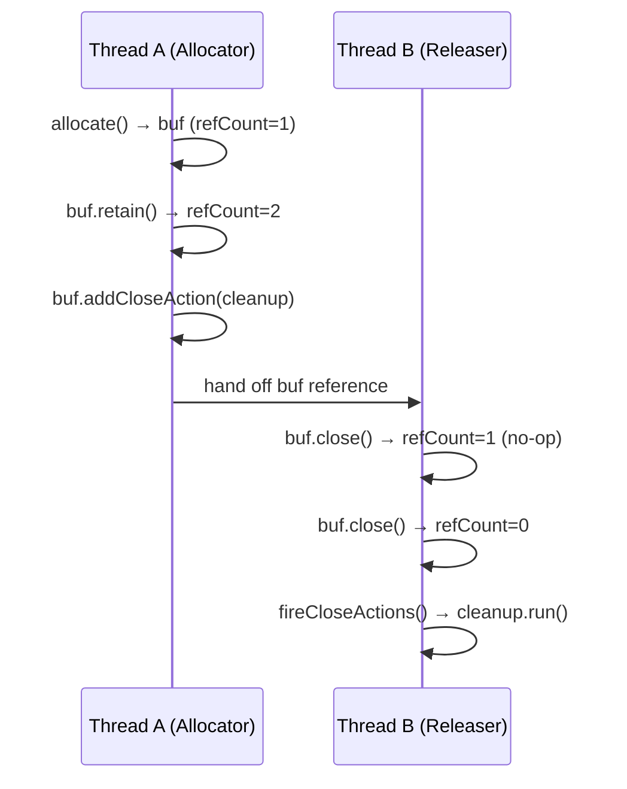
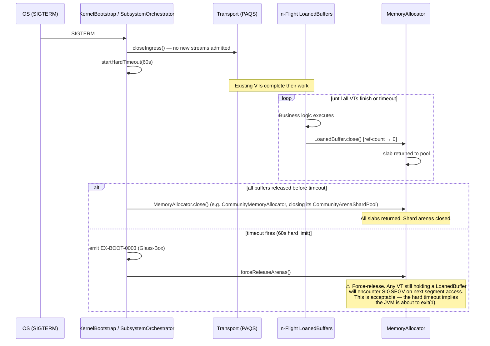
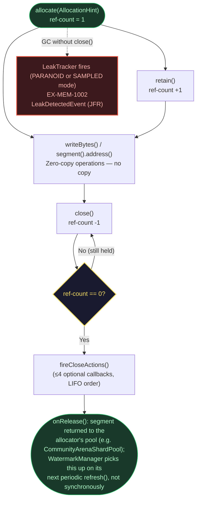

# Kernel Subsystem: Memory (L0 Foundation)

**Physical Layout:**

- SPI: `eu.exeris.kernel.spi.memory.*` (Allocators, LoanedBuffer)
- Core: `eu.exeris.kernel.core.memory.*` (AbstractLoanedBuffer, LeakTracker, WatermarkLevel, WatermarkManager, ResourceArbiter, ScalingContext, MemoryEnvironmentProbe, MemoryMaintenanceTask, JFR events)
- Drivers: `exeris-kernel-community`

**Layer:** L0 (Foundation)
**Status:** Validated Architectural Prototype (TRL-3)

---

## Overview

The **Memory subsystem** implements the **Zero-Allocation Memory Model** for the Exeris Kernel using Java 26 Panama
FFM (Foreign Function & Memory API). Instead of a monolithic manager, memory is handled via a strict SPI-driven provider
model. It provides:

- **Pluggable Allocation Strategies:** Drivers implement the `MemoryAllocator` SPI, discovered through
  `MemoryProvider#createAllocator` (e.g., the shard-based `Arena` pool in Community).
- **Loan Pattern (RAII):** Automatic reference counting via `LoanedBuffer` and VarHandle-based atomics (zero GC
  pressure).
- **Paranoid Leak Detector:** Integrated `java.lang.ref.Cleaner` to detect unclosed Off-Heap segments.
- **Watermark & Resource Arbiter:** Core intelligence that monitors memory exhaustion and triggers load shedding.

### Design Principles

Every byte allocated must serve a purpose:

- **Zero GC Churn:** No object allocations on the I/O hot-path. Data flows via `LoanedBuffer` references.
- **Zero Copy:** Data is never copied to the JVM Heap unless interacting with legacy Java systems.
- **Deterministic Lifecycle:** Reference counting via `VarHandle` atomics ensures memory is returned to native pools
  immediately after use.
- **Implementation Blindness:** Core operates exclusively on the `MemoryAllocator` interface injected via
  `ServiceLoader`. It must never know what platform-specific allocator backs the `MemoryAllocator` contract.

---

## Responsibilities

**What Memory SPI/Core DOES:**

1. Define strict contracts for allocation (`AllocationHint`); `PartitionedPool` is planned but not yet implemented.
2. Provide lock-free base classes (`AbstractLoanedBuffer`).
3. Monitor memory pressure via `WatermarkManager`.
4. Decide when to shed load (`ResourceArbiter`).

**What Memory Drivers DO:**

1. Allocate and manage physical Off-Heap memory.
2. Maintain pools of pre-sliced slabs for O(1) network buffer allocation.
3. Integrate with specific hardware/OS capabilities.

---

## Error Codes (Glass-Box Telemetry)

> **Source of truth:** `KernelErrorCodes.java` in `exeris-kernel-spi` declares each code's `rawArgs`
> layout in its Javadoc. **Only `EX-MEM-1001` is actually thrown that way** — its exception
> (`MemoryExhaustedException extends ExerisKernelException`) carries the two values below through a
> real `rawArgs()` array. `EX-MEM-1002` and `EX-MEM-1003` are never thrown as exceptions at all: both
> are reported purely as `jdk.jfr.Event` subclasses (`LeakDetectedEvent`, `PeekMisuseEvent`) with
> named typed fields, not a `rawArgs` array — `LeakDetectedEvent`'s own Javadoc says so explicitly.
> The Payload column below documents each event's actual fields; it deliberately diverges from
> `KernelErrorCodes.java`'s own `rawArgs` Javadoc for 1002/1003, which describes a layout
> (`segmentAddress`/`segmentByteSize` for 1002; an undocumented "allocation hint conflict" for 1003)
> that neither event implements — that SPI-side Javadoc is itself stale and outside this document's
> reach (`.java` files are not touched here).

| Code          | Meaning                  | Action                                          | Actual Payload (JFR event fields, not `rawArgs`)     |
|:--------------|:-------------------------|:------------------------------------------------|:-----------------------------------------------------|
| `EX-MEM-1001` | Off-heap Exhausted       | Trigger `H3_EXCESSIVE_LOAD` backpressure.       | `MemoryExhaustedException.rawArgs()`: `[0] long requestedBytes, [1] long availableBytes` |
| `EX-MEM-1002` | Arena Leak Detected      | `LeakTracker` fires in `PARANOID` (every allocation) or `SAMPLED` (~1-in-128) mode when a buffer is GC'd unclosed. | `LeakDetectedEvent` fields: `bufferLabel` (String, hex identity hash), `allocationStack` (String, `PARANOID` only), `capacityBytes` (long) |
| `EX-MEM-1003` | Peek View Ownership Misuse | `retain()` or `addCloseAction()` was called on a non-owning view returned by `peek()`; call was a no-op, potential use-after-free risk. | `PeekMisuseEvent` fields: `errorCode` (String, `"EX-MEM-1003"`), `callerMethod` (String, `"retain"` or `"addCloseAction"`) |

---

## The Loan Pattern (RAII)

Exeris replaces `byte[]` with `LoanedBuffer`. Applications must use the `try-with-resources` pattern to ensure
deterministic cleanup. Applications interact only with the SPI — the underlying allocator is invisible.

```java
try (LoanedBuffer buffer = allocator.allocate(AllocationHint.MEDIUM)) {
    buffer.writeBytes(payload, 0, payload.length);
    transport.send(buffer);
}
```

### Async Ownership Transfer (forked subtasks)

When passing a `LoanedBuffer` to a forked subtask, you **MUST** explicitly retain ownership before
forking. A scope's `join()` barrier does not manage buffer lifetimes. The scope below is
`core.concurrent.StructuredScope`, the GA-line seam; on the `preview` branch the same rule holds for
`StructuredTaskScope`, and it is the retain/close pairing that matters, not which type owns the fork.

```java
try (StructuredScope scope = StructuredScope.openWithoutBindings()) {
    try (LoanedBuffer buffer = allocator.allocate(AllocationHint.NETWORK_FRAME)) {
        buffer.retain();

        scope.fork(() -> {
            try {
                return processAsync(buffer);
            } finally {
                buffer.close();
            }
        });

        scope.join();
    }
}
```

> If a subtask outlives its parent scope (advanced orchestration only), `retain()` is mandatory to prevent a
> use-after-free on the native segment.

#### Ownership Transfer Timing Diagram

The following diagram shows the exact point at which ownership is transferred and the JMM happens-before chain
that makes close actions visible across threads:



> **JMM Contract:** Visibility of `closeAction` slots across threads is guaranteed by an explicit
> `VarHandle.fullFence()` issued after each slot write in `addCloseAction()`, paired with the matching
> fence before the read in the close-side `fireCloseActions()` — the fields themselves are plain
> (non-volatile) `Runnable`s, so the fence pair is what makes the write visible, not the reference-count
> `VarHandle` CAS and not implicit safe-publication through the hand-off alone. Thread B is guaranteed
> to observe every `closeAction` slot written by Thread A as long as this fence pair executes on both
> sides.
> **Community transport handoff note:** Community transport commonly hands off `LoanedBuffer`
> ownership through queue-based cross-VT transfer (carrier thread allocates, stream VT may release).
> For this reason Community allocator ownership must not use `Arena.ofConfined()`; every native
> segment the Community allocator hands out — across the nine pooled size classes (512 B up to
> 1 MB) and oversized requests above 1 MB — is sourced from one per-shard `Arena`, created once via
> `Arena.ofShared()` lazily on first use, to keep release deterministic across that handoff. This
> does not mean the arena is touched on every allocation: a free-list hit reuses a previously
> pooled segment without calling into the arena at all; only a free-list miss or an oversized
> request calls `arena.allocate()` on it. Oversized allocations are not dropped to temporary
> auto-arenas; they allocate from the same per-shard shared arena as pooled allocations, so their
> release is only accounted for (`CommunityOverflowReturnEvent`), not returned to a free-list
> bucket — the backing memory is reclaimed when the pool's shard arena closes.

> **JFR event:** `CommunityOverflowReturnEvent` (`eu.exeris.kernel.community.memory.CommunityOverflowReturnEvent`) — emitted when an oversized off-heap slab is returned to the shared arena pool.

---

## Multi-Tier Memory Strategy

| Tier           | Allocator                                                                     | GC Handshakes on hot-path | Use Case                          |
|:---------------|:------------------------------------------------------------------------------|:--------------------------|:----------------------------------|
| **Community**  | `MemoryAllocator` via `KernelProviders.MEMORY_ALLOCATOR` (shared, bounded; pooled size classes and oversized allocations > 1 MB both source segments from one per-shard `Arena.ofShared()`, but a pooled-size-class free-list hit reuses a segment without calling into that arena) | Low (JVM thread-local)    | Standard TCP, JDBC persistence    |

### ScalingContext — Multi-Tenant SLA Shedding (INCUBATING — TRL-2)

`ScalingContext` defines per-tier shedding thresholds (`premium`, `standard`, `free`) with O(1) `actionFor(utilization)`
decisions.

> `ResourceArbiter.decide(Context, ScalingContext)` is implemented in Core (applies tenant-specific SLA thresholds). However, `ScalingContext` has no TCK coverage (no `AbstractScalingContextArbiterTck` exists) and is not yet connected to the bootstrap propagation path (no `ScopedValue` slot for production use) — the caller must construct or select a `ScalingContext` and pass it explicitly on every call.

---

## Code Examples

### 1. Subsystem Registration via ServiceLoader

Core never directly instantiates an allocator. It receives it through the SPI discovery chain.

```java
MemoryAllocator allocator = ServiceLoader.load(MemoryAllocator.class)
        .findFirst()
        .orElseThrow(); // no MemoryAllocator provider on the module/class path
```

### 2. ResourceArbiter Integration

The arbiter is consulted by call sites (transport admission, background logic) — it never throttles,
rejects, or throws itself; it only returns an `Action` derived from the current `WatermarkLevel`.
Enforcement, including raising `MemoryExhaustedException`, is the caller's responsibility. The
arbiter is not allocation-free, though: on a decision-cache miss (`decide(Context)`, about once per
millisecond per context) and on every call to the uncached `decide(Context, ScalingContext)`
overload, it allocates and commits a `ResourceArbiterDecisionEvent` JFR object when `FlightRecorder`
is initialized:

```java
public final class RequestGate {

    private final ResourceArbiter arbiter;
    private final MemoryAllocator allocator;

    public LoanedBuffer tryAllocate(AllocationHint hint) {
        if (arbiter.decide(ResourceArbiter.Context.TRANSPORT_IO) == ResourceArbiter.Action.SHED_LOAD) {
            throw new MemoryExhaustedException(hint.sizeBytes(), 0L);
        }
        return allocator.allocate(hint);
    }
}
```

---

## WatermarkManager — Levels and Configuration

`WatermarkManager` monitors off-heap utilisation and resolves it to one of four discrete `WatermarkLevel`
values (three threshold boundaries — 70/85/95%, hardcoded in the enum, see the note below) that drive
`ResourceArbiter` decisions and, through it, PAQS load shedding.

The `ResourceArbiter` Action column below is what `ResourceArbiterPolicy.actionForLevel` returns for the
`TRANSPORT_IO` context. **The arbiter only returns this `Action` value — it never itself throttles,
rejects, or throws.** Enforcement is entirely the caller's: `AdmissionController` (transport)
consults it per inbound stream and maps the action to an admission `Decision` by `StreamPriority`;
`EX-MEM-1001`/`MemoryExhaustedException` is raised only by the allocator itself, when a physical
allocation attempt fails (arena `OutOfMemoryError`) — the arbiter's `SHED_LOAD` does not throw it
directly, and nothing in Memory gates on a specific `AllocationHint`. The arbiter is not
allocation-free: `decide(Context)` allocates a `ResourceArbiterDecisionEvent` JFR object on each
~1 ms cache miss, and `decide(Context, ScalingContext)` (used by the per-tenant SLA path below) is
never cached, so it allocates one on every call, whenever `FlightRecorder` is initialized.

| Level        | Default Threshold | PAQS Response                                                  | `ResourceArbiter` Action (`TRANSPORT_IO`)        |
|:-------------|:-----------------:|:---------------------------------------------------------------|:-------------------------------------------------|
| `NORMAL`     | < 70%             | All `StreamPriority` admitted                                  | `ALLOW`                                          |
| `WARNING`    | 70–85%            | `LOW` and `TELEMETRY` streams shed (`EX-NET-4006`)             | `THROTTLE`                                       |
| `CRITICAL`   | 85–95%            | All streams shed except `CRITICAL` priority                    | `REJECT`                                         |
| `SHEDDING`   | ≥ 95%             | All streams shed regardless of priority (`H3_EXCESSIVE_LOAD`) | `SHED_LOAD`                                      |

(`KERNEL_LOGIC` context is stricter: it already reaches `SHED_LOAD` at `CRITICAL`, trading background
work — projections, sagas, graph queries — for transport throughput under pressure.)

**Configuration keys** (API format — prefix `exeris.` for system properties, e.g. `-Dexeris.memory.watermarkPollIntervalMs=50`):

```
network.paqs.warningThreshold=0.70    # fraction of total off-heap budget
network.paqs.criticalThreshold=0.85
network.paqs.sheddingThreshold=0.95
memory.watermarkPollIntervalMs=50     # sampling interval
```

> **Sampling note:** Allocation sampling is configurable via `telemetry.allocationSampleRate=0.01`.
> This rate is not hardcoded — operators running JFR-based heap analysis may set it to `1.0`
> temporarily at the cost of higher telemetry overhead.

> **Note:** These configuration keys are planned. In the current implementation: 
> WatermarkManager thresholds are hardcoded via `WatermarkLevel` enum constants (70/85/95%); 
> the watermark refresh interval defaults to **5,000 ms** (not 50 ms as shown); 
> `telemetry.allocationSampleRate` is not implemented — Community JFR sampling uses system property 
> `-Dexeris.community.memory.jfr.sampleEvery=N` (integer allocation-frequency, not a rate fraction).

---

### Core Operational Components

- **`MemoryEnvironmentProbe`** — when invoked, detects total memory via cgroup v2, then cgroup v1,
  then OS physical RAM, then JVM `-Xmx`, to compute an off-heap budget, and emits a single
  `MemoryEnvironmentProbed` JFR event. Not currently wired to bootstrap: no caller in
  `KernelBootstrap`, `SubsystemOrchestrator`, or `CommunityMemorySubsystem` invokes it in this
  repository — its only caller is its own unit test, so it does not run during a kernel boot today.
- **`MemoryMaintenanceTask`** — Virtual Thread maintenance loop: calls `performMaintenance()` every 10 s, `WatermarkManager.refresh()` every 5 s

---

## Graceful Shutdown — In-Flight LoanedBuffers

> **Not yet implemented.** Per `docs/subsystems/bootstrap.md`, OS signal handling (`SIGTERM`/`SIGINT`)
> is not implemented in `KernelBootstrap`/`SubsystemOrchestrator` on this tree — callers are
> responsible for invoking `boot()` and managing JVM shutdown themselves. Neither `closeIngress()`
> nor a hard-timeout drain loop exists in the bootstrap code today, and no `SagaEngine` class exists
> in this repository. The sequence below is the **target design** this subsystem is meant to honor
> once bootstrap grows signal handling; treat it as forward-looking, not as what a `kill -TERM` on
> today's kernel actually does to an in-flight `LoanedBuffer`.

The intended contract for in-flight `LoanedBuffer` instances, once implemented:



> **Operator implication (once implemented):** the target design sets `terminationGracePeriodSeconds: 75`
> in the K8s pod spec (60 s drain + 15 s buffer). Long-lived work parked with active `LoanedBuffer`
> references at shutdown would be force-released under this design; this document makes no claim about
> a saga/compensation mechanism, since no such class exists in this repository today.

---

## LoanedBuffer — Full Lifecycle Diagram



---

## Testing Strategy

### Unit Tests

- Reference counting (`retain`/`close` logic in `AbstractLoanedBuffer`).
- `VarHandle` thread-safety under concurrent modifications.
- FFM memory bounds checking (preventing out-of-bounds reads/writes).

### Integration Tests (TCK)

- Multiple Virtual Threads allocating/deallocating concurrently.
- Arena exhaustion (graceful `MemoryExhaustedException` with correct `EX-MEM-1001` code).
- `LeakTracker` correctly identifying dropped buffers in `PARANOID` mode (`EX-MEM-1002`).

**TCK gap:** `ResourceArbiter.decide(Context, ScalingContext)` — the per-tenant SLA override path has no TCK coverage. `AbstractScalingContextArbiterTck` does not yet exist.

### Performance (JMH)

- `CommunityMemoryAllocatorBenchmark` (`exeris-kernel-community`, extends the TCK's
  `AbstractMemoryAllocatorBenchmark`): documents an SLO of **≥ 500,000 acquire/release ops/s** for
  a single-threaded `AllocationHint.MICRO` loop through the Community allocator, and requires the
  raw heap-array baseline to stay ≥ 10× faster than that. This is a JMH microbenchmark checked by a
  human reading its output, not an enforced CI gate and not a sustained concurrent load test.

---

## Summary

The Memory subsystem provides the foundation for hyper-density execution. By enforcing the `LoanedBuffer` pattern
through SPI and resolving allocator implementations via `ServiceLoader`, it ensures that off-heap memory lifecycle is explicit and GC-independent, 
regardless of which allocator is active.

---

## Owning ADRs

- [ADR-007](../adr/ADR-007-next-gen-runtime-architecture.md) — Next-Gen Runtime Architecture (Exeris Kernel)

## Stability

This subsystem's SPI surface (`eu.exeris.kernel.spi.memory.*`) is classified **stable** in the
[SPI Stability Matrix](../stability-matrix.md). See the matrix for the semver policy and TCK
coverage status.
