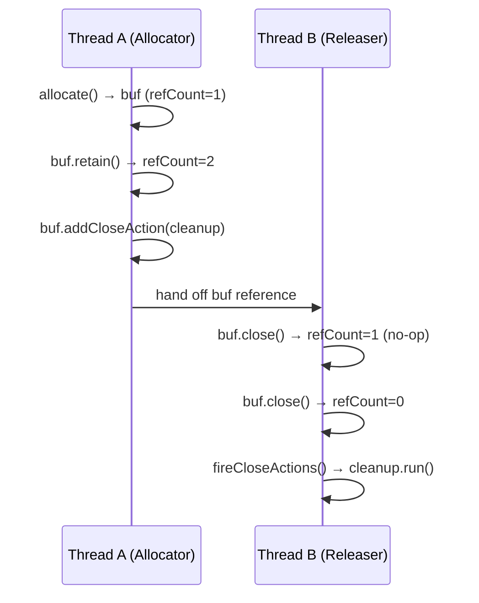
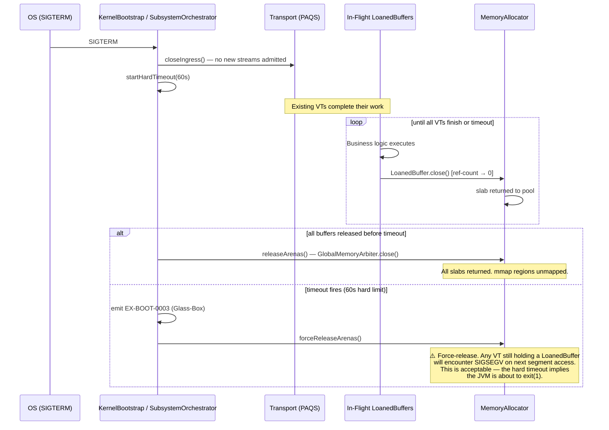
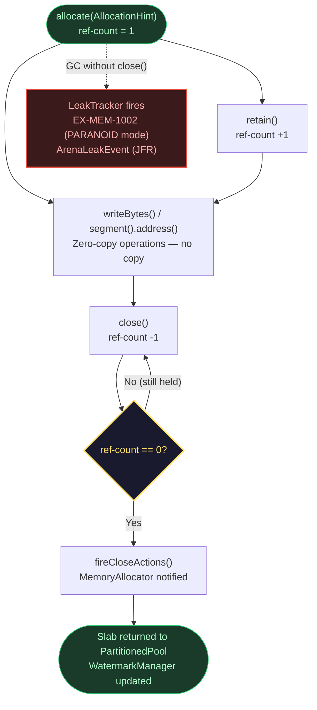

# Kernel Subsystem: Memory (L0 Foundation)

**Physical Layout:**

- SPI: `eu.exeris.kernel.spi.memory.*` (Allocators, LoanedBuffer)
- Core: `eu.exeris.kernel.core.memory.*` (AbstractLoanedBuffer, LeakTracker, WatermarkLevel, WatermarkManager, ResourceArbiter, ScalingContext, MemoryEnvironmentProbe, MemoryMaintenanceTask, JFR events)
- Drivers: `exeris-kernel-community`

**Layer:** L0 (Foundation)
**Status:** Validated Architectural Prototype (TRL-3)

---

## Overview

The **Memory subsystem** implements the **Zero-Allocation Memory Model** for the Exeris Kernel using Java 26 Panama
FFM (Foreign Function & Memory API). Instead of a monolithic manager, memory is handled via a strict SPI-driven provider
model. It provides:

- **Pluggable Allocation Strategies:** Drivers implement `MemoryAllocator` and `NetworkBufferCluster` (e.g., standard
  Arenas in Community).
- **Loan Pattern (RAII):** Automatic reference counting via `LoanedBuffer` and VarHandle-based atomics (zero GC
  pressure).
- **Paranoid Leak Detector:** Integrated `java.lang.ref.Cleaner` to detect unclosed Off-Heap segments.
- **Watermark & Resource Arbiter:** Core intelligence that monitors memory exhaustion and triggers load shedding.

### Design Principles

Every byte allocated must serve a purpose:

- **Zero GC Churn:** No object allocations on the I/O hot-path. Data flows via `LoanedBuffer` references.
- **Zero Copy:** Data is never copied to the JVM Heap unless interacting with legacy Java systems.
- **Deterministic Lifecycle:** Reference counting via `VarHandle` atomics ensures memory is returned to native pools
  immediately after use.
- **Implementation Blindness:** Core operates exclusively on the `MemoryAllocator` interface injected via
  `ServiceLoader`. It must never know what platform-specific allocator backs the `MemoryAllocator` contract.

---

## Responsibilities

**What Memory SPI/Core DOES:**

1. Define strict contracts for allocation (`AllocationHint`); `PartitionedPool` is planned but not yet implemented.
2. Provide lock-free base classes (`AbstractLoanedBuffer`).
3. Monitor memory pressure via `WatermarkManager`.
4. Decide when to shed load (`ResourceArbiter`).

**What Memory Drivers DO:**

1. Allocate and manage physical Off-Heap memory.
2. Maintain pools of pre-sliced slabs for O(1) network buffer allocation.
3. Integrate with specific hardware/OS capabilities.

---

## Error Codes (Glass-Box Telemetry)

> **Source of truth:** `KernelErrorCodes.java` in `exeris-kernel-spi`. The `rawArgs` binary layout is defined
> in the Javadoc of each constant and must not diverge from this table.

| Code          | Meaning                  | Action                                          | Glass-Box Payload (`rawArgs`)                        |
|:--------------|:-------------------------|:------------------------------------------------|:-----------------------------------------------------|
| `EX-MEM-1001` | Off-heap Exhausted       | Trigger `H3_EXCESSIVE_LOAD` backpressure.       | `[0] long requestedBytes, [1] long availableBytes`   |
| `EX-MEM-1002` | Arena Leak Detected      | Log in `PARANOID` mode with native stack trace. | `[0] long segmentAddress, [1] long segmentByteSize`  |
| `EX-MEM-1003` | Peek View Ownership Misuse | `retain()` or `addCloseAction()` was called on a non-owning view returned by `peek()`; call was a no-op, potential use-after-free risk. | `rawArgs[0]: String callerMethod` |

---

## The Loan Pattern (RAII)

Exeris replaces `byte[]` with `LoanedBuffer`. Applications must use the `try-with-resources` pattern to ensure
deterministic cleanup. Applications interact only with the SPI — the underlying allocator is invisible.

```java
try (LoanedBuffer buffer = allocator.allocate(AllocationHint.MEDIUM)) {
    buffer.writeBytes(payload, 0, payload.length);
    transport.send(buffer);
}
```

### Async Ownership Transfer (StructuredTaskScope)

When passing a `LoanedBuffer` to a subtask forked inside a `StructuredTaskScope`, you **MUST** explicitly retain
ownership before forking. The scope's `join()` barrier does not manage buffer lifetimes.

```java
try (var scope = StructuredTaskScope.open(Joiner.awaitAllSuccessfulOrThrow())) {
    try (LoanedBuffer buffer = allocator.allocate(AllocationHint.NETWORK_FRAME)) {
        buffer.retain();

        scope.fork(() -> {
            try {
                return processAsync(buffer);
            } finally {
                buffer.close();
            }
        });

        scope.join();
    }
}
```

> If a subtask outlives its parent scope (advanced orchestration only), `retain()` is mandatory to prevent a
> use-after-free on the native segment.

#### Ownership Transfer Timing Diagram

The following diagram shows the exact point at which ownership is transferred and the JMM happens-before chain
that makes close actions visible across threads:



> **JMM Contract:** Visibility of `closeAction` slots across threads is guaranteed by standard Java
> safe publication semantics — e.g., passing the `LoanedBuffer` reference via `StructuredTaskScope`
> or a concurrent queue — rather than explicit memory fences. Thread B is guaranteed to observe every
> `closeAction` slot written by Thread A as long as the buffer reference itself is published safely.
> **Community transport handoff note:** Community transport commonly hands off `LoanedBuffer`
> ownership through queue-based cross-VT transfer (carrier thread allocates, stream VT may release).
> For this reason Community allocator ownership must not use `Arena.ofConfined()`; current Community
> allocator uses shared arena semantics for all allocations (both pooled size-class allocations and
> oversized allocations > 128 KB) to keep release deterministic across that handoff.
> Oversized allocations are not dropped to temporary auto-arenas; they allocate from the same shared
> arena as pooled allocations, ensuring uniform lifecycle management.

> **Contract note (2026-03 refactor):** Community oversized allocations (> 128 KB) were moved from
> temporary `Arena.ofAuto()` fallback behavior to shared-arena allocation for consistency and
> cross-VT ownership safety. This removes GC-driven lifecycle variance for oversized buffers.

> **JFR event:** `CommunityOverflowReturnEvent` (`eu.exeris.kernel.community.memory.CommunityOverflowReturnEvent`) — emitted when an oversized off-heap slab is returned to the shared arena pool.

---

## Multi-Tier Memory Strategy

| Tier           | Allocator                                                                     | GC Handshakes on hot-path | Use Case                          |
|:---------------|:------------------------------------------------------------------------------|:--------------------------|:----------------------------------|
| **Community**  | `MemoryAllocator` via `KernelProviders.MEMORY_ALLOCATOR` (shared, bounded; pooled and oversized > 128 KB both use shared arena) | Low (JVM thread-local)    | Standard TCP, JDBC persistence    |

### ScalingContext — Multi-Tenant SLA Shedding (INCUBATING — TRL-2)

`ScalingContext` defines per-tier shedding thresholds (`premium`, `standard`, `free`) with O(1) `actionFor(utilization)`
decisions.

> `ResourceArbiter.decide(Context, ScalingContext)` is implemented in Core (applies tenant-specific SLA thresholds). However, `ScalingContext` has no TCK coverage and is not yet connected to the bootstrap propagation path (no ScopedValue slot for production use). The TRL status for this feature is TRL-3 (implemented but not fully integrated).

---

## Code Examples

### 1. Subsystem Registration via ServiceLoader

Core never directly instantiates an allocator. It receives it through the SPI discovery chain.

```java
MemoryAllocator allocator = ServiceLoader.load(MemoryAllocator.class)
        .findFirst()
        .orElseThrow(() -> new KernelBootstrapException(KernelErrorCodes.EX_BOOT_0002));
```

### 2. WatermarkManager Integration

```java
public class ResourceArbiter {

    private final WatermarkManager watermark;
    private final MemoryAllocator allocator;

    public LoanedBuffer tryAllocate(AllocationHint hint) {
        if (watermark.isHighWatermarkBreached()) {
            throw new MemoryExhaustedException(hint.bytes(), watermark.availableBytes());
        }
        return allocator.allocate(hint);
    }
}
```

---

## WatermarkManager — Levels and Configuration

`WatermarkManager` monitors off-heap utilisation and exposes three threshold levels that drive PAQS
load shedding and `ResourceArbiter` decisions.

| Level        | Default Threshold | PAQS Response                                                  | `ResourceArbiter` Action                         |
|:-------------|:-----------------:|:---------------------------------------------------------------|:-------------------------------------------------|
| `NORMAL`     | < 70%             | All `StreamPriority` admitted                                  | `ALLOW` — allocations proceed unrestricted       |
| `WARNING`    | 70–85%            | `LOW` and `TELEMETRY` streams shed (`EX-NET-4006`)             | `THROTTLE` — new `AllocationHint.LARGE` requests rejected |
| `CRITICAL`   | 85–95%            | All streams shed except `CRITICAL` priority                    | `REJECT` — all new non-essential allocations rejected |
| `SHEDDING`   | ≥ 95%             | All streams shed regardless of priority (`H3_EXCESSIVE_LOAD`) | `SHED_LOAD` — new allocations refused; `EX-MEM-1001` thrown |

**Configuration keys** (API format — prefix `exeris.` for system properties, e.g. `-Dexeris.memory.watermarkPollIntervalMs=50`):

```
network.paqs.warningThreshold=0.70    # fraction of total off-heap budget
network.paqs.criticalThreshold=0.85
network.paqs.sheddingThreshold=0.95
memory.watermarkPollIntervalMs=50     # sampling interval
```

> **Sampling note:** Allocation sampling is configurable via `telemetry.allocationSampleRate=0.01`.
> This rate is not hardcoded — operators running JFR-based heap analysis may set it to `1.0`
> temporarily at the cost of higher telemetry overhead.

> **Note:** These configuration keys are planned. In the current implementation: 
> WatermarkManager thresholds are hardcoded via `WatermarkLevel` enum constants (70/85/95%); 
> the watermark refresh interval defaults to **5,000 ms** (not 50 ms as shown); 
> `telemetry.allocationSampleRate` is not implemented — Community JFR sampling uses system property 
> `-Dexeris.community.memory.jfr.sampleEvery=N` (integer allocation-frequency, not a rate fraction).

---

### Core Operational Components

- **`MemoryEnvironmentProbe`** — probes cgroup v2/v1 and OS physical RAM at bootstrap to compute off-heap budget; emits `MemoryEnvironmentProbed` JFR event
- **`MemoryMaintenanceTask`** — Virtual Thread maintenance loop: calls `performMaintenance()` every 10 s, `WatermarkManager.refresh()` every 5 s

---

## Graceful Shutdown — In-Flight LoanedBuffers

When the Kernel receives `SIGTERM`, `KernelBootstrap` (via `SubsystemOrchestrator`) initiates a controlled drain sequence.
The contract for in-flight `LoanedBuffer` instances:



> **Operator implication:** Set `terminationGracePeriodSeconds: 75` in K8s pod spec (60 s drain + 15 s
> buffer). If Sagas (L4) are parked with active `LoanedBuffer` references at shutdown, they will be
> force-released. Use `SagaEngine.cancel(sagaId)` proactively during `SHUTTING_DOWN` if guaranteed
> compensation is required before JVM exit.

---

## LoanedBuffer — Full Lifecycle Diagram



---

## Testing Strategy

### Unit Tests

- Reference counting (`retain`/`close` logic in `AbstractLoanedBuffer`).
- `VarHandle` thread-safety under concurrent modifications.
- FFM memory bounds checking (preventing out-of-bounds reads/writes).

### Integration Tests (TCK)

- Multiple Virtual Threads allocating/deallocating concurrently.
- Arena exhaustion (graceful `MemoryExhaustedException` with correct `EX-MEM-1001` code).
- `LeakTracker` correctly identifying dropped buffers in `PARANOID` mode (`EX-MEM-1002`).

**TCK gap:** `ResourceArbiter.decide(Context, ScalingContext)` — the per-tenant SLA override path has no TCK coverage. `AbstractScalingContextArbiterTck` does not yet exist.

### Load Tests

- 100k allocate/close cycles per second.
- GC pressure baseline verified via JFR (must remain near 0 B/req).

---

## Summary

The Memory subsystem provides the foundation for hyper-density execution. By enforcing the `LoanedBuffer` pattern
through SPI and resolving allocator implementations via `ServiceLoader`, it ensures that off-heap memory lifecycle is explicit and GC-independent, 
regardless of which allocator is active.

---

## Stability

This subsystem's SPI surface (`eu.exeris.kernel.spi.memory.*`) is classified **stable** in the
[SPI Stability Matrix](../stability-matrix.md). See the matrix for the semver policy and TCK
coverage status.
