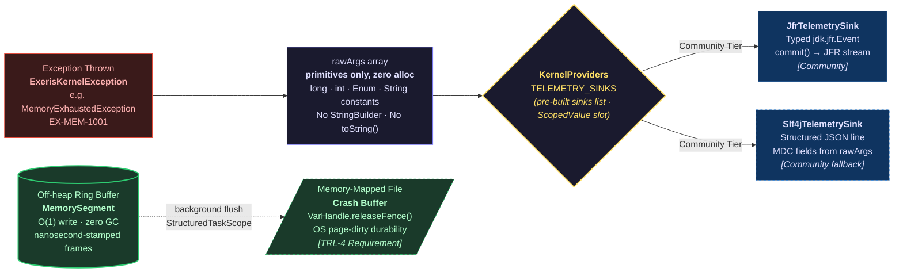

# Kernel Subsystem: Telemetry (L1 Observability)

**Physical Layout:**

- SPI: `eu.exeris.kernel.spi.telemetry.*` (`TelemetryProvider`, `TelemetrySink`, `KernelEvent`, `TelemetryConfig`, `EventLevel`)
- Core: `eu.exeris.kernel.core.telemetry.*` (`JfrTelemetrySink`, `ErrorMapperRegistry`, `TelemetryJfrEvents`, `TransportErrorCode`)
- Community: `eu.exeris.kernel.community.telemetry.*` (`CommunityTelemetryProvider`, `JfrTelemetrySink` (wrapper), `Slf4jTelemetrySink`, `ConsoleSink`, `FileSink`)

**Layer:** L1 (Observability)  
**Status:** Validated Architectural Prototype (TRL-3)

---

> **ℹ️ Implementation Note — Telemetry SPI Status:**
> The telemetry contracts (`TelemetryProvider`, `TelemetrySink`, `KernelEvent`, `TelemetryConfig`) are
> defined under `eu.exeris.kernel.spi.telemetry.*` and are covered by `exeris-kernel-tck`
> (including `AbstractTelemetrySinkTck`, `AbstractTelemetryProviderTck`).
> `JfrTelemetrySink` is the reference implementation in `exeris-kernel-core`.
> `GlassBoxSerializer` (structured JFR streaming over off-heap ring buffer) is a planned TRL-4
> type — not yet implemented in this repository.
>
> Implications for contributors:
> - In the planned KernelBootstrap-backed runtime, `TelemetryProvider` will be discoverable via `ServiceLoader` from L1+ code. In this repo, `exeris-kernel-core` does not yet provide a `KernelBootstrap` implementation; treat this discovery path as forward-looking.
>   New sink implementations belong in `exeris-kernel-community`, guarded
>   by the existing TCKs.
> - The `KernelProviders.TELEMETRY_PROVIDER` `ScopedValue` slot holds the factory (bound once at bootstrap).
>   The pre-built sink list is available via `KernelProviders.TELEMETRY_SINKS`. Hot-path code should use
>   `TELEMETRY_SINKS` to emit — iterating the pre-built list incurs no factory calls. Accessing either
>   slot before bootstrap completes is a programming error and will surface as `NoSuchElementException`.
> - Note: there is **no** `TelemetryRouter` or `TelemetryEvent` type in the telemetry SPI. The SPI
>   entry points are `TelemetryProvider` (factory) and `TelemetrySink` (emit/increment/gauge/latency),
>   and the canonical event envelope is `KernelEvent`. Any `TelemetryRouter` mentioned later in this
>   document or in diagrams is a Core-only routing/orchestration helper built on top of `TelemetrySink`,
>   not an SPI interface.

---

## Overview

The **Telemetry subsystem** is the **Zero-Allocation Observability Pipeline** for the Exeris Kernel.
It is designed around a single invariant: **no `String` concatenation and no heap allocation may occur
on the event-emission hot-path**.

The core mechanism is the **Glass-Box Observability Pattern**: every `ExerisKernelException` subclass
carries a `rawArgs: Object[]` payload that encodes domain context as **raw primitives** (`long`, `int`,
`Enum`). These are serialised directly into a deterministic binary frame — bypassing `toString()`,
`StringBuilder`, and `Formatter` entirely.

> **Why "Glass-Box"?** Traditional observability hides system state behind gigabytes of string-formatted
> logs where GC pauses distort timings and `StringBuilder` allocations corrupt the failure path.
> Exeris builds systems from glass and steel: every allocation, every `rawArg`, every byte entering the
> ring buffer is **visible, deterministic, and measurable in nanoseconds**. Nothing is hidden under the
> Garbage Collector's carpet.

---

## Design Principles

| Principle                          | Implementation                                                                     |
|:-----------------------------------|:-----------------------------------------------------------------------------------|
| Zero string formatting on hot-path | `rawArgs[]` are never concatenated inside `ExerisKernelException`                  |
| JFR-First                          | Every critical lifecycle event emits a typed `@jdk.jfr.Event` subclass             |
| Pluggable sinks                    | `TelemetrySink` SPI — Community: JFR/SLF4J/Console/File sinks                     |
| Async dispatch *(implemented since 0.7.0)* | `eu.exeris.kernel.core.telemetry.AsyncTelemetrySink` (Core-internal) wraps a list of downstream sinks. Producers enqueue into a bounded heap ring; a dedicated virtual-thread consumer drains the ring and fans out to every wrapped sink. Synchronous fan-out via `KernelProviders.TELEMETRY_SINKS` remains the baseline — the async wrapper is opt-in. See [Async dispatch](#async-dispatch) below. |
| Structured error codes             | `EX-[DOMAIN]-[ID]` format enables log-scraper pattern matching without regex       |

---

## The Glass-Box Observability Pattern

### Safety Contract (Non-Negotiable)

`String.formatted()`, `String.valueOf()`, and `StringBuilder` are **strictly banned** inside
`ExerisKernelException` constructors. This is not a style preference — it is a **Safety Contract**.
When the system is under memory pressure (the most likely moment to throw `MemoryExhaustedException`),
a `StringBuilder` allocation on the exception-construction path would add GC pressure to an already
stressed allocator. The failure path must never worsen the failure.

### The Problem (Legacy "Muddy Water" Pattern)

```java
// ❌ BANNED — allocates StringBuilder + String on every exception construction:
throw new RuntimeException(
    "Memory exhausted: requested %d bytes, available %d bytes"
            .formatted(requestedBytes, availableBytes));
```

### Solution: rawArgs Binary Layout

```java
// ✅ CORRECT — zero String allocation. rawArgs stored as primitives:
public MemoryExhaustedException(long requestedBytes, long availableBytes) {
    super(KernelErrorCodes.EX_MEM_1001, "Off-heap allocator exhausted", null,
            requestedBytes, availableBytes);
}
```

The `Object[]` varargs boxing (autobox of `long` → `Long`) is the only permitted allocation
per throw, because exceptions are **never thrown on the allocation hot-path** — they represent
exceptional failure states, not normal operation.

## Error Code Registry

Every `ExerisKernelException` subclass MUST declare its `rawArgs` binary layout in a Javadoc comment
**and** register its error code in `KernelErrorCodes`. The table below is the human-readable index —
`KernelErrorCodes.java` is the source of truth for the binary decoder.

```
EX-MEM-1001  Off-heap exhausted             rawArgs[0]=long requestedBytes,    [1]=long availableBytes
EX-MEM-1002  Arena leak detected            rawArgs[0]=long segmentAddress,     [1]=long segmentByteSize
EX-MEM-1003  AllocationHint conflict        (no rawArgs)
EX-BOOT-0001 DAG cycle detected             rawArgs[0]=String[] cycleMembers    ← emitted by orchestrator (pre-telemetry panic)
EX-BOOT-0002 Bootstrap failure              rawArgs — opaque (variable arity per pathway; Glass-Box consumers MUST NOT rely on layout)
EX-BOOT-0003 Bootstrap deadline exceeded    rawArgs[0]=String subsystemName,    [1]=long deadlineMs
EX-BOOT-0004 Memory provider bootstrap      rawArgs[0]=String providerName,     [1]=long requestedBytes
EX-BOOT-3001 Telemetry provider failure     rawArgs[0]=String providerName,     [1]=String reason
EX-NET-2001  TLS wrap (encrypt) failure     rawArgs[0]=int nativeErrorCode,     [1]=String detail
EX-NET-2002  Crypto provider bootstrap      rawArgs[0]=String providerName,     [1]=String reason
EX-NET-2003  TLS unwrap (decrypt) failure   rawArgs[0]=int nativeErrorCode,     [1]=String detail
EX-NET-4001  Transport bind/handshake       rawArgs[0]=String transportName,    [1]=int port
EX-NET-4002  Transport send failure         rawArgs[0]=String transportName,    [1]=long bytesSent
EX-NET-4003  Transport receive timeout      rawArgs[0]=String transportName,    [1]=long timeoutMs
EX-NET-4004  Transport engine bootstrap     rawArgs[0]=String transportName,    [1]=String reason
EX-NET-4005  Transport engine start         rawArgs[0]=String transportName,    [1]=int port
EX-NET-4006  PAQS load shedding             rawArgs[0]=String transportName,    [1]=int streamPriority,    [2]=int thresholdPriority
EX-NET-4007  Buffer exhaustion              rawArgs[0]=String transportName,    [1]=int poolCapacity,      [2]=int activeSlabs
EX-SEC-2001  PrincipalContext missing        (no rawArgs)
EX-SEC-2002  Token validation failure       rawArgs[0]=String tokenType,        [1]=String failureReason
EX-RUN-3002  Carrier pinned                 rawArgs[0]=long blockTimeMs,        [1]=String carrierName
EX-EVENT-6001 Generic event failure         rawArgs[0]=String message
EX-EVENT-6002 Bus publish failure           rawArgs[0]=String eventType,        [1]=long queueDepth,        [2]=long queueCapacity
EX-EVENT-6003 Registry conflict             rawArgs[0]=String eventType,        [1]=int ordinal
EX-EVENT-6004 Provider boot failure         rawArgs[0]=String providerName,     [1]=String reason           ← intentional duplicate of EX-FLOW-7001 schema; different subsystem domain
EX-FLOW-7001 Provider boot failure          rawArgs[0]=String providerName,     [1]=String reason           ← intentional duplicate of EX-EVENT-6004 schema; different subsystem domain
EX-FLOW-7002 Lifecycle / schedule fail      rawArgs[0]=String engineName,       [1]=String phase,           [2]=String staticReasonCode, [3]=int contextVal
EX-FLOW-7003 Step execution failure         rawArgs[0]=String defName,          [1]=long idMost,            [2]=long idLeast,            [3]=int stepIdx, [4]=String reason, [5]=String causeType
EX-FLOW-7004 Registry conflict              rawArgs[0]=int stepId,              [1]=String reason
```

> **Note — `EX-BOOT-0002` Variable Arity:** This is the only code in the registry that deliberately
> violates the one-code-one-schema rule. `EX-BOOT-0002` is a catch-all for bootstrap failures that
> occur before the telemetry subsystem itself has initialised (i.e., before the JFR sink is bound and
> before the Glass-Box ring buffer is ready). At that point, the kernel cannot guarantee which
> subsystem triggered the failure, so the `rawArgs` layout varies per pathway. **Glass-Box decoders
> MUST treat `EX-BOOT-0002` as an opaque payload** — emit it as a hex dump or raw string for manual
> inspection. Structural field decoding is explicitly not supported for this code.

> **Note — `EX-EVENT-6004` / `EX-FLOW-7001` Identical Schema:** These two codes share the same
> `rawArgs` layout (`providerName`, `reason`) intentionally. They model the same class of failure
> (provider boot) in two distinct subsystem domains (Event Bus vs. Flow Engine). The duplication
> is deliberate and not a copy-paste error — each code maps to a different binary domain prefix
> (`EX-EVENT` vs. `EX-FLOW`) in the Glass-Box struct header, allowing domain-scoped filtering
> in the `exeris-decoder` CLI without string parsing.

---

## Glass-Box Telemetry Pipeline

The diagram below shows the full lifecycle of an observability event — from exception construction
to binary ring buffer storage. The branching point is the `TelemetrySink` SPI: Community routes to
JFR/SLF4J sinks.



> **Key invariant (hot path):** The path `Exception → rawArgs → emitEvent()` performs **no String
> formatting and no transient per-emit heap allocations beyond construction of the `KernelEvent`
> carrier (and, when JFR is enabled, the corresponding JFR `Event` inside `JfrTelemetrySink`)**.

---

## JFR Events (JFR-First Mandate)

Every critical lifecycle transition MUST emit a typed JFR event. No `Logger.info()` substitution.

### Required Events

| Event Class             | When Emitted                                    | Key Fields                                            |
|:------------------------|:------------------------------------------------|:------------------------------------------------------|
| `TelemetryJfrEvents.KernelLifecycleJfrEvent` *(eu.exeris.kernel.core.telemetry.jfr)* | Kernel bootstrap, subsystem lifecycle (including completion of each subsystem `initialize()`), warnings, and errors | `errorCode`, `level`, `component`, `message` |
| `CommunityAllocationEvent` *(implemented, community module; `eu.exeris.kernel.community.memory.CommunityAllocationEvent`)* | Community-tier buffer allocation (when `jfrEnabled=true`) | `sizeBytes`, `hint`, `tierName` |
| `TelemetryJfrEvents.MemoryExhaustionJfrEvent` *(eu.exeris.kernel.core.telemetry.jfr)* | On every `MemoryExhaustedException` (EX-MEM-1001) | `errorCode`, `requestedBytes`, `availableBytes`, `component` |
| `LeakDetectedEvent` *(eu.exeris.kernel.core.memory)* | `LeakTracker` detection (PARANOID/SAMPLED mode) | `bufferLabel (String)`, `allocationStack (String)`, `capacityBytes (long)` |
| `TelemetryJfrEvents.TransportBindJfrEvent` *(eu.exeris.kernel.core.telemetry.jfr)* | On transport bind / engine-start lifecycle (EX-NET-4001/4005) | `errorCode`, `transportName`, `port`, `component` |
| `StreamShedEvent` *(eu.exeris.kernel.core.transport.jfr)* | On every PAQS load-shed | `streamId`, `priority`, `shedReason`, `engineName`, `activeStreamCount` |
| `TelemetryJfrEvents.CarrierPinnedJfrEvent` *(eu.exeris.kernel.core.telemetry.jfr)* | Virtual thread pins carrier > threshold (EX-RUN-3002) | `errorCode`, `blockTimeMs`, `component` |
| `AsyncTelemetryDropEvent` *(eu.exeris.kernel.core.telemetry; since 0.7.0)* | Emitted on every drop by `AsyncTelemetrySink` when the bounded ring is full | `sinkName`, `eventCode`, `totalDrops`, `ringCapacity` |
| `CommunityTlsHandshakeEvent` *(implemented, community module; present in this repo)* | Each `SSL_do_handshake` invocation | `complete`, `opensslError` |
| `TlsPhaseTransitionEvent` *(planned, TRL‑4 target; not yet implemented)* | Every `TlsStateMachine` phase transition | `sslPtr`, `fromPhase`, `toPhase` |
| `TlsEngineCloseEvent` *(planned, TRL‑4 target; not yet implemented)* | `OffHeapTlsEngine` → CLOSED | `sslPtr`, `graceful`, `finalPhase` |
| `TlsHandshakeEvent` *(planned, TRL‑4 target; not yet implemented)* | Start and end of TLS handshake | `sessionId`, `protocol`, `cipher`, `durationNanos` |
| `TlsHandshakeFailureEvent` *(planned, TRL‑4 target; not yet implemented)* | Handshake exception | `errorCode`, `peerAddress`, `failureReason` |
| `ConfigHotReloadEvent` *(planned, TRL‑4 target; not yet implemented)* | `@Dynamic` config key updated | `configKey`, `providerName`, `succeeded` |
| `OutboxDlqTransferEvent` *(planned, TRL‑4 target; not yet implemented)* | Outbox record moved to DLQ after max retries | `eventType`, `outboxRecordId`, `attempt` |
| `SagaLifecycleEvent` *(planned, TRL‑4 target; not yet implemented)* | Saga state transition | `sagaType`, `status`, `durationNanos`, `stepIndex` |
| `TelemetryJfrEvents.KernelMetricJfrEvent` *(eu.exeris.kernel.telemetry.KernelMetric)* | Emitted on `increment()` / `gauge()` calls | `metricName`, `metricType (COUNTER/GAUGE)`, `value` |
| `TelemetryJfrEvents.KernelLatencyJfrEvent` *(eu.exeris.kernel.telemetry.KernelLatency)* | Emitted on `latency()` calls | `metricName`, `nanoseconds` |
| `CommunityEventQueueOverflowEvent` *(eu.exeris.kernel.events.CommunityEventQueueOverflow; community module, since v0.8 Sprint 5 — EVENT-111)* | `CommunityEventQueue.push` refuses a fail-fast publish because the queue is at capacity (paired with `EX-EVENT-6002`) | `engineName`, `eventType`, `queueDepth`, `queueCapacity` |
| `KafkaPublishFailedEvent` *(eu.exeris.kernel.events.kafka.PublishFailed; community-kafka module, pkg-private, since v0.8 Sprint 5 — JFR-091)* | `KafkaEventEngine.KafkaPublishBus` `publish` / `publishAndAwait` catch block, before wrapping as `EventBusException`. Payload bytes NEVER logged (Glass-Box secret-safe). | `engineName`, `topic`, `eventTypeOrdinal`, `publishMode`, `exceptionClass`, `exceptionMessage` |
| `FlowSnapshotSaveFailedEvent` *(eu.exeris.kernel.flow.FlowSnapshotSaveFailed; community module, public, since v0.8 Sprint 5 — JFR-091)* | `JdbcFlowSnapshotStore.save` non-OCC `PersistenceProviderException` rollback path. OCC race losers continue to emit `OptimisticLockConflictEvent` (no overlap). | `engineName`, `sqlState` (`SQLSTATE_UNKNOWN` sentinel when no `SQLException` in cause chain), `exceptionClass`, `exceptionMessage` |
| `CommunityKernelDiagnosticsEvent` *(eu.exeris.kernel.diagnostics.KernelDiagnostics; community module, pkg-private, since v0.9 — ADR-033 §EP step 8)* | One INFO audit event per out-of-process `KernelDiagnostics` call (codes `EX-DIAG-1001..1004`), so operators can audit who introspected the kernel. Cold path, `@StackTrace(false)`, single-phase commit. | `errorCode`, `method` |
### JFR Event Pattern (Zero-Allocation)

```java
// JFR event: allocated per emission — JFR framework copies fields on commit().
// Exceptions are never on the hot-path; the single allocation here is acceptable.
// Do NOT share event instances across threads (JFR events are not thread-safe).
@jdk.jfr.Label("Memory Exhaustion")
@jdk.jfr.Category({"Exeris Kernel", "Memory"})
@jdk.jfr.StackTrace(false)  // suppress: stack trace = O(n) allocation
public final class MemoryExhaustionEvent extends jdk.jfr.Event {
    @jdk.jfr.Label("Requested Bytes")
    long requestedBytes;
    @jdk.jfr.Label("Available Bytes")
    long availableBytes;
    @jdk.jfr.Label("Allocator Name")
    String allocatorName;
}

static void emitExhaustion(long requested, long available, String name) {
    var event = new MemoryExhaustionEvent();
    event.requestedBytes = requested;
    event.availableBytes = available;
    event.allocatorName  = name;
    event.commit();
}
```

**Rule:** JFR `Event` subclasses must set `@StackTrace(false)` on all hot-path events.
Stack trace capture is O(depth) allocation — it is reserved for `LeakTracker` and `CarrierPinnedEvent` only.

---

## SPI Architecture

```
TelemetryProvider (SPI interface — factory)
  │
  └─ createSinks(TelemetryConfig) → List<TelemetrySink>   // never empty; immutable list

TelemetrySink (SPI interface) — implemented by:
  ├─ [Community] JfrTelemetrySink          → writes to JFR event stream
  └─ [Community] Slf4jTelemetrySink        → structured fallback via SLF4J + MDC
```

> **Why `List<TelemetrySink>` not a single sink?** `TelemetryProvider.createSinks()` returns a
> list to support fan-out (e.g., JFR + File simultaneously in Community). The list is built once at
> bootstrap and bound to `KernelProviders.TELEMETRY_SINKS`. Hot-path code iterates the pre-built
> list — zero factory calls, zero object creation per emission.

> **Note:** `eu.exeris.kernel.core.telemetry.JfrTelemetrySink` contains the full implementation. `eu.exeris.kernel.community.telemetry.JfrTelemetrySink` is a thin delegation wrapper (zero logic) that delegates to the Core implementation. New Community sinks should follow the same delegation pattern.

### ScopedValue Propagation

Both `TELEMETRY_PROVIDER` (the factory) and `TELEMETRY_SINKS` (the pre-built, ready-to-use list) are
bound as `ScopedValue` slots by `KernelBootstrap`. Hot-path subsystems use `TELEMETRY_SINKS` directly.
**No static router singleton** — any static `TelemetryRouter.isEnabled()` method is banned.

> **Core-internal note:** `exeris-kernel-core` may use an internal fan-out helper to iterate over
> `TELEMETRY_SINKS`, but this is **not** an SPI type and is invisible to consumers of the public API.

```java
// ✅ CORRECT — emit to all configured sinks (no per-emission allocations):
for (TelemetrySink sink : KernelProviders.TELEMETRY_SINKS.get()) {
    sink.emit(event);
}

// ❌ BANNED (lambda captures `event` → allocates a new instance per call on some JVMs):
KernelProviders.TELEMETRY_SINKS.get()
        .forEach(sink -> sink.emit(event));

// ❌ BANNED (static singleton — violates The Wall):
TelemetryRouter.emitMetric(metric);
```

---

## Async dispatch

`AsyncTelemetrySink` (since 0.7.0) is the Core-internal asynchronous dispatcher that decouples the caller's critical path from sink fan-out. The synchronous fan-out over `KernelProviders.TELEMETRY_SINKS` remains the baseline — the async wrapper is opt-in for sites that benefit from amortising slow downstream sinks (e.g., SLF4J appenders).

### Pipeline

```
producer thread →  AsyncTelemetrySink.emit()
                       │
                       ▼
                bounded ring (heap, capacity configurable, default 4096)
                       │
                       ▼
                 dedicated VT consumer ──fan-out──→  JfrTelemetrySink
                                                  →  Slf4jTelemetrySink
                                                  →  …
```

### Drop policy

When the ring is full, `emit()` discards the incoming event (drop-newest), increments a `LongAdder` drop counter, and emits an `AsyncTelemetryDropEvent` JFR event with `sinkName`, `eventCode`, `totalDrops`, `ringCapacity`. Operators monitor this event to detect runaway emission rates and to size the ring appropriately. Drop-newest is preferred over drop-oldest because the oldest frames carry the causal context most useful for diagnosing the burst that caused the overflow.

### Metrics pass-through

`increment` / `gauge` / `latency` calls are forwarded synchronously to all wrapped sinks. These calls are already cheap (primitive args only) and asynchronous dispatch would add overhead without measurable benefit.

### Lifecycle

- Construction starts the VT consumer immediately.
- `close()` stops accepting new events, interrupts the consumer to wake it from `poll`, and waits up to the configured drain timeout (default 2 s) for in-flight events. A misbehaving downstream sink that throws is logged-and-skipped — it cannot starve the consumer or other sinks.

### Validation gates

- `AsyncTelemetrySinkTest` (Core unit) covers correctness: fan-out delivery, drop counter on overflow, drain on close, metric pass-through, throwing-sink isolation, post-close emit no-op.
- `CoreAsyncTelemetryRingBufferTckTest` extends `AbstractTelemetryRingBufferTck` to prove the wrapper sustains 100k events/s with no exceptions and a sub-100 ms close-flush.
- `CoreTelemetryZeroAllocTckTest` continues to pin the underlying `JfrTelemetrySink` allocation discipline; the async wrapper inherits the contract for the caller path.

---

## Operational metrics export — Prometheus (since 0.7.0)

Operators scraping kernel metrics use the Prometheus pull model. The kernel ships two Community classes:

- **`eu.exeris.kernel.community.metrics.PrometheusMetricsSink`** — `TelemetrySink` that records counter/gauge/latency calls in concurrent maps and produces a Prometheus 0.0.4 text exposition snapshot on demand via `exposeText()`.
- **`eu.exeris.kernel.community.metrics.PrometheusMetricsHandler`** — `HttpHandler` that serves `GET /metrics` (path configurable) returning the snapshot as the HTTP response body. Path-mismatch → `404`; non-`GET` → `405` with `Allow: GET`. Pair with `HealthEndpointHandler` on the same HTTP engine.

### Why pull, not push

| Aspect | Prometheus pull (chosen) | OTLP push |
|:--|:--|:--|
| Client state | None — each scrape is stateless | Long-lived gRPC client + retry buffer |
| Dependencies | None beyond JDK | `opentelemetry-exporter-otlp` + Protobuf |
| Failure mode | Scraper observes scrape failure directly | Push retries can mask sustained failure |
| K8s integration | Pod annotation / `ServiceMonitor` | OpenTelemetry Collector sidecar |

The Community baseline ships pull because it adds zero new runtime dependencies and integrates with standard Kubernetes scraping out of the box. An Enterprise binding may add an OTLP exporter later without modifying this sink.

### Metric mapping

| `TelemetrySink` call | Prometheus type | Exposition shape |
|:--|:--|:--|
| `increment(name, delta)` | `counter` | `name <total>` |
| `gauge(name, value)` | `gauge` | `name <last_value>` |
| `latency(name, nanoseconds)` | `summary` | `name_count <count>` + `name_sum <sum>` (no quantiles in baseline) |

Latency without quantiles is intentional — streaming quantile sketches add allocation pressure on the hot path. Operators compute averages via PromQL: `rate(name_sum[1m]) / rate(name_count[1m])`. Quantile support is tracked as a 0.8+ enhancement once a low-allocation sketch (e.g., DDSketch) is selected.

### Naming sanitisation

Caller-supplied names are mapped to the Prometheus name regex `[a-zA-Z_:][a-zA-Z0-9_:]*` — characters outside the set are replaced with `_`, and a leading digit/invalid first character is prefixed with `_`. The original name remains the lookup key in the concurrent maps so multiple `increment` calls on the same logical metric continue to accumulate as expected.

### Wiring example

```java
PrometheusMetricsSink metrics = new PrometheusMetricsSink();
List<TelemetrySink> sinks = List.of(metrics, new JfrTelemetrySink());

// ... bind sinks via KernelProviders.TELEMETRY_SINKS …

PrometheusMetricsHandler handler = new PrometheusMetricsHandler(metrics, allocator);
httpServerEngine.setHandler(handler);   // or compose into an application router
```

### Validation

- `PrometheusMetricsSinkTest` covers counter/gauge/latency exposition, sanitisation, deterministic ordering, concurrent updates (16 VTs × 1000 increments), and `close()` semantics.
- `PrometheusMetricsHandlerTest` covers routing (200/404/405), Content-Type, Content-Length, and custom paths.

---

## L0 Crash Observability — Memory-Mapped Crash Buffer (TRL-4 Requirement)

The Glass-Box in-RAM buffer used during L0 (pre-JFR) boot provides **zero durability** on a hard JVM crash.
To satisfy TRL-4 operator observability requirements, the L0 Glass-Box buffer **MUST** be backed by a
memory-mapped file. Full contract is defined in `docs/subsystems/bootstrap.md#l0-crash-observability`.

**Key points for Telemetry engineers:**

- The crash buffer uses the **same binary frame format** as `GlassBoxSerializer` (see Binary Struct Mapping above).
- Frames written to the mapped buffer use `VarHandle.releaseFence()` — not `msync` — to remain on the zero-syscall path.
  The OS page-dirty mechanism handles durability asynchronously.
- The crash buffer produces `.ring` files in the **shared `exeris-telemetry-spec` wire format**; the canonical
  open crash-file decoder (the open subset of the `exeris-enterprise-observability` decoder/forensics path)
  reads them — the kernel does not ship a second, kernel-local decoder. See the `Crash-file decoding` section below.
- **This is a hard TRL-4 requirement.** Exeris deployments without crash buffer support are limited to TRL-3 certification.

---

## Crash-file decoding — Canonical Open Decoder

> **Status: Planned / TRL-4**
> The open-core **L0 crash-buffer producer** is not yet implemented in this repo — when it lands it will
> write `.ring` files in the shared `exeris-telemetry-spec` wire format. Do not reference a decode step in
> build pipelines until the producer ships.

There is **exactly one canonical crash-file decoder** for the shared `.ring` wire format, and the kernel
does **not** ship a second, kernel-local implementation. The crash-FILE decode path is the **open** subset
of the `exeris-enterprise-observability` decoder/forensics tooling — `FrameDecoder`, `FrameValidator`, and
`CrashBufferReader` / scanner / timeline-reconstructor — consuming the neutral `exeris-telemetry-spec`
schema. The **live**-stream decode path is the Enterprise side. This file=open /
live=enterprise cut is recorded in [ADR-039](../adr/ADR-039-open-core-observability-boundary.md)
(Open-Core Observability Boundary).

The kernel's role is producer-only: the L0 crash buffer emits `.ring` files in the shared format, and the
canonical open decoder reads them. The kernel shares the `rawArgs` binary layout (Error Code Registry
above) with that decoder via `exeris-telemetry-spec` — there is no kernel-owned schema registry fork.

State vs events: live runtime *state* is read out-of-process through the `KernelDiagnostics` SPI
(ADR-033); crash *frames* / events stay in this binary Glass-Box format over `exeris-telemetry-spec`.
The two surfaces do not overlap.

### Optional build-time decode goal

If a Maven decode goal is desired for build pipelines, it MUST **wrap** the canonical open decoder rather
than reimplement it — it does not exist in the current codebase and is not part of the kernel reactor.

### Usage

```bash
# Decode a crash-buffer file with the canonical open decoder (exeris-enterprise-observability CLI)
exeris-decode /tmp/exeris-crash/kernel-12345.ring

# Decode with verbose rawArgs layout
exeris-decode --verbose /tmp/exeris-crash/kernel-12345.ring

# Decode from a Windows crash directory
exeris-decode %TEMP%\exeris-crash\kernel-12345.ring

# Filter by error domain
exeris-decode --filter EX-MEM /tmp/exeris-crash/kernel-12345.ring
```

### Output Format

```
[0000000042ns] EX-BOOT-0001 [FATAL_BUILD_DEFECT] DAG cycle detected
               rawArgs[0]: cycleMembers=[Security, Flow]

[0000000107ns] EX-MEM-1002 [CRITICAL] Arena leak detected
               rawArgs[0]: segmentAddress=0x7f3a00000000
               rawArgs[1]: segmentByteSize=65536

[0000001840ns] EX-NET-4006 [WARN] PAQS load shedding
               rawArgs[0]: transportName=CommunityTcpTransport
               rawArgs[1]: streamPriority=3 (LOW)
               rawArgs[2]: thresholdPriority=2 (NORMAL)
```

---

## `Slf4jTelemetrySink` — SLF4J Fallback Binding

`Slf4jTelemetrySink` is the Community fallback sink for environments without JFR (e.g., container
runtimes with restricted JVM flags). It emits structured JSON lines and mirrors
canonical EX-* fields into MDC for downstream log pipelines.

| Aspect                    | Detail                                                                                                           |
|:--------------------------|:-----------------------------------------------------------------------------------------------------------------|
| **Status**                | Implemented in `exeris-kernel-community`                                                                          |
| **Role**                  | Fallback sink when `JfrTelemetrySink` cannot be used (JFR disabled/unavailable)                                  |
| **SLF4J version**         | SLF4J API 2.x                                                                                                     |
| **Dependency model**      | `exeris-kernel-community` declares `slf4j-api`; binding remains application-owned                                |
| **JSON semantics**        | JSON body with `timestamp`, `level`, `code`, `component`, `message`, `rawArgs`; MDC mirrors EX-* fields         |
| **Disclosure shaping**    | Per-emit, resolves the active `KernelProfile` via `ExceptionDisclosure::activeProfile`. PROD/TEST replace `message` with the opaque `"<errorCode> [traceId=<uuid>]"` envelope, set `rawArgs` to `[]`, and suppress the throwable forwarded to SLF4J (no stack trace). DEV forwards everything. See `docs/subsystems/exceptions.md#disclosure-rendering`. |

---

## Telemetry Lifecycle and L0 Integration

The telemetry subsystem is initialised as part of the **L1 boot layer** — after L0 (Config, Memory, Exceptions)
completes. This creates a deliberate gap: L0 subsystems cannot emit JFR events through the telemetry pipeline.

| Phase               | Telemetry Available                                    | Mechanism                                      |
|:--------------------|:-------------------------------------------------------|:-----------------------------------------------|
| **L0 boot (pre-JFR)** | ❌ JFR sink not yet bound                            | Glass-Box pre-allocated in-RAM buffer (L0-only) |
| **L1 boot**         | ✅ JFR sink bound; `KernelProviders.TELEMETRY_PROVIDER` populated | `ScopedValue` slot bound by `KernelBootstrap` |
| **READY**           | ✅ Full — `JfrTelemetrySink` + `Slf4jTelemetrySink` + Binary sink | Normal operation |
| **SHUTTING_DOWN**   | ✅ Until `releaseArenas()` call                         | Events after Arena release are lost             |

**L0 failure observability:** Any `ExerisKernelException` thrown during L0 (Config, Memory, Exceptions init)
is written to the pre-allocated Glass-Box in-RAM ring buffer. If JVM crashes before L1 completes, this
buffer is only durable if the TRL-4 memory-mapped crash buffer is active (`/tmp/exeris-crash/kernel-<pid>.ring`).
Without it, L0 crash data is lost on a hard JVM crash.

---

## Banned Patterns

| Pattern                                                      | Reason                                              | Replacement                                   |
|:-------------------------------------------------------------|:----------------------------------------------------|:----------------------------------------------|
| `String.formatted(...)` inside exception constructor         | Allocates StringBuilder                             | `rawArgs[]` primitives                        |
| `Map.of("key", value)` for metric tags on hot-path           | Creates anonymous Map class                         | Pre-allocated tag arrays or JFR fields        |
| `Logger.info("allocated {} bytes", size)` in allocation loop | SLF4J formats lazily but still allocates on enabled | JFR event with numeric fields                 |
| Static `TelemetryRouter.isEnabled()`                         | Breaks provider isolation (The Wall)                | `KernelProviders.TELEMETRY_PROVIDER.get().isEnabled()` |
| `Thread.currentThread().getStackTrace()` in hot-path events  | O(depth) object churn                               | Limit to `PARANOID` mode only                 |

---

## Testing Strategy

### Unit Tests

- Verify `rawArgs` index layout matches `KernelErrorCodes` Javadoc for every `ExerisKernelException` subclass.
- Verify `isEnabled() == false` results in zero allocations (measure via `Instrumentation.getObjectSize`).

### Integration Tests (TCK)

- `JfrTelemetrySink` correctly writes and the events are readable via `RecordingStream`.

> **TCK coverage table:**
> | TCK Abstract | Core binding | Community binding |
> |---|---|---|
> | `AbstractTelemetrySinkTck` | ✓ | ✓ |
> | `AbstractTelemetryProviderTck` | — | ✓ |
> | `AbstractJfrTelemetrySinkTck` | ✓ | **MISSING** — Community wrapper not bound to typed JFR TCK |
> | `TelemetryZeroAllocTck` | ✓ | **MISSING** |
> | `TelemetryCarrierPinningTck` | — | **MISSING** |
> | `AbstractTelemetryRingBufferTck` | ✓ (`CoreAsyncTelemetryRingBufferTckTest`, since 0.7.0) | **MISSING** |
>
> Community TCK bindings for `AbstractJfrTelemetrySinkTck`, `TelemetryZeroAllocTck`, `TelemetryCarrierPinningTck`, and `AbstractTelemetryRingBufferTck` are open TCK debt.

### Load Tests

- Zero heap allocation delta (verified via `-Xverify:all` + JFR GC allocation profiler baseline).

---

## TCK Coverage

| TCK Suite | Module | Description |
|:---------|:-------|:------------|
| `AbstractTelemetrySinkTck` | `exeris-kernel-tck` | Core `TelemetrySink` contract: `emit()`, `increment()`, `gauge()`, `latency()` lifecycle |
| `AbstractTelemetryProviderTck` | `exeris-kernel-tck` | `TelemetryProvider` ServiceLoader discovery and `createSinks()` contract |
| `AbstractJfrTelemetrySinkTck` | `exeris-kernel-tck` | JFR-specific emission contract and `@StackTrace(false)` enforcement |
| `AbstractTelemetryRingBufferTck` | `exeris-kernel-tck` | Ring buffer back-pressure and off-heap write contract |
| `TelemetryZeroAllocTck` | `exeris-kernel-tck` | Hot-path zero-allocation assertion via JFR AllocationMonitor |
| `TelemetryCarrierPinningTck` | `exeris-kernel-tck` | Verifies telemetry emission does not pin Virtual Thread carrier |

Community bindings: `JfrTelemetrySinkTckTest`, `CommunityTelemetryProviderTckTest`, `FileSinkTckTest`, `Slf4jTelemetrySinkTckTest`, `ConsoleSinkTckTest` in `exeris-kernel-community`.

> **Gap:** `AbstractTelemetryRingBufferTck` has no Community-tier concrete binding. No Community concrete test exists in `exeris-kernel-community/src/test/`.
