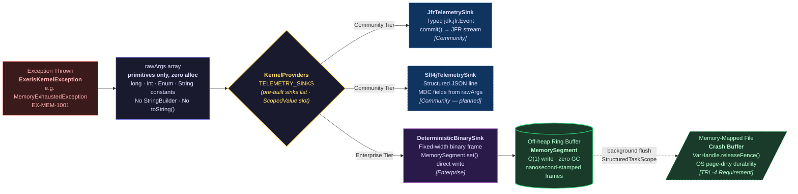

# Kernel Subsystem: Telemetry (L1 Observability)

**Physical Layout:**

- SPI: `eu.exeris.kernel.spi.telemetry.*` (`TelemetryProvider`, `TelemetrySink`, `KernelEvent`, `TelemetryConfig`)
- Core: `eu.exeris.kernel.core.telemetry.*` (`JfrTelemetrySink`, `ErrorMapperRegistry`, `TelemetryJfrEvents`)
- Enterprise: Binary deterministic sink, structured JFR streaming over off-heap ring buffer *(planned — `BinaryGlassBox` / `GlassBoxSerializer` are target TRL-4 types, not yet implemented)*

**Layer:** L1 (Observability)  
**Status:** Validated Architectural Prototype (TRL-3)

---

> **ℹ️ Implementation Note — Telemetry SPI Status:**
> The telemetry contracts (`TelemetryProvider`, `TelemetrySink`, `KernelEvent`, `TelemetryConfig`) are
> defined under `eu.exeris.kernel.spi.telemetry.*` and are covered by `exeris-kernel-tck`
> (including `AbstractTelemetrySinkTck`, `AbstractTelemetryProviderTck`).
> `JfrTelemetrySink` and `BinaryGlassBox` are the reference implementations in `exeris-kernel-core`.
>
> Implications for contributors:
> - In the planned KernelBootstrap-backed runtime, `TelemetryProvider` will be discoverable via `ServiceLoader` from L1+ code. In this repo, `exeris-kernel-core` does not yet provide a `KernelBootstrap` implementation; treat this discovery path as forward-looking.
>   New sink implementations belong in `exeris-kernel-community` or `exeris-kernel-enterprise`, guarded
>   by the existing TCKs.
> - The `KernelProviders.TELEMETRY_PROVIDER` `ScopedValue` slot holds the factory (bound once at bootstrap).
>   The pre-built sink list is available via `KernelProviders.TELEMETRY_SINKS`. Hot-path code should use
>   `TELEMETRY_SINKS` to emit — iterating the pre-built list incurs no factory calls. Accessing either
>   slot before bootstrap completes is a programming error and will surface as `NoSuchElementException`.
> - Note: there is **no** `TelemetryRouter` or `TelemetryEvent` type in the telemetry SPI. The SPI
>   entry points are `TelemetryProvider` (factory) and `TelemetrySink` (emit/increment/gauge/latency),
>   and the canonical event envelope is `KernelEvent`. Any `TelemetryRouter` mentioned later in this
>   document or in diagrams is a Core-only routing/orchestration helper built on top of `TelemetrySink`,
>   not an SPI interface.

---

## Overview

The **Telemetry subsystem** is the **Zero-Allocation Observability Pipeline** for the Exeris Kernel.
It is designed around a single invariant: **no `String` concatenation and no heap allocation may occur
on the event-emission hot-path**.

The core mechanism is the **Glass-Box Observability Pattern**: every `ExerisKernelException` subclass
carries a `rawArgs: Object[]` payload that encodes domain context as **raw primitives** (`long`, `int`,
`Enum`). These are serialised directly into a deterministic binary frame — bypassing `toString()`,
`StringBuilder`, and `Formatter` entirely.

> **Why "Glass-Box"?** Traditional observability hides system state behind gigabytes of string-formatted
> logs where GC pauses distort timings and `StringBuilder` allocations corrupt the failure path.
> Exeris builds systems from glass and steel: every allocation, every `rawArg`, every byte entering the
> ring buffer is **visible, deterministic, and measurable in nanoseconds**. Nothing is hidden under the
> Garbage Collector's carpet.

---

## Design Principles

| Principle                          | Implementation                                                                     |
|:-----------------------------------|:-----------------------------------------------------------------------------------|
| Zero string formatting on hot-path | `rawArgs[]` are never concatenated inside `ExerisKernelException`                  |
| JFR-First                          | Every critical lifecycle event emits a typed `@jdk.jfr.Event` subclass             |
| Pluggable sinks                    | `TelemetrySink` SPI — Community gets JFR/SLF4J, Enterprise gets binary ring-buffer |
| Async dispatch *(planned)*         | Planned Core-internal dispatcher will fan out to registered `TelemetrySink` instances off the caller's critical path while preserving the zero-allocation contract via pre-allocated routing structures; the current reference sink (`JfrTelemetrySink`) emits synchronously on the caller thread. |
| Structured error codes             | `EX-[DOMAIN]-[ID]` format enables log-scraper pattern matching without regex       |

---

## The Glass-Box Observability Pattern

### Safety Contract (Non-Negotiable)

`String.formatted()`, `String.valueOf()`, and `StringBuilder` are **strictly banned** inside
`ExerisKernelException` constructors. This is not a style preference — it is a **Safety Contract**.
When the system is under memory pressure (the most likely moment to throw `MemoryExhaustedException`),
a `StringBuilder` allocation on the exception-construction path would add GC pressure to an already
stressed allocator. The failure path must never worsen the failure.

### The Problem (Legacy "Muddy Water" Pattern)

```java
// ❌ BANNED — allocates StringBuilder + String on every exception construction:
throw new RuntimeException(
    "Memory exhausted: requested %d bytes, available %d bytes"
            .formatted(requestedBytes, availableBytes));
```

### Solution: rawArgs Binary Layout

```java
// ✅ CORRECT — zero String allocation. rawArgs stored as primitives:
public MemoryExhaustedException(long requestedBytes, long availableBytes) {
    super(KernelErrorCodes.EX_MEM_1001, "Off-heap allocator exhausted", null,
            requestedBytes, availableBytes);
}
```

The `Object[]` varargs boxing (autobox of `long` → `Long`) is the only permitted allocation
per throw, because exceptions are **never thrown on the allocation hot-path** — they represent
exceptional failure states, not normal operation.

### Binary Struct Mapping (Enterprise Glass-Box)

The Enterprise `GlassBoxSerializer` maps `rawArgs` to a fixed-width binary struct written
directly into an off-heap ring buffer via `MemorySegment.set(ValueLayout, offset, value)`:

```
Offset  Size  Type    Field
──────  ────  ──────  ─────────────────────────────────
0       8     long    timestamp_nanos
8       16    UUID    traceId (two longs: msb + lsb)
24      2     short   errorCode_domain  (EX_MEM → 1, EX_NET → 4, ...)
26      2     short   errorCode_id      (1001, 1002, ...)
28      N     varies  rawArgs payload (layout defined per error code)
```

No `toString()`, no `ObjectOutputStream`, no JSON serialiser is ever invoked.
Reading side (crash-log analyser or APM agent) interprets the binary struct directly.

---

## Error Code Registry

Every `ExerisKernelException` subclass MUST declare its `rawArgs` binary layout in a Javadoc comment
**and** register its error code in `KernelErrorCodes`. The table below is the human-readable index —
`KernelErrorCodes.java` is the source of truth for the binary decoder.

```
EX-MEM-1001  Off-heap exhausted             rawArgs[0]=long requestedBytes,    [1]=long availableBytes
EX-MEM-1002  Arena leak detected            rawArgs[0]=long segmentAddress,     [1]=long segmentByteSize
EX-MEM-1003  AllocationHint conflict        (no rawArgs)
EX-BOOT-0001 DAG cycle detected             rawArgs[0]=String[] cycleMembers    ← emitted by orchestrator (pre-telemetry panic)
EX-BOOT-0002 Bootstrap failure              rawArgs — opaque (variable arity per pathway; Glass-Box consumers MUST NOT rely on layout)
EX-BOOT-0003 Bootstrap deadline exceeded    rawArgs[0]=String subsystemName,    [1]=long deadlineMs
EX-BOOT-0004 Memory provider bootstrap      rawArgs[0]=String providerName,     [1]=long requestedBytes
EX-BOOT-3001 Telemetry provider failure     rawArgs[0]=String providerName,     [1]=String reason
EX-NET-2001  TLS wrap (encrypt) failure     rawArgs[0]=int nativeErrorCode,     [1]=String detail
EX-NET-2002  Crypto provider bootstrap      rawArgs[0]=String providerName,     [1]=String reason
EX-NET-2003  TLS unwrap (decrypt) failure   rawArgs[0]=int nativeErrorCode,     [1]=String detail
EX-NET-4001  Transport bind/handshake       rawArgs[0]=String transportName,    [1]=int port
EX-NET-4002  Transport send failure         rawArgs[0]=String transportName,    [1]=long bytesSent
EX-NET-4003  Transport receive timeout      rawArgs[0]=String transportName,    [1]=long timeoutMs
EX-NET-4004  Transport engine bootstrap     rawArgs[0]=String transportName,    [1]=String reason
EX-NET-4005  Transport engine start         rawArgs[0]=String transportName,    [1]=int port
EX-NET-4006  PAQS load shedding             rawArgs[0]=String transportName,    [1]=int streamPriority,    [2]=int thresholdPriority
EX-NET-4007  Buffer exhaustion              rawArgs[0]=String transportName,    [1]=int poolCapacity,      [2]=int activeSlabs
EX-SEC-2001  PrincipalContext missing        (no rawArgs)
EX-SEC-2002  Token validation failure       rawArgs[0]=String tokenType,        [1]=String failureReason
EX-RUN-3002  Carrier pinned                 rawArgs[0]=long blockTimeMs,        [1]=String carrierName
EX-EVENT-6001 Generic event failure         rawArgs[0]=String message
EX-EVENT-6002 Bus publish failure           rawArgs[0]=String eventType,        [1]=long queueDepth,        [2]=long queueCapacity
EX-EVENT-6003 Registry conflict             rawArgs[0]=String eventType,        [1]=int ordinal
EX-EVENT-6004 Provider boot failure         rawArgs[0]=String providerName,     [1]=String reason           ← intentional duplicate of EX-FLOW-7001 schema; different subsystem domain
EX-FLOW-7001 Provider boot failure          rawArgs[0]=String providerName,     [1]=String reason           ← intentional duplicate of EX-EVENT-6004 schema; different subsystem domain
EX-FLOW-7002 Lifecycle / schedule fail      rawArgs[0]=String engineName,       [1]=String phase,           [2]=String staticReasonCode, [3]=int contextVal
EX-FLOW-7003 Step execution failure         rawArgs[0]=String defName,          [1]=long idMost,            [2]=long idLeast,            [3]=int stepIdx, [4]=String reason, [5]=String causeType
EX-FLOW-7004 Registry conflict              rawArgs[0]=int stepId,              [1]=String reason
```

> **Note — `EX-BOOT-0002` Variable Arity:** This is the only code in the registry that deliberately
> violates the one-code-one-schema rule. `EX-BOOT-0002` is a catch-all for bootstrap failures that
> occur before the telemetry subsystem itself has initialised (i.e., before the JFR sink is bound and
> before the Glass-Box ring buffer is ready). At that point, the kernel cannot guarantee which
> subsystem triggered the failure, so the `rawArgs` layout varies per pathway. **Glass-Box decoders
> MUST treat `EX-BOOT-0002` as an opaque payload** — emit it as a hex dump or raw string for manual
> inspection. Structural field decoding is explicitly not supported for this code.

> **Note — `EX-EVENT-6004` / `EX-FLOW-7001` Identical Schema:** These two codes share the same
> `rawArgs` layout (`providerName`, `reason`) intentionally. They model the same class of failure
> (provider boot) in two distinct subsystem domains (Event Bus vs. Flow Engine). The duplication
> is deliberate and not a copy-paste error — each code maps to a different binary domain prefix
> (`EX-EVENT` vs. `EX-FLOW`) in the Glass-Box struct header, allowing domain-scoped filtering
> in the `exeris-decoder` CLI without string parsing.

---

## Glass-Box Telemetry Pipeline

The diagram below shows the full lifecycle of an observability event — from exception construction
to binary ring buffer storage. The branching point is the `TelemetrySink` SPI: Community routes to
JFR/SLF4J; Enterprise routes to the deterministic off-heap sink.



> **Key invariant (hot path):** The path `Exception → rawArgs → emitEvent()` performs **no String
> formatting and no transient per-emit heap allocations beyond construction of the `KernelEvent`
> carrier (and, when JFR is enabled, the corresponding JFR `Event` inside `JfrTelemetrySink`)**.
> The ring buffer write in the Enterprise path is a single `MemorySegment.set()` call on a
> pre-allocated segment — O(1), with no additional GC pressure from the write itself.

---

## JFR Events (JFR-First Mandate)

Every critical lifecycle transition MUST emit a typed JFR event. No `Logger.info()` substitution.

### Required Events

| Event Class             | When Emitted                                    | Key Fields                                            |
|:------------------------|:------------------------------------------------|:------------------------------------------------------|
| `TelemetryJfrEvents.KernelLifecycleJfrEvent` *(eu.exeris.kernel.core.telemetry.jfr)* | Kernel bootstrap, subsystem lifecycle (including completion of each subsystem `initialize()`), warnings, and errors | `errorCode`, `level`, `component`, `message` |
| `CommunityAllocationEvent` *(planned, community module; not present in this repo)* | Community-tier buffer allocation (when `jfrEnabled=true`) | `sizeBytes`, `hint`, `tierName` |
| `TelemetryJfrEvents.MemoryExhaustionJfrEvent` *(eu.exeris.kernel.core.telemetry.jfr)* | On every `MemoryExhaustedException` (EX-MEM-1001) | `errorCode`, `requestedBytes`, `availableBytes`, `component` |
| `LeakDetectedEvent` *(eu.exeris.kernel.core.memory)* | `LeakTracker` detection (PARANOID/SAMPLED mode) | `segmentAddress`, `segmentByteSize`                   |
| `TelemetryJfrEvents.TransportBindJfrEvent` *(eu.exeris.kernel.core.telemetry.jfr)* | On transport bind / engine-start lifecycle (EX-NET-4001/4005) | `errorCode`, `transportName`, `port`, `component` |
| `StreamShedEvent` *(eu.exeris.kernel.core.transport.jfr)* | On every PAQS load-shed | `streamId`, `priority`, `shedReason`, `engineName`, `activeStreamCount` |
| `TelemetryJfrEvents.CarrierPinnedJfrEvent` *(eu.exeris.kernel.core.telemetry.jfr)* | Virtual thread pins carrier > threshold (EX-RUN-3002) | `errorCode`, `blockTimeMs`, `component` |
| `CommunityTlsHandshakeEvent` *(planned, community module; not present in this repo)* | Each `SSL_do_handshake` invocation | `complete`, `opensslError` |
| `TlsPhaseTransitionEvent` *(planned, TRL‑4 target; not yet implemented)* | Every `TlsStateMachine` phase transition | `sslPtr`, `fromPhase`, `toPhase` |
| `TlsEngineCloseEvent` *(planned, TRL‑4 target; not yet implemented)* | `OffHeapTlsEngine` → CLOSED | `sslPtr`, `graceful`, `finalPhase` |
| `TlsHandshakeEvent` *(planned, TRL‑4 target; not yet implemented)* | Start and end of TLS handshake (cross-tier) | `sessionId`, `protocol`, `cipher`, `durationNanos` |
| `TlsHandshakeFailureEvent` *(planned, TRL‑4 target; not yet implemented)* | Handshake exception | `errorCode`, `peerAddress`, `failureReason` |
| `ConfigHotReloadEvent` *(planned, TRL‑4 target; not yet implemented)* | `@Dynamic` config key updated | `configKey`, `providerName`, `succeeded` |
| `OutboxDlqTransferEvent` *(planned, TRL‑4 target; not yet implemented)* | Outbox record moved to DLQ after max retries | `eventType`, `outboxRecordId`, `attempt` |
| `SagaLifecycleEvent` *(planned, TRL‑4 target; not yet implemented)* | Saga state transition | `sagaType`, `status`, `durationNanos`, `stepIndex` |

### JFR Event Pattern (Zero-Allocation)

```java
// JFR event: allocated per emission — JFR framework copies fields on commit().
// Exceptions are never on the hot-path; the single allocation here is acceptable.
// Do NOT share event instances across threads (JFR events are not thread-safe).
@jdk.jfr.Label("Memory Exhaustion")
@jdk.jfr.Category({"Exeris Kernel", "Memory"})
@jdk.jfr.StackTrace(false)  // suppress: stack trace = O(n) allocation
public final class MemoryExhaustionEvent extends jdk.jfr.Event {
    @jdk.jfr.Label("Requested Bytes")
    long requestedBytes;
    @jdk.jfr.Label("Available Bytes")
    long availableBytes;
    @jdk.jfr.Label("Allocator Name")
    String allocatorName;
}

static void emitExhaustion(long requested, long available, String name) {
    var event = new MemoryExhaustionEvent();
    event.requestedBytes = requested;
    event.availableBytes = available;
    event.allocatorName  = name;
    event.commit();
}
```

**Rule:** JFR `Event` subclasses must set `@StackTrace(false)` on all hot-path events.
Stack trace capture is O(depth) allocation — it is reserved for `LeakTracker` and `CarrierPinnedEvent` only.

---

## SPI Architecture

```
TelemetryProvider (SPI interface — factory)
  │
  └─ createSinks(TelemetryConfig) → List<TelemetrySink>   // never empty; immutable list

TelemetrySink (SPI interface) — implemented by:
  ├─ [Community] JfrTelemetrySink          → writes to JFR event stream
  ├─ [Community] Slf4jTelemetrySink        → planned fallback (not yet implemented)
  └─ [Enterprise] DeterministicBinarySink  → writes to off-heap ring buffer (zero GC)
```

> **Why `List<TelemetrySink>` not a single sink?** `TelemetryProvider.createSinks()` returns a
> list to support fan-out (e.g., JFR + File simultaneously in Community). The list is built once at
> bootstrap and bound to `KernelProviders.TELEMETRY_SINKS`. Hot-path code iterates the pre-built
> list — zero factory calls, zero object creation per emission.

### ScopedValue Propagation

Both `TELEMETRY_PROVIDER` (the factory) and `TELEMETRY_SINKS` (the pre-built, ready-to-use list) are
bound as `ScopedValue` slots by `KernelBootstrap`. Hot-path subsystems use `TELEMETRY_SINKS` directly.
**No static router singleton** — any static `TelemetryRouter.isEnabled()` method is banned.

> **Core-internal note:** `exeris-kernel-core` may use an internal fan-out helper to iterate over
> `TELEMETRY_SINKS`, but this is **not** an SPI type and is invisible to consumers of the public API.

```java
// ✅ CORRECT — emit to all configured sinks (no per-emission allocations):
for (TelemetrySink sink : KernelProviders.TELEMETRY_SINKS.get()) {
    sink.emit(event);
}

// ❌ BANNED (lambda captures `event` → allocates a new instance per call on some JVMs):
KernelProviders.TELEMETRY_SINKS.get()
        .forEach(sink -> sink.emit(event));

// ❌ BANNED (static singleton — violates The Wall):
TelemetryRouter.emitMetric(metric);
```

---

## Community vs Enterprise Sinks

### Community (Free Tier)

- `JfrTelemetrySink` — writes typed JFR events. Zero external dependencies. Works with `jcmd` and JDK Mission Control.
- `Slf4jTelemetrySink` — **planned** fallback for environments without JFR. Not yet implemented in this repository. `exeris-kernel-community` currently declares no SLF4J dependencies.

### Enterprise (Secret Sauce — lives in `exeris-kernel-enterprise`)

- `DeterministicBinarySink` — writes deterministic binary frames to an **off-heap ring buffer**
  (`MemorySegment`) backed by a memory-mapped file. Buffer rotation is O(1). A background
  `StructuredTaskScope` flushes to disk without blocking the emission path. This is the Glass-Box
  principle at the hardware boundary: every kernel state transition is permanently recorded as a
  fixed-width, nanosecond-stamped binary frame — no string formatting, no GC interference, no data loss.
- **Schema:** fixed-width binary frames (see Binary Struct Mapping above). Compatible with
  `perf`/`ftrace`-style offline analysis tools.
- **SPI isolation:** `DeterministicBinarySink` imports only `exeris-kernel-spi` types.

---

## L0 Crash Observability — Memory-Mapped Crash Buffer (TRL-4 Requirement)

The Glass-Box in-RAM buffer used during L0 (pre-JFR) boot provides **zero durability** on a hard JVM crash.
To satisfy TRL-4 operator observability requirements, the L0 Glass-Box buffer **MUST** be backed by a
memory-mapped file. Full contract is defined in `docs/subsystems/bootstrap.md#l0-crash-observability`.

**Key points for Telemetry engineers:**

- The crash buffer uses the **same binary frame format** as `GlassBoxSerializer` (see Binary Struct Mapping above).
- Frames written to the mapped buffer use `VarHandle.releaseFence()` — not `msync` — to remain on the zero-syscall path.
  The OS page-dirty mechanism handles durability asynchronously.
- The `exeris-decoder` CLI reuses the `GlassBoxSerializer` schema registry to decode both in-process JFR
  events and post-crash binary frames — single source of truth for the `rawArgs` layout table.
- **This is a hard TRL-4 requirement.** Exeris deployments without crash buffer support are limited to TRL-3 certification.

---

## `exeris-decoder` CLI — Crash Buffer Analysis Tool

> **Status: Planned, Not Yet Wired Into This Repo**
> The `exeris-decoder` tool and its Maven plugin goal are part of the TRL-4 roadmap.
> Neither the standalone JAR nor the `exeris-kernel-build-config:decode` plugin goal exist in the
> current codebase. Do not attempt to reference them in build pipelines until the TRL-4 implementation lands.

`exeris-decoder` decodes Glass-Box binary crash buffer files (`kernel-<pid>.bin`) into human-readable
error reports using the `rawArgs` binary layout defined in the Error Code Registry above.

### Distribution

`exeris-decoder` is planned to be distributed as:
- A **standalone executable JAR** bundled in `exeris-kernel-core` → `target/exeris-decoder.jar`
- A **Maven plugin goal** (`exeris-kernel-build-config:decode`) for integration with build pipelines

It has zero runtime dependencies beyond JDK 26.

### Usage

```bash
# Decode a crash buffer file
java -jar exeris-decoder.jar /tmp/exeris-crash/kernel-12345.bin

# Decode with verbose rawArgs layout
java -jar exeris-decoder.jar --verbose /tmp/exeris-crash/kernel-12345.bin

# Decode from Windows crash directory
java -jar exeris-decoder.jar %TEMP%\exeris-crash\kernel-12345.bin

# Filter by error domain
java -jar exeris-decoder.jar --filter EX-MEM /tmp/exeris-crash/kernel-12345.bin

# Decode a live JFR recording (same schema)
java -jar exeris-decoder.jar --jfr boot.jfr
```

### Output Format

```
[0000000042ns] EX-BOOT-0001 [FATAL_BUILD_DEFECT] DAG cycle detected
               rawArgs[0]: cycleMembers=[Security, Flow]

[0000000107ns] EX-MEM-1002 [CRITICAL] Arena leak detected
               rawArgs[0]: segmentAddress=0x7f3a00000000
               rawArgs[1]: segmentByteSize=65536

[0000001840ns] EX-NET-4006 [WARN] PAQS load shedding
               rawArgs[0]: transportName=CommunityTcpTransport
               rawArgs[1]: streamPriority=3 (LOW)
               rawArgs[2]: thresholdPriority=2 (NORMAL)
```

---

## Planned `Slf4jTelemetrySink` — SLF4J Binding (Not Yet Implemented)

`Slf4jTelemetrySink` is a **planned** fallback sink for environments without JFR (e.g., some container
runtimes with restricted JVM flags). It is **not yet implemented** in this repository and is **not**
available in current builds of `exeris-kernel-community`.

| Aspect                    | Detail                                                                                   |
|:--------------------------|:----------------------------------------------------------------------------------------|
| **Status**                | Planned / Not yet implemented in this repo                                              |
| **Intended role**         | Fallback sink when `JfrTelemetrySink` cannot be used (e.g., JFR disabled/unavailable)   |
| **Intended SLF4J version**| SLF4J API 2.x (for MDC fluent API). SLF4J 1.x would not be supported.                   |
| **Dependency model**      | To be defined. `exeris-kernel-community` currently declares **no** SLF4J dependencies; applications must configure logging independently. |
| **Planned JSON semantics**| When implemented, MDC fields such as `errorCode`, `traceId`, `subsystem`, `rawArgs.*` are expected to be populated for structured logging. |

---

## Telemetry Lifecycle and L0 Integration

The telemetry subsystem is initialised as part of the **L1 boot layer** — after L0 (Config, Memory, Exceptions)
completes. This creates a deliberate gap: L0 subsystems cannot emit JFR events through the telemetry pipeline.

| Phase               | Telemetry Available                                    | Mechanism                                      |
|:--------------------|:-------------------------------------------------------|:-----------------------------------------------|
| **L0 boot (pre-JFR)** | ❌ JFR sink not yet bound                            | Glass-Box pre-allocated in-RAM buffer (L0-only) |
| **L1 boot**         | ✅ JFR sink bound; `KernelProviders.TELEMETRY_PROVIDER` populated | `ScopedValue` slot bound by `KernelBootstrap` |
| **READY**           | ✅ Full — `JfrTelemetrySink` + planned `Slf4jTelemetrySink` + Binary sink | Normal operation |
| **SHUTTING_DOWN**   | ✅ Until `releaseArenas()` call                         | Events after Arena release are lost             |

**L0 failure observability:** Any `ExerisKernelException` thrown during L0 (Config, Memory, Exceptions init)
is written to the pre-allocated Glass-Box in-RAM ring buffer. If JVM crashes before L1 completes, this
buffer is only durable if the TRL-4 memory-mapped crash buffer is active (`/tmp/exeris-crash/kernel-<pid>.bin`).
Without it, L0 crash data is lost on a hard JVM crash.

---

## Banned Patterns

| Pattern                                                      | Reason                                              | Replacement                                   |
|:-------------------------------------------------------------|:----------------------------------------------------|:----------------------------------------------|
| `String.formatted(...)` inside exception constructor         | Allocates StringBuilder                             | `rawArgs[]` primitives                        |
| `Map.of("key", value)` for metric tags on hot-path           | Creates anonymous Map class                         | Pre-allocated tag arrays or JFR fields        |
| `Logger.info("allocated {} bytes", size)` in allocation loop | SLF4J formats lazily but still allocates on enabled | JFR event with numeric fields                 |
| Static `TelemetryRouter.isEnabled()`                         | Breaks provider isolation (The Wall)                | `KernelProviders.TELEMETRY_PROVIDER.get().isEnabled()` |
| `Thread.currentThread().getStackTrace()` in hot-path events  | O(depth) object churn                               | Limit to `PARANOID` mode only                 |

---

## Testing Strategy

### Unit Tests

- Verify `rawArgs` index layout matches `KernelErrorCodes` Javadoc for every `ExerisKernelException` subclass.
- Verify `isEnabled() == false` results in zero allocations (measure via `Instrumentation.getObjectSize`).

### Integration Tests (TCK)

- `JfrTelemetrySink` correctly writes and the events are readable via `RecordingStream`.
- `DeterministicBinarySink` (Enterprise): ring-buffer does not overflow under 100k events/s; flush latency < 1 ms P99.

### Load Tests

- Emission of 1M `MemoryAllocationEvent` samples (1% sampling rate) adds < 50 µs/req overhead.
- Zero heap allocation delta (verified via `-Xverify:all` + JFR GC allocation profiler baseline).

