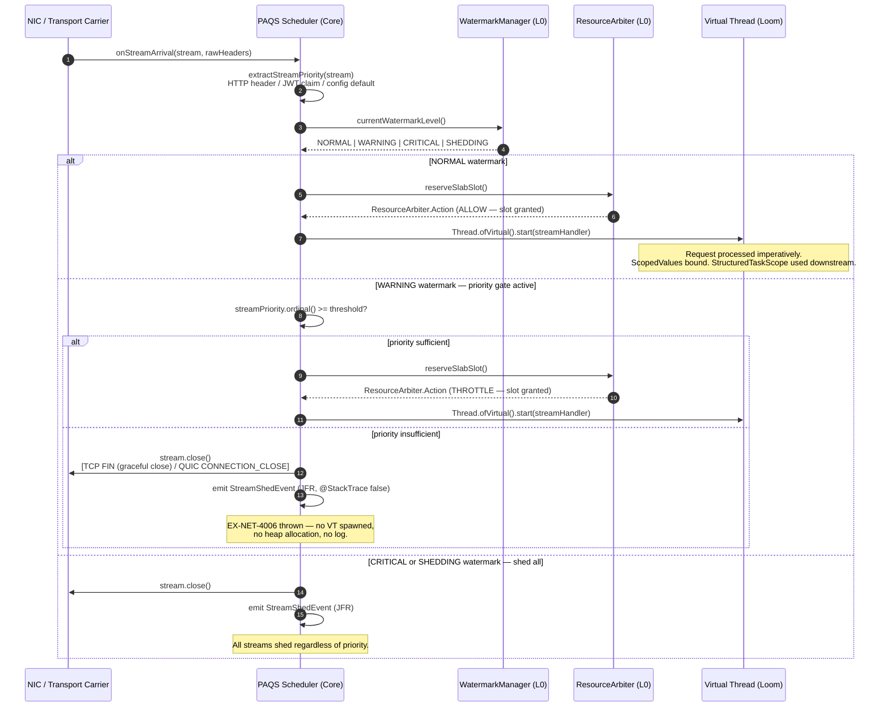

# Kernel Subsystem: Transport (L2 Native I/O)

**Physical Layout:**

- SPI: `eu.exeris.kernel.spi.transport.*` (Stream, Connection, TransportProvider)
- Core: `eu.exeris.kernel.core.transport.*` (PAQS Scheduler, Load Shedding, Stream Lifecycle)
- Drivers:
    - **`community`**: **Exeris Native TCP Carrier** — Custom off-heap TCP/TLS engine built on
      Panama FFM and OpenSSL, designed for Virtual Thread density on standard POSIX networking.
    - **`enterprise`**: **Exeris Native QUIC Carrier** — Flagship `io_uring` implementation (Linux)
      with kernel-bypass SQ/CQ ring management and QUIC/HTTP3 support.

**Layer:** L2 (Native I/O)
**Status:** Validated Architectural Prototype (TRL-3)

---

## Overview

The **Transport subsystem** is the Kernel's high-density gateway. It rejects legacy reactive event-loops
in favor of a **Virtual Thread-per-Stream** architecture, mapping data from the wire directly into
off-heap `LoanedBuffer` slabs via Panama FFM — no JVM heap contact on the ingress path.

- **Kernel-Bypass (Enterprise):** Leverages `io_uring` (Linux) to batch I/O operations and eliminate
  syscall overhead. The **Carrier Loop** (`IoUringQuicCarrier`) owns the native SQ/CQ rings and manages
  Virtual Thread park/unpark without OS context-switch cost.
- **PAQS Scheduler:** The **Priority-Aware Queue Scheduler** injects business context at the network edge.
  Low-priority traffic (e.g., telemetry) is shed before any heap state is allocated, preserving resources
  for critical flows (e.g., payments).
- **Native Everywhere:** The Community tier rejects Netty and Tomcat entirely. It uses a custom off-heap
  TCP carrier with Panama FFM and OpenSSL, delivering zero object churn on the network hot-path.
- **Protocol Blindness:** Business logic operates on abstract `Stream` objects — oblivious to whether data
  flows over TCP on Windows or QUIC/`io_uring` on Linux.

---

## Core Philosophy

### 1. Carrier Loop Architecture

Transport logic centers around dedicated **Carrier Loops**. Each loop manages native sockets, task queues
(`MpscArrayQueue`), and local memory pools (`SlabPool`) in a tight, non-blocking execution cycle.

The relationship between Carrier Loops and Virtual Threads is deliberate:

- **Carrier Loop:** Owns the native I/O rings. Wakes Virtual Threads when data is ready. Never executes
  business logic.
- **Virtual Thread:** Executes business logic imperatively. Parks on I/O waits. Carrier Loop resumes it
  at zero OS context-switch cost.

This separation gives you the simplicity of blocking, imperative code with the performance of a native
event loop.

### 2. PAQS: Business Context at the Network Edge

PAQS is the enforcement arm of the `ResourceArbiter`. When `WatermarkManager` signals memory pressure,
PAQS raises the shedding threshold — streams below that priority are dropped at the transport edge before
a single byte enters the application stack. This prevents GC pressure from cascading into business logic.

### 3. Zero-Copy from Wire to Storage

In the Enterprise tier, bytes travel:
```
NIC → io_uring CQ ring → LoanedBuffer slab → TLS unwrap (off-heap) → Persistence / Graph
```
No intermediate `byte[]`, no `ByteBuffer.allocate()`, no heap serialization.

---

## Performance Tiering

| Feature              | Community (Native TCP)           | Enterprise (Native QUIC)                   |
|:---------------------|:---------------------------------|:-------------------------------------------|
| **I/O Engine**       | Panama FFM + POSIX sockets       | Native `io_uring` (Linux) / Direct I/O     |
| **Protocol**         | TCP / TLS 1.3 (HTTP/1.1 + 2)     | UDP / QUIC (HTTP/3)                        |
| **Syscall Strategy** | Optimized POSIX (`epoll`/`kqueue`)| SQ/CQ Ring Submission (Kernel-Bypass)      |
| **Allocation**       | Bounded Best-Effort (Off-Heap)   | Strict Zero-Copy                           |
| **Target Platform**  | Cross-platform                   | Linux (max perf) / Multi-platform fallback |

---

## Responsibilities

**What Transport SPI DOES:**

1. Define the `Stream` and `Connection` lifecycle interfaces.
2. Provide `TransportProvider` for native driver registration via `ServiceLoader`.
3. Define abstract `StreamHeaders` for protocol-blind header access.
4. Define `StreamPriority` enum consumed by the PAQS Scheduler.

**What Transport Core DOES:**

1. Implement the **PAQS Scheduler** and global Load Shedding logic.
2. Coordinate with `ResourceArbiter` to monitor `SlabPool` exhaustion and trigger backpressure.
3. Manage Virtual Thread lifecycle (one per incoming stream). The PAQS spawns per-stream virtual threads
   via `Thread.ofVirtual().start()` — the sole deliberate exception to the `StructuredTaskScope` mandate.
   `StructuredTaskScope.fork()` enforces `WrongThreadException` for any caller that did not open the scope;
   since `schedule()` is called concurrently by multiple carrier threads (NIO selectors, io_uring rings),
   a shared long-lived STS is architecturally incompatible with the multi-carrier ingress model. These
   unstructured VTs act as roots of the Request Tree. All subsequent concurrent operations within
   the stream handler MUST use `StructuredTaskScope`.

---

## Error Codes

> **Source of truth:** `KernelErrorCodes.java` in `exeris-kernel-spi`.

| Code          | Meaning                  | Glass-Box Payload (`rawArgs`)                                               |
|:--------------|:-------------------------|:----------------------------------------------------------------------------|
| `EX-NET-4001` | Bind / Handshake Failure | `[0] String transportName, [1] int port`                                    |
| `EX-NET-4002` | Send Failure             | `[0] String transportName, [1] long bytesSent`                              |
| `EX-NET-4003` | Receive Timeout          | `[0] String transportName, [1] long timeoutMs`                              |
| `EX-NET-4004` | Engine Bootstrap Failure | `[0] String transportName, [1] String reason`                               |
| `EX-NET-4005` | Port Already in Use      | `[0] String transportName, [1] int port` — **Fatal:** check OS process list |
| `EX-NET-4006` | PAQS Load Shedding       | `[0] String transportName, [1] int streamPriority, [2] int thresholdPriority`|
| `EX-NET-4007` | Buffer Exhaustion        | `[0] String transportName, [1] int poolCapacity, [2] int activeSlabs`       |

**Operational note for `EX-NET-4006`:** This is a deliberate, non-fatal policy decision — not a hardware
failure. No connection state or heap object is allocated for the shed stream. It MUST emit a JFR event
(`eu.exeris.kernel.core.transport.jfr.StreamShedEvent`) but must not increment error counters used for alerting.

**Operational note for `EX-NET-4007`:** When thrown, the Transport Core MUST immediately signal
`ResourceArbiter.onBufferExhaustion()` to trigger L0 backpressure. New streams are refused until at least
one `SlabPool` slot is reclaimed.

---

## Code Examples

### 1. `io_uring` Carrier Loop — Zero-Allocation Ingress (Enterprise)

```java
public void processIngress() {
    long cqEntry = ioUring.peekCq();
    if (cqEntry != 0) {
        LoanedBuffer slab = ingressPool.allocate();
        ioUring.prepareRead(fd, slab.segment().address(), slab.capacity());
        ioUring.submit();
    }
}
```

> `peekCq()` reads directly from the memory-mapped CQ ring — no syscall, no heap allocation. The
> `LoanedBuffer` address is passed as a raw `long` to the `io_uring` SQE. The Carrier Loop never
> touches a Java object between the ring and the slab.

### 2. PAQS Priority Gate (Core)

```java
public void onStreamArrival(Stream stream, StreamPriority priority) {
    if (resourceArbiter.currentThreshold().isAbove(priority)) {
        stream.close();
        throw new TransportLoadSheddingException(
                KernelErrorCodes.EX_NET_4006,
                transportName, priority.ordinal(), resourceArbiter.currentThreshold().ordinal());
    }
    scope.fork(() -> streamHandler.handle(stream));
}
```

> The priority check is O(1) — a single `int` comparison against the `WatermarkManager` threshold.
> No heap allocation occurs for shed streams. The Virtual Thread is never created.

### 3. Protocol-Blind Stream Handler (SPI)

```java
package eu.exeris.kernel.spi.transport;

public interface StreamHandler {
    void handle(Stream stream);
}
```

---

## PAQS Decision Flow (Full Sequence)

The diagram below shows the complete path of an incoming stream through the PAQS admission gate —
from NIC arrival through the WatermarkManager check to either Virtual Thread fork or shed.



---

## `StreamPriority` — Origin and Assignment

`StreamPriority` is not self-declared by the client. It is **assigned by the Kernel** at the transport
edge based on verifiable attributes. The priority assignment chain:

| Source                             | Mechanism                                                                                         | Trust Level        |
|:-----------------------------------|:--------------------------------------------------------------------------------------------------|:-------------------|
| **Authenticated principal attribute** | Derived from the validated `PrincipalContext` provided by `SecurityProvider` before PAQS admission (for example, from a token claim or directory attribute). Cannot be client-forged once authentication succeeds. | High (verified) |
| **HTTP/QUIC stream header `x-priority`** | Mapped to `StreamPriority` enum by transport carrier. Treated as **untrusted input** — capped at `NORMAL` unless an authenticated principal attribute (see above) overrides. | Low (untrusted) |
| **Endpoint configuration**         | Static mapping via `network.paqs.endpointPriority.<path>` config key. Overrides header. | High (operator) |
| **Default (no source)**            | `StreamPriority.NORMAL`                                                                         | N/A               |

**Priority enum (SPI):**

```
enum StreamPriority {
    CRITICAL,   // payments, health checks, ops — never shed except at SHEDDING watermark
    HIGH,       // premium tier, authenticated business flows
    NORMAL,     // default — most application traffic
    LOW,        // lower-value application traffic, batch jobs, analytics
    TELEMETRY   // observability-only streams, fire-and-forget metrics/logs
}
```

> **PAQS invariant:** Priority is evaluated **once** at stream admission. It cannot change mid-stream.
> This ensures O(1) shed decisions with zero re-evaluation overhead.

---

## Connection Draining Policy

When PAQS sheds a stream or the Kernel initiates graceful shutdown:

| Scenario               | TCP (Community)                                     | QUIC (Enterprise)                                        |
|:-----------------------|:----------------------------------------------------|:---------------------------------------------------------|
| **PAQS load shed**     | `FIN` (graceful close) — client receives `HTTP 503` | `CONNECTION_CLOSE` frame (QUIC error `0x00`) — no RST   |
| **Graceful shutdown**  | `FIN` after drain timeout — no forced `RST`         | `GOAWAY` frame issued to drain existing streams          |
| **Hard shutdown timeout** | `RST` after 60 s hard timeout                   | `CONNECTION_CLOSE` with application error code `0x01`   |

> **Why `FIN` not `RST` for load shedding?** `RST` causes immediate connection teardown on the client
> side, which may interrupt in-flight retries and force the client to reconnect. `FIN` allows the client
> to receive the `HTTP 503` response body, which is machine-readable and enables intelligent backoff.
> `RST` is reserved for hard timeout scenarios only.

---

## WebSocket / SSE — Design Stance

**WebSocket and Server-Sent Events (SSE) are not supported at TRL-3.** This is a deliberate scope
constraint, not an oversight.

| Protocol     | Status      | Rationale                                                                                              |
|:-------------|:------------|:-------------------------------------------------------------------------------------------------------|
| **WebSocket** | 🚧 Planned TRL-5 | Requires long-lived, upgradeable TCP connections. Community TCP carrier needs HTTP Upgrade handling. Will be implemented as a `StreamHandler` variant. |
| **SSE**       | 🚧 Planned TRL-5 | Requires one-directional streaming via HTTP/1.1 chunked transfer or HTTP/2 push. Follows WebSocket implementation. |
| **HTTP/2 Push** | 🚧 Planned TRL-5 | Enterprise QUIC/HTTP3 transport is the target carrier for push semantics. |
| **gRPC streaming** | 🚧 Planned TRL-5 | Modelled as HTTP/2 streams — follows transport carrier maturity. |

For real-time push requirements at TRL-3, use the **Events subsystem (L3)** with a Kafka/Redpanda
backend and a polling client. The PAQS scheduler handles priority-based delivery.

---

## Proxy Protocol v2 — Client IP Preservation

**Status:** 🚧 Planned (no runtime support in current TRL-3 prototype). Configuration keys are defined in `docs/subsystems/config.md` (`network.proxyProtocolEnabled`, `network.proxyProtocolRequired`). This section describes the **target behavior**.

Exeris Community and Enterprise transport drivers will support **Proxy Protocol v2** (HAProxy specification)
for client IP preservation behind load balancers (HAProxy, NGINX, AWS NLB, GCP LB).

| Feature                            | Community                           | Enterprise                          |
|:-----------------------------------|:-----------------------------------:|:-----------------------------------:|
| Proxy Protocol v2 parsing          | 🚧 Planned TRL-4                    | 🚧 Planned TRL-4                    |
| Real client IP in `StreamHeaders`  | 🚧 Planned via `remoteAddress()`    | 🚧 Planned via `remoteAddress()`    |
| TLV extension support              | 🚧 Planned TRL-4                    | 🚧 Planned TRL-4                    |

> **Target behavior:** when Proxy Protocol is enabled (`network.proxyProtocolEnabled=true`), the transport carrier
> reads the PPv2 header before any TLS handshake attempt. The real client IP is extracted and stored in the
> `Stream` metadata. If the PPv2 header is malformed or absent while `network.proxyProtocolRequired=true`, the
> connection is dropped immediately with `EX-NET-4001` to prevent forged client IPs when Proxy Protocol is
> required by the network topology.

---

## Testing Strategy

### Unit Tests

- PAQS shedding logic: verify streams below threshold are rejected before `scope.fork()`.
- `SlabPool` exhaustion: `EX-NET-4007` thrown with correct `rawArgs` when all slots are active.
- Priority ordering: `StreamPriority` enum ordinals enforce correct relative ordering.

### Integration Tests (TCK)

- **`io_uring` Validation (Linux):** SQ/CQ ring submission integrity under concurrent streams.
- **Zero-Allocation Hot-Path:** JFR baseline shows zero heap allocations during `processIngress()`.
- **Cross-Platform Parity:** Identical business logic behavior over Community TCP and Enterprise QUIC.
- **PAQS Integration:** `WatermarkManager` pressure increase correctly raises PAQS threshold and
  triggers `EX-NET-4006` for low-priority streams.

### Load Tests

- **Saturation Analysis:** Identify the crossover point where `io_uring` outperforms the POSIX stack
  in P99 latency.
- **Carrier Stress:** `MpscArrayQueue` throughput under millions of network events per second with
  zero `CarrierPinnedEvent` emissions.

---

## Summary

The Transport subsystem is the high-performance gateway of the Exeris Kernel. By combining `io_uring`
kernel-bypass (Enterprise) with a Panama FFM TCP carrier (Community), it delivers a zero-object-churn
ingress path on every platform. The PAQS Scheduler makes this deterministic under load — shed decisions
are made at the network edge in O(1) time, before a single byte of unauthorized or low-priority traffic
consumes heap, CPU, or a Virtual Thread.
