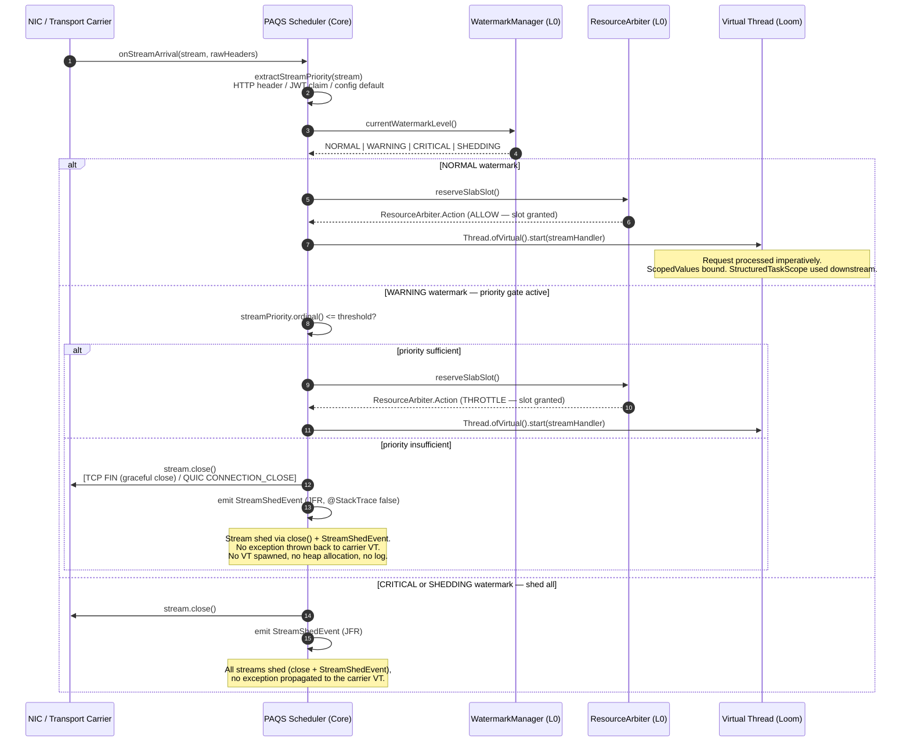

# Kernel Subsystem: Transport (L2 Native I/O)

**Physical Layout:**

- SPI: `eu.exeris.kernel.spi.transport.*` (TransportStream, TransportConnection, TransportProvider, TransportEngine)
- Core: `eu.exeris.kernel.core.transport.*` (PAQS Scheduler, Load Shedding, Stream Lifecycle)
- Drivers:
    - **`community`**: **Exeris Native TCP Carrier** — Custom off-heap TCP/TLS engine built on
      Panama FFM and OpenSSL, designed for Virtual Thread density on standard POSIX networking.

**Layer:** L2 (Native I/O)  
**Status:** Validated Architectural Prototype (TRL-3)

---

## Overview

The **Transport subsystem** is the Kernel's high-density gateway. It rejects legacy reactive event-loops
in favor of a **Virtual Thread-per-Stream** architecture, mapping data from the wire directly into
off-heap `LoanedBuffer` slabs via Panama FFM — no JVM heap contact on the ingress path.

- **PAQS Scheduler:** The **Priority-Aware Queue Scheduler** injects business context at the network edge.
  Low-priority traffic (e.g., telemetry) is shed before any heap state is allocated, preserving resources
  for critical flows (e.g., payments).
- **Native Everywhere:** The Community tier rejects Netty and Tomcat entirely. It uses a custom off-heap
  TCP carrier with Panama FFM and OpenSSL, delivering zero object churn on the network hot-path.
- **Protocol Blindness:** Business logic operates on abstract `Stream` objects — oblivious to whether data
  flows over TCP on Windows or QUIC/`io_uring` on Linux.

---

## Connection ceiling

`TransportConfig.maxConnections()` (`http.maxConnections`, default `HttpConfig.DEFAULT_MAX_CONNECTIONS`
= 1000) is a hard cap on **concurrent connections across all reactors**, enforced at accept time. When
it is reached, `NativeTcpCarrier` accepts the connection at TCP level and immediately closes it.

What a client observes: the socket opens and then dies, with no HTTP response — a transport-level
failure, not a status code. There is no way for the client to distinguish this from a network fault.

Two properties make the ceiling easy to reach at a request rate that feels comfortable. It counts
**concurrent connections, not rate**, so a client whose connection pool overlaps with a draining
previous pool can cross it while neither pool alone comes close. And it is enforced before anything
else — no queue, no shed decision, no response.

Refusals are visible in two places, and were visible in neither before v0.11:

- `TransportStats.totalRejected` includes them. It previously counted only PAQS load-sheds, so it read
  zero during a total accept-time refusal — a value an operator reasonably reads as "this server is
  healthy, look elsewhere".
- `eu.exeris.kernel.transport.CommunityConnectionRefused` is emitted per refusal, carrying the active
  count, the configured ceiling, and a cumulative total whose slope distinguishes a blip from a wall.

Whether an accept-time cap is the right mechanism — as opposed to admitting and shedding at request
level, where the response can carry a status — and whether 1000 is the right default, are open
questions tracked in `docs/ROADMAP.md`. The behaviour above is unchanged; only its visibility is new.

## Accept-path failure modes

There are two ways an accepted connection ends without being served, and they look identical from the
client: the socket opens and dies. They are different in kind, and the kernel now distinguishes them.

| | Refusal | Setup fault |
|---|---|---|
| Event | `CommunityConnectionRefused` | `CommunityAcceptFault` |
| Cause | the connection ceiling was reached | something threw while configuring the channel, resolving the peer, building the stream, or registering it |
| Nature | a **policy** decision at a known limit | a **defect** — allocator failure, TLS engine that would not initialise, registry inconsistency |
| In `totalRejected` | yes | **no** |

A setup fault is deliberately **not** counted as a refusal. `totalRejected` means work the engine
*declined*, and a setup that broke declined nothing. Folding the two together would leave an operator
reading a spike unable to tell a capacity problem from a bug — the one distinction that changes what
they do next.

Both paths recover: the accept loop continues. That is correct for a per-connection failure, and
making a setup fault fatal would trade a silent drop for an outage. What changed is only that neither
is silent.

The fault event carries the exception **class** and never its message, matching
`CommunityReactorDispatchFault` — a message can carry request-derived text.

## Core Philosophy

### 1. Carrier Loop Architecture

Transport logic centers around dedicated **Carrier Loops**. Each loop manages native sockets, task queues
(`MpscArrayQueue`), and local memory pools (`SlabPool`) in a tight, non-blocking execution cycle.

The relationship between Carrier Loops and Virtual Threads is deliberate:

- **Carrier Loop:** Owns the native I/O rings. Wakes Virtual Threads when data is ready. Never executes
  business logic.
- **Virtual Thread:** Executes business logic imperatively. Parks on I/O waits. Carrier Loop resumes it
  at zero OS context-switch cost.

This separation gives you the simplicity of blocking, imperative code with the performance of a native
event loop.

### 2. PAQS: Business Context at the Network Edge

PAQS is the enforcement arm of the `ResourceArbiter`. When `WatermarkManager` signals memory pressure,
PAQS raises the shedding threshold — streams below that priority are dropped at the transport edge before
a single byte enters the application stack. This prevents GC pressure from cascading into business logic.

### 3. Zero-Copy Ingress

The Community carrier transfers bytes from the network socket directly into off-heap `LoanedBuffer` slabs via Panama FFM. No intermediate `byte[]`, no `ByteBuffer.allocate()`, no heap serialization.

---

## Responsibilities

**What Transport SPI DOES:**

1. Define the `TransportStream` and `TransportConnection` lifecycle interfaces.
2. Provide `TransportProvider` and `TransportEngine` for native driver registration via `ServiceLoader`.
3. 🚧 **Planned (TRL-4):** Define `StreamHeaders` SPI interface for protocol-blind header access. Not yet implemented — current header access is via `TransportStream` implementation directly.
4. Define `StreamPriority` enum consumed by the PAQS Scheduler.

**What Transport Core DOES:**

1. Implement the **PAQS Scheduler** and global Load Shedding logic.
2. Coordinate with `ResourceArbiter` to monitor `SlabPool` exhaustion and trigger backpressure.
3. Manage Virtual Thread lifecycle (one per incoming stream). The PAQS spawns per-stream virtual threads
   via `Thread.ofVirtual().start()` — the sole deliberate exception to the `StructuredTaskScope` mandate.
   `StructuredTaskScope.fork()` enforces `WrongThreadException` for any caller that did not open the scope;
   since `schedule()` is called concurrently by multiple carrier threads (NIO selectors, io_uring rings),
   a shared long-lived STS is architecturally incompatible with the multi-carrier ingress model. These
   unstructured VTs act as roots of the Request Tree. All subsequent concurrent operations within
   the stream handler MUST use `StructuredTaskScope`.
4. Expose cross-platform POSIX / Winsock socket symbol loading via `CoreSyscallLoader` (Panama FFM). Migration of the active Community carrier onto this shared socket path is planned; the current in-repo carrier remains NIO-backed, and NIO is retained as the explicit fallback path for portability and degraded-operation scenarios.

---

## Provider Selection — Descending Priority + First-Available

`CommunityTransportSubsystem` resolves a `TransportProvider` at bootstrap via the shared
`BootstrapProviderSelector.loadHighestPriority(...)` helper with the availability filter
`TransportProvider::isAvailable`. Selection semantics:

1. **Discovery:** all `TransportProvider` implementations on the classpath are loaded via `ServiceLoader`.
2. **Availability filter:** providers for which `isAvailable()` returns `false` are removed from the
   candidate set. Platform-conditional providers (e.g., io_uring on Linux only, IOCP on Windows only)
   gate themselves here. The default `isAvailable()` returns `true`.
3. **Descending priority + deterministic tie-break:** remaining candidates are ranked by
   `priority()` (higher wins). On ties, the implementation class name (alphabetical, last wins under
   `Stream.max`) breaks the tie deterministically across JVMs and ServiceLoader orderings.
4. **First-available wins:** the highest-priority available provider is selected. If the candidate
   set is empty, no transport engine is created and the subsystem stays in `DISABLED` mode.

This means an unavailable higher-priority provider (e.g., io_uring on a non-Linux host) does NOT
shadow an available lower-priority provider (e.g., NIO Community baseline). The selection contract
is exercised by `BootstrapProviderSelectorTest` and validated end-to-end through the
`CommunityTransportSubsystemLifecycleTckTest` binding.

---

## Error Codes

> **Source of truth:** `KernelErrorCodes.java` in `exeris-kernel-spi`.

| Code          | Meaning                  | Glass-Box Payload (`rawArgs`)                                               |
|:--------------|:-------------------------|:----------------------------------------------------------------------------|
| `EX-NET-4001` | Bind / Handshake Failure | `[0] String transportName, [1] int port`                                    |
| `EX-NET-4002` | Send Failure             | `[0] String transportName, [1] long bytesSent`                              |
| `EX-NET-4003` | Receive Timeout          | `[0] String transportName, [1] long timeoutMs`                              |
| `EX-NET-4004` | Engine Bootstrap Failure | `[0] String transportName, [1] String reason`                               |
| `EX-NET-4005` | Port Already in Use      | `[0] String transportName, [1] int port` — **Fatal:** check OS process list |
| `EX-NET-4006` | PAQS Load Shedding       | `[0] String transportName, [1] int streamPriority, [2] int thresholdPriority`|
| `EX-NET-4007` | Buffer Exhaustion        | `[0] String transportName, [1] int poolCapacity, [2] int activeSlabs`       |

**Operational note for `EX-NET-4006`:** This is a deliberate, non-fatal policy decision — not a hardware
failure. No connection state or heap object is allocated for the shed stream. It MUST emit a JFR event
(`eu.exeris.kernel.core.transport.jfr.StreamShedEvent`) but must not increment error counters used for alerting.

**Operational note for `EX-NET-4007`:** When thrown, the `WatermarkManager` detects slab exhaustion and elevates the watermark level. `ResourceArbiter.decide(Context.TRANSPORT_IO)` then returns `Action.SHED_LOAD`, signaling PAQS to reject new streams.

---

## Code Examples

### 2. PAQS Priority Gate (Core)

```java
public void onStreamArrival(TransportStream stream, StreamPriority priority) {
    if (resourceArbiter.currentThreshold().isAbove(priority)) {
        stream.close();
        // stream is closed and StreamShedEvent is emitted — no exception propagated
        return;
    }
    Thread.ofVirtual().start(() -> streamHandler.handle(stream));
}
```

> The priority check is O(1) — a single `int` comparison against the `WatermarkManager` threshold.
> No heap allocation occurs for shed streams. The Virtual Thread is never created.

### 3. Protocol-Blind Stream Handler (SPI)

```java
package eu.exeris.kernel.spi.transport;

public interface StreamHandler {
    void handle(Stream stream);
}
```

---

## PAQS Decision Flow (Full Sequence)

The diagram below shows the complete path of an incoming stream through the PAQS admission gate —
from NIC arrival through the WatermarkManager check to either Virtual Thread fork or shed.



---

## `StreamPriority` — Origin and Assignment

`StreamPriority` is not self-declared by the client. It is **assigned by the Kernel** at the transport
edge based on verifiable attributes. The priority assignment chain:

| Source                             | Mechanism                                                                                         | Trust Level        |
|:-----------------------------------|:--------------------------------------------------------------------------------------------------|:-------------------|
| **Authenticated principal attribute** | Derived from the validated `PrincipalContext` provided by `SecurityProvider` before PAQS admission (for example, from a token claim or directory attribute). Cannot be client-forged once authentication succeeds. | High (verified) |
| **HTTP/QUIC stream header `x-priority`** | Mapped to `StreamPriority` enum by transport carrier. Treated as **untrusted input** — capped at `NORMAL` unless an authenticated principal attribute (see above) overrides. | Low (untrusted) |
| **Endpoint configuration**         | Static mapping via `network.paqs.endpointPriority.<path>` config key. Overrides header. | High (operator) |
| **Default (no source)**            | `StreamPriority.NORMAL`                                                                         | N/A               |

**Priority enum (SPI):**

```
enum StreamPriority {
    CRITICAL,   // payments, health checks, ops — never shed except at SHEDDING watermark
    HIGH,       // premium tier, authenticated business flows
    NORMAL,     // default — most application traffic
    LOW,        // lower-value application traffic, batch jobs, analytics
    TELEMETRY   // observability-only streams, fire-and-forget metrics/logs
}
```

> **PAQS invariant:** Priority is evaluated **once** at stream admission. It cannot change mid-stream.
> This ensures O(1) shed decisions with zero re-evaluation overhead.

---

## Connection Draining Policy

When PAQS sheds a stream or the Kernel initiates graceful shutdown:

| Scenario               | Community (TCP)                                     |
|:-----------------------|:----------------------------------------------------|
| **PAQS load shed**     | `FIN` (graceful close) — client receives `HTTP 503` |
| **Graceful shutdown**  | `FIN` after drain timeout — no forced `RST`         |
| **Hard shutdown timeout** | `RST` after 60 s hard timeout                   |
| **`TransportStream.reset(long)`** | `RST` (abortive) — `SO_LINGER 0` then close; queued writes abandoned (no drain wait) |
| **Unrecoverable outbound-write failure** | `RST` (abortive) — queued writes abandoned so teardown cannot hang |

> **Why `FIN` not `RST` for load shedding?** `RST` causes immediate connection teardown on the client
> side, which may interrupt in-flight retries and force the client to reconnect. `FIN` allows the client
> to receive the `HTTP 503` response body, which is machine-readable and enables intelligent backoff.
> `RST` is reserved for hard timeout scenarios only.
>
> **`reset(long)` vs `close()`:** `close()` is a graceful end-of-stream (`FIN`, drains queued writes);
> `reset(long)` is the deliberate abortive primitive (`RST`, abandons queued writes) — the SPI's
> transport-agnostic stream abort (an Enterprise QUIC binding maps it to `RESET_STREAM`). A failed
> outbound write self-aborts via the same path. **Telemetry follow-up:** a secret-safe, single-phase
> `StreamLifecycleEvent` for the reset transition is deferred to the security/transport
> validation-stage JFR pass (Phase 4 N1) — the reset call sites are the intended emission points.

---

## WebSocket / SSE — Design Stance

**Server-Sent Events (SSE) is the kernel's first server-push primitive — decided in [ADR-043](../adr/ADR-043-kernel-http-streaming-spi.md) (ACCEPTED), implemented in v0.10.** WebSocket remains unsupported and is a separately-justified follow-up. No server-push existed at TRL-3; this was a deliberate scope constraint, now being lifted SSE-first.

| Protocol     | Status      | Rationale                                                                                              |
|:-------------|:------------|:-------------------------------------------------------------------------------------------------------|
| **SSE**       | ✅ Shipped v0.10 — ratified by [ADR-043](../adr/ADR-043-kernel-http-streaming-spi.md) (ACCEPTED) | One-directional server push, surfaced as the sibling `HttpStreamExchange` SPI (respond-once `HttpExchange` untouched). **SSE-first** — the minimal server-push primitive. The delivered wire framing is a close-delimited HTTP/1.1 response, not chunked transfer as sketched here before it landed; per-event chunked framing and an HTTP/2 `DATA` path are follow-ups. See [http.md](http.md) for the SPI surface and the per-item delivery status. |
| **WebSocket** | Deferred — separately-justified follow-up (not milestone-pinned) | Full duplex; requires an HTTP Upgrade (H1) / Extended CONNECT (H2 RFC 8441) handshake + frame protocol. Decided separately once a bidirectional/low-latency client-streaming use case is proven; may precede 1.0 but is not pinned to a release milestone (see ADR-043 §What is NOT in scope). |
| **gRPC streaming** | 🚧 Planned TRL-5 | Modelled as HTTP/2 streams — follows transport carrier maturity. |

Full-duplex traffic still has no kernel primitive: until WebSocket is decided, a bidirectional
use case pairs SSE downstream with ordinary requests upstream, or falls back to the **Events
subsystem (L3)** with a Kafka/Redpanda backend and a polling client. The PAQS scheduler handles
priority-based delivery.

---

## Proxy Protocol v2 — Client IP Preservation

**Status:** 🚧 Planned (no runtime support in current TRL-3 prototype). Configuration keys are defined in `docs/subsystems/config.md` (`network.proxyProtocolEnabled`, `network.proxyProtocolRequired`). This section describes the **target behavior**.

The Community transport driver will support **Proxy Protocol v2** (HAProxy specification)
for client IP preservation behind load balancers (HAProxy, NGINX, AWS NLB, GCP LB).

| Feature                            | Community                           |
|:-----------------------------------|:-----------------------------------:|
| Proxy Protocol v2 parsing          | 🚧 Planned TRL-4                    |
| Real client IP in `StreamHeaders`  | 🚧 Planned via `remoteAddress()`    |
| TLV extension support              | 🚧 Planned TRL-4                    |

> **Target behavior:** when Proxy Protocol is enabled (`network.proxyProtocolEnabled=true`), the transport carrier
> reads the PPv2 header before any TLS handshake attempt. The real client IP is extracted and stored in the
> `Stream` metadata. If the PPv2 header is malformed or absent while `network.proxyProtocolRequired=true`, the
> connection is dropped immediately with `EX-NET-4001` to prevent forged client IPs when Proxy Protocol is
> required by the network topology.

---

## JFR Events

| Event | JFR Name | Purpose |
|---|---|---|
| `StreamShedEvent` | `eu.exeris.kernel.transport.StreamShed` | Emitted by PAQS when stream is rejected under high load |
| `StreamAcceptedEvent` | `eu.exeris.kernel.transport.StreamAccepted` | Emitted by PAQS when stream is admitted |
| `StreamLifecycleEvent` | `eu.exeris.kernel.transport.StreamLifecycle` | State transitions within a stream lifetime |
| `TransportIngressQueueDepthEvent` | `eu.exeris.kernel.transport.IngressQueueDepth` | Current queue depth metric |
| `TransportQueueBackpressureAlertEvent` | `eu.exeris.kernel.transport.QueueBackpressureAlert` | Alert when queue exceeds threshold |

---

## Testing Strategy

### Unit Tests

- PAQS shedding logic: verify streams below threshold are rejected before `scope.fork()`.
- `SlabPool` exhaustion: `EX-NET-4007` thrown with correct `rawArgs` when all slots are active.
- Priority ordering: `StreamPriority` enum ordinals enforce correct relative ordering.

### Integration Tests (TCK)

- **`io_uring` Validation (Linux):** SQ/CQ ring submission integrity under concurrent streams.
- **Zero-Allocation Hot-Path:** JFR baseline shows zero heap allocations during `processIngress()`.
- **PAQS Integration:** `WatermarkManager` pressure increase correctly raises PAQS threshold and
  triggers `EX-NET-4006` for low-priority streams. 🚧 Planned — not yet implemented. `AbstractPaqsIntegrationTck` covering WatermarkManager→PAQS→EX-NET-4006 chain does not yet exist.

**Full TCK abstract class set (all have full Community bindings):** `AbstractTransportEngineTck`, `AbstractTransportProviderTck`, `AbstractTransportConnectionTck`, `AbstractTransportStreamTck`, `TransportZeroAllocTck`, `TransportCarrierPinningTck`.

### Load Tests

- **Carrier Stress:** `MpscArrayQueue` (Agrona) throughput under millions of network events per second with
  zero `CarrierPinnedEvent` emissions.

---

## Implementation Notes — Class Decomposition Assessment (HEUR-061)

`NativeTcpCarrier` (~1.4k LOC, 146 declared members) and `NativeTcpStream` (~1.2k LOC, 133 declared members) cross the CLAUDE.md "≈5 collaborators" heuristic threshold. A v0.6 PR-review carry-over (HEUR-061) asked whether they should be decomposed along reactor / FD-owner / PAQS-dispatch responsibility lines.

**Assessment outcome (v0.7 Sprint 2): keep current single-file shape; do not refactor in this sprint.**

**Responsibility lines (informational map, not extraction targets):**

`NativeTcpCarrier`:

- **Engine lifecycle + config** — `TransportConfig` / `MemoryAllocator` / `KernelCryptoProvider` injection, `running` / `closed` AtomicBooleans, acceptor thread, stream/connection counters.
- **FFM socket backend selection + validation** — `SocketBackendMode` enum, `SocketBackendSelection` record, PosixHybrid / NIO fallback, `validateServerSocketBootstrap*` / `validateClientSocketBackend*` probes, Windows `bestEffortWsaCleanup`.
- **Reactor loop** — `ReactorLoop` inner class: `Selector`, `pendingRequests` MPSC queue (PERF-063 — `MpscUnboundedArrayQueue`), `drainPendingRequests`, key dispatch.
- **Acceptor / connection bootstrap** — `runAcceptorLoop`, `acceptPendingConnections`, `tryReserveConnectionSlot`, `buildAcceptedStream`, `registerAndHandshakeConnection`.
- **Client-side connection bootstrap** — `connect` flips the connected channel to non-blocking and `registerClientChannel` registers it on a single client-side reactor (SERVER/DUAL keep `config.reactorCount()` reactors; CLIENT/DUAL outbound uses one). Client ingress and egress are reactor-driven exactly like accepted server channels — there is no separate client ingress/writer Virtual-Thread pump (removed in v0.8 Sprint 7 / TCK-064, which eliminated the blocking-`recv()` carrier-pinning stall).
- **PAQS-dispatch read/flush path** — `readIngress`, `flushStream`, `adaptTlsIfNeeded`, `closeKeyStream`.

`NativeTcpStream`:

- Stream open/close state machine and FD-owner integration.
- Outbound queue (`MpscUnboundedArrayQueue`) and write loop with TLS layering.
- Inbound queue (`SpscArrayQueue` / `SpscUnboundedArrayQueue`) and read loop with TLS layering.
- Backpressure / queue-depth bookkeeping for PAQS interaction.

**Why not extract now:**

1. **Tight coupling cost**: `ReactorLoop` is an inner class deliberately — its operational surface (`channelRuntimeRegistry`, `streamByChannel`, `closeKeyStream`, `readIngress`, `flushStream`) is intimate with carrier state. Promoting it to a top-level class requires ~10 callback / port references injected through the constructor, which trades an inner class for a callback-heavy delegate without measurable readability gain. Same risk applies to FD-owner / PAQS-dispatch extraction.
2. **Active development collision risk**: v0.7 Sprint 5 (Kafka EventEngine), Sprint 6 (distributed integration), and PERF-061 / PERF-062 (HTTP/2 frame writer + TLS ingress slab) all touch transport hot paths. Decomposition during this window adds merge surface to every concurrent PR.
3. **Sibling precedent**: SQ-006 raised the analogous question for `CoreFlowRuntime` and was deferred with a design note rather than a refactor PR. The same disposition applies here.
4. **Heuristic vs hard rule**: the ">5 collaborators" rule is a signal, not a hard gate (CLAUDE.md §C heuristics). Class size alone does not justify forced decomposition when the cost outweighs the benefit.

**When to revisit:**

- If a future sprint introduces a second carrier (e.g., io_uring) that needs to share reactor/FD-owner code — at that point extraction yields a real reuse benefit.
- If profiling data shows that the current class layout regresses inlining or escape analysis on the hot path (no current evidence).
- If the file size exceeds ~2k LOC after Sprint 5/6 changes — at that scale revisit with profiling data and a measured refactor PR.

Tracking: revisit alongside any io_uring / FFM-native carrier work (currently planned post-v0.7).

---

## Summary

The Transport subsystem is the high-performance gateway of the Exeris Kernel. With a Panama FFM TCP carrier and PAQS-enforced shedding, it delivers a zero-object-churn ingress path on every platform. The PAQS Scheduler makes this deterministic under load — shed decisions
are made at the network edge in O(1) time, before a single byte of unauthorized or low-priority traffic
consumes heap, CPU, or a Virtual Thread.

---

## Stability

This subsystem's SPI surface (`eu.exeris.kernel.spi.transport.*`) is classified **stable** in the
[SPI Stability Matrix](../stability-matrix.md). See the matrix for the semver policy and TCK
coverage status.
